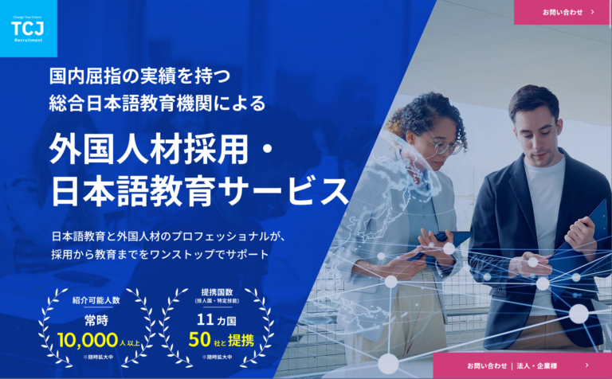
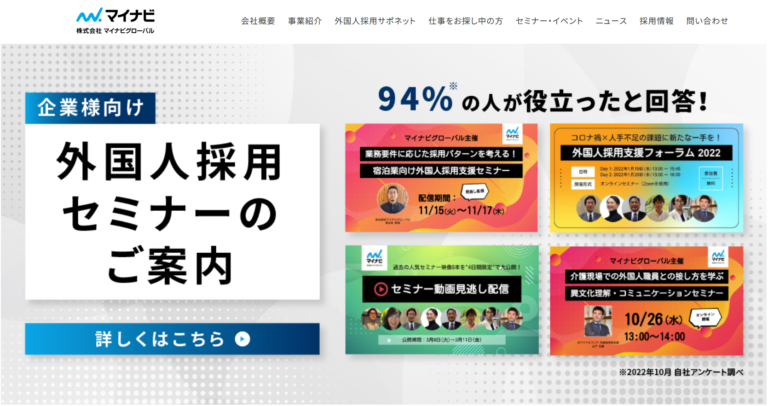
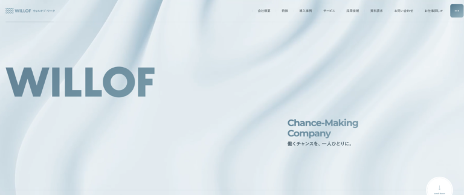

「建築現場で働ける外国人材を採用したいけど、前回は日本語が通じず失敗した…」 「今度こそミスマッチを避けて、長く働いてくれる人材を見つけたい」

建築業界の深刻な人手不足を背景に、外国人材の採用は年々増加しています。しかし、「JLPTのN2を持っているから安心していたのに、現場の安全指示が全く理解できず、ヒヤリハットが多発した」という失敗事例も少なくありません。

本記事では、37年の日本語教育実績を持つTCJグローバルが、建築業で外国人材を成功させるための全手順を徹底解説します。特に「日本語能力の評価方法」と「建築現場で本当に必要なコミュニケーション力」について、実例を交えて詳しくご紹介いたします。

## 建築業における外国人材の現状【2026年版】

### 建設業の外国人労働者数は17.8万人に到達

建築・建設業界で働く外国人材の数は、年々急速に増加しています。厚生労働省が公表した最新データ（2025年1月発表）によると、2024年10月末時点で建設業の外国人労働者数は**177,902人**となり、前年比で**22.7%増加**しました。

2020年の11.1万人と比較すると、わずか4年で約1.6倍に拡大しており、建築業界にとって外国人材がいかに重要な戦力となっているかがわかります。

建設業における外国人労働者数の推移

11.1万人

2020年

14.5万人

2023年

17.8万人

2024年

出典：厚生労働省[「外国人雇用状況」の届出状況まとめ](https://www.mhlw.go.jp/stf/newpage_44254.html)

### 主な出身国はベトナムと中国

国籍別で見ると、**ベトナム人労働者**が最も多く、次いで**中国人労働者**が続いています。ベトナムは特に特定技能や技能実習の送出国として活発で、建築業界でも中心的な存在となっています。

### なぜ建築業で外国人材が必要なのか

建築業界で外国人材の受け入れが進む背景には、以下の3つの深刻な課題があります:

- **1\. 深刻な人手不足**: 2025年問題（団塊世代の大量退職）により、建築現場の人手不足は年々悪化
- **2\. 若手人材の確保難**: 3K（きつい、汚い、危険）のイメージから、若い日本人の入職者が減少
- **3\. 工期遅延リスクの回避**: 人手不足による工期遅延を避けるため、外国人材の戦力化が急務

## 建築業で使える在留資格（ビザ）の種類と特徴

建築業で外国人材を受け入れる際、主に使用される在留資格（ビザ）は4種類あります。それぞれの特徴を理解し、自社のニーズに合ったビザ種別を選ぶことが重要です。

### 1\. 技能実習

技能実習は、開発途上国への技能移転を目的とした制度です。

- **対象職種**: 型枠施工、鉄筋施工、建築大工、配管、とび、左官など
- **期間**: 最長5年（1号1年+2号2年+3号2年）
- **メリット**: 日本語能力が低くても受け入れ可能、教育しながら戦力化
- **デメリット**: 監理団体を経由する必要があり、手続きが複雑

### 2\. 特定技能

特定技能は、人手不足が深刻な分野で即戦力となる外国人材を受け入れるための制度です。建築業界では非常に重要な在留資格となっています。

- **対象職種**: 19種類の建設関連職種（型枠施工、鉄筋施工、建築大工、配管、とび、左官、コンクリート圧送、トンネル推進工、建設機械施工、土工、屋根ふき、電気通信、鉄筋継手、内装仕上げ、表装、とび・土工・コンクリート打設、吹付ウレタン断熱、海洋土木工）
- **期間**: 1号は最長5年、2号は更新回数に制限なし（実質無期限）
- **メリット**: 即戦力として受け入れ可能、2号なら長期定着が期待できる
- **デメリット**: JAC（建設技能人材機構）への加入や建設業許可が必要、登録支援機関の支援義務

**重要:** 2023年に創設された特定技能2号により、建設分野でも外国人材の長期定着が可能になりました。これは建築業界にとって大きな転換点です。

### 3\. 技術・人文知識・国際業務（技人国）

大学や専門学校で専門教育を受けた人材が、専門知識を活かして働くための在留資格です。

- **対象職種**: 建築設計、CADオペレーター、施工管理、BIMマネージャー、構造計算など
- **期間**: 更新可能（制限なし）
- **メリット**: 専門的な業務に従事可能、長期雇用が前提
- **デメリット**: 単純作業は不可、N2以上の日本語能力が望ましい

### 4\. 身分に基づく在留資格

永住者、日本人の配偶者等、永住者の配偶者等、定住者などがこれにあたり、日本人と同様に職種や勤務時間の制限なく就労できます。

### 【比較表】在留資格ごとの特徴まとめ

| 在留資格 | 対象職種 | 期間 | 日本語要件 | おすすめ企業 |
| --- | --- | --- | --- | --- |
| 技能実習 | 現場作業 | 最長5年 | 基礎レベル | 教育前提の企業 |
| 特定技能1号 | 現場作業19職種 | 最長5年 | N4以上 | 即戦力が欲しい企業 |
| 特定技能2号 | 同上 | 無制限 | N4以上 | 長期定着を目指す企業 |
| 技人国 | 設計・施工管理等 | 更新可 | N2以上推奨 | 専門職を求める企業 |

## 建築業で外国人材を採用する5つのポイント【失敗しない選び方】

外国人材紹介会社は数多く存在しますが、建築業で本当に成功する採用を実現するためには、以下の5つのポイントを押さえることが不可欠です。

### 1\. 日本語能力の評価方法を確認する【最重要】

#### JLPTだけでは建築現場で通用しない理由

外国人材採用で最も多い失敗は、「日本語能力が想定より低かった」というケースです。特に建築現場では、このミスマッチが重大事故につながるリスクがあります。

JLPT（日本語能力試験）は読み書き中心の試験であり、**口頭能力（スピーキング）を正確に測ることができません**。実際、N2を持っていても会話がほとんどできないケースは珍しくありません。

**実例:** 「N2保持者を採用したが、『KY活動』『ヒヤリハット』『養生』などの現場用語が全く理解できず、安全指示が伝わらなかった。結果、ヒヤリハットが多発し、6ヶ月で退職に至った。」

#### 建築現場で本当に必要な日本語能力とは

建築現場で求められる日本語能力は、以下の3つです:

- **1\. 口頭コミュニケーション能力**: 職長の指示を正確に理解し、報告・連絡・相談ができる
- **2\. 専門用語の理解**: 型枠、鉄筋、配管、スラブ、躯体、図面読解など
- **3\. 安全用語の理解**: 立入禁止、注意喚起、KY活動、ヒヤリハット、墜落制止用器具など

#### TCJの日本語教師資格保持者によるアセスメント

37年の日本語教育実績を持つTCJグローバルでは、**日本語教師資格保持者が求職者の日本語能力を厳格に評価**する点が最大の強みです。JLPTのスコアだけでは測れない「実際のコミュニケーション力」を見極められます。

特に独自の**Can-Doアセスメント**により、「図面を読める」「安全指示を理解できる」「作業報告ができる」など、**実務で何ができるか**を可視化します。

さらに、文部科学省「認定日本語教育機関活用促進事業」と連携し、**建築業特化型の日本語レッスン**を無料提供しています。一般的な日本語教育では習得が難しい「専門用語」や「現場特有の表現」を教育し、入社後の定着率向上を支援します。

### 2\. 入社後のサポート体制を確認する

外国人材の採用は、「入社がゴール」ではなく「入社がスタート」です。入社後のサポート体制が充実しているかどうかで、定着率が大きく変わります。

| サポート項目 | 内容 | 重要度 |
| --- | --- | --- |
| ビザ申請サポート | 在留資格の申請・変更・更新手続き | ★★★ |
| 登録支援機関業務 | 特定技能人材の義務的支援（10項目） | ★★★ |
| 日本語教育 | 入社後の日本語研修、建築特化型の教育 | ★★★ |
| 生活支援 | 住居探し、銀行口座開設、役所手続き | ★★ |
| 定着フォロー | 定期面談、キャリア相談、トラブル対応 | ★★ |

特に重要なのは「日本語教育の継続」です。入社後も継続的に日本語力を向上させる仕組みがあるかどうかで、定着率が大きく変わります。

TCJグローバルでは、特定技能人材をご採用いただいた企業様には、**入社後6ヶ月間、75,000円相当の動画レッスンを無料**で提供しています。採用コストを抑えながら、人材の日本語力を継続的に向上させることができます。

### 3\. 建築業界での紹介実績を確認する

外国人材紹介会社によって、得意とする業界・職種は大きく異なります。建築業で成功するためには、**建築業界での実績が豊富な会社**を選ぶことが重要です。

- 同業種・同規模の企業での成功事例があるか
- 建築特有の課題（安全管理、専門用語、図面読解等）を理解しているか
- JAC（建設技能人材機構）加入など、建設業の受け入れ要件を満たしているか

### 4\. 料金体系と返金規定を確認する

料金体系が明確で、早期退職時の返金規定があるかどうかも重要なポイントです。多くの紹介会社では、入社後3〜6ヶ月以内の退職に対して返金規定を設けています。契約前に必ず確認しましょう。

### 5\. 許認可・法令遵守を確認する

外国人材紹介には、厚生労働省の許認可が必要です。以下を必ず確認しましょう:

- **有料職業紹介事業許可番号**: ホームページに明記されているか
- **登録支援機関番号**: 特定技能人材を扱う場合に必要
- **建設業の受け入れ体制**: JAC加入、建設業許可など

## おすすめ外国人材紹介会社3選【建築業特化】

上記のポイントを踏まえ、建築業界での実績・サポート体制・専門性の観点から、おすすめの外国人材紹介会社を厳選してご紹介します。

### 株式会社TCJグローバル（信濃町）

TCJグローバルは、1988年創業、37年以上の日本語教育実績を持つ東京中央日本語学院を母体とした外国人材紹介会社です。建築業界で最も重要な「日本語能力の評価」に強みを持ち、現場で本当に使えるコミュニケーション力を持った人材をご紹介します。

#### TCJグローバルの5つの強み

1\. 日本語教師資格保持者によるアセスメント

最大の強みは、日本語教師資格保持者が求職者の日本語能力を厳格に評価する点です。JLPTのスコアだけでは測れない「実際のコミュニケーション力」を見極められます。特に口頭能力を重視したアセスメントを行うため、「面接で聞いていた日本語力と違う…」という失敗を防げます。

2\. 文部科学省連携の日本語教育プログラム

文部科学省「認定日本語教育機関活用促進事業」と連携し、特定技能人材向けに建築業特化型の日本語レッスンを無料提供しています。一般的な日本語教育では習得が難しい「専門用語」や「現場特有の表現」（型枠、鉄筋、配管、KY活動など）を教育し、入社後の定着率向上を支援します。

3\. 入社後6ヶ月間の動画レッスン無料

特定技能人材をご採用いただいた企業様には、入社後6ヶ月間、75,000円相当の動画レッスンを無料で提供しています。採用コストを抑えながら、人材の日本語力を継続的に向上させることができます。

4\. Can-Doアセスメント

「図面を読める」「安全指示を理解できる」「作業報告ができる」など、実務で何ができるかを可視化するCan-Doアセスメントを実施。建築現場で即戦力となる人材を見極めます。

5\. 高品質な現地教育

ベトナム、ネパール、ウズベキスタンなどの海外拠点・提携校で教育された人材を紹介。入国前から質の高い日本語教育を受けた人材をご紹介します。

#### 料金体系

| サービス | 料金 | 含まれる内容 |
| --- | --- | --- |
| 特定技能人材（海外・国内） | 50万円/人 | 入社後6ヶ月間の日本語動画レッスン（75,000円相当）無料 |
| 高度ビザ人材（技人国など） | 理論年収の35%/人 | 日本語能力の厳格評価 |
| 登録支援機関業務 | 4万円/月/人 | 特定技能の義務的支援 |

**対応分野：**建設（型枠施工、鉄筋施工、建築大工、配管等）、施工管理、CADオペレーター

[株式会社TCJグローバル →](https://tcj-education.com/ja/tcj-recruitment/)

### マイナビグローバル（千代田区）

https://global-saponet.mgl.mynavi.jp

マイナビグループの外国人材紹介サービスです。大手ならではの豊富なネットワークと、これまで2,250人以上の外国人材を紹介してきた実績があります。

入社前の入出国・住居確保から、入社後の日本語学習支援・定期面談まで、手厚いサポートが特徴。初めて外国人材を採用する企業にも安心の体制が整っています。

**対応分野：**特定技能全分野、技術・人文知識・国際業務など

### ウィルオブ・ワーク（新宿区）

https://willof-work.co.jp

ASEAN地域を中心に海外30社以上のグループ会社と提携し、海外からの直接採用も可能な点が強みです。

外国人雇用の経験が少ない企業や、課題を抱える企業への手厚いサポートが特徴。建設業を含む特定の分野を得意としています。

**サービス形態：**人材紹介、登録支援機関 **対応分野：**建設、製造、外食、宿泊など

## 建築業における外国人材の料金相場【2025年最新】

人材タイプによって料金は大きく異なります。以下は2025年時点の建築業界での相場です。

| 人材タイプ | 料金相場 | 備考 |
| --- | --- | --- |
| 特定技能（海外） | 40〜60万円/人 | 送出機関費用含む場合あり |
| 特定技能（国内） | 30〜50万円/人 | 在住者のため手続き簡易 |
| 技人国（設計・施工管理） | 理論年収の30〜35% | エンジニア等の専門職 |
| 技能実習 | 30〜50万円/人 | 監理団体を経由 |
| 登録支援機関業務 | 2〜5万円/月/人 | 特定技能の義務的支援 |

安すぎる料金には注意が必要です。料金が安い分、日本語能力の評価が甘かったり、入社後のサポートが手薄だったりする場合があります。

## よくある失敗パターンと回避方法【建築業の実例】

失敗パターン1: 日本語力のミスマッチ

**よくある状況:**

N2を持っているから安心していたが、現場の安全指示が全く理解できず、ヒヤリハット多発。6ヶ月で退職に至った。

**原因:**

JLPTは読み書き中心の試験であり、口頭能力（スピーキング）や建築専門用語を正確に測れない。

**回避方法:**

- ・ 日本語教師資格保持者によるアセスメントがある紹介会社を選ぶ
- ・ 採用前に建築用語（型枠、鉄筋、KY活動など）の理解度を確認する
- ・ 入社後の継続的な日本語教育がある会社を選ぶ

失敗パターン2: 早期離職

**よくある状況:**

入社6ヶ月で退職、採用コストが無駄になった。

**原因:**

生活環境への不適応、孤立感、キャリアパスの不透明さ。

**回避方法:**

- ・ 定期面談・生活支援がある紹介会社を選ぶ
- ・ 現場での受け入れ体制を整える（メンター制度等）
- ・ キャリアパスを明示する（特定技能2号への昇格など）

失敗パターン3: ビザの不許可・違反

**よくある状況:**

在留資格の範囲外の業務をさせてしまい、法的トラブルに発展した。

**原因:**

ビザの制限を正しく理解していなかった。紹介会社からの説明が不十分だった。

**回避方法:**

- ・ 入管法に精通した紹介会社を選ぶ
- ・ 業務内容とビザの適合性を事前に確認
- ・ JAC加入など、適正な受け入れ体制を整備

## よくある質問（FAQ）

Q1. 建築業で最もおすすめの在留資格は？

A. 即戦力が欲しい場合は「特定技能」、長期定着を目指すなら「特定技能2号」、専門職（設計・施工管理）なら「技人国」がおすすめです。特定技能2号は2023年に創設され、更新回数に制限がないため、建築業での長期定着が可能になりました。

Q2. 採用までにどれくらいの期間がかかる？

A. 国内在住者であれば1〜2ヶ月、海外からの採用であれば3〜6ヶ月が目安です。ビザ申請やJAC加入手続きに時間がかかるため、余裕を持った計画が必要です。

Q3. 日本語能力はどのレベルが必要？

A. 特定技能ならN4以上、技人国ならN2以上が目安ですが、**JLPTだけでは不十分**です。建築現場では口頭能力や専門用語の理解が不可欠なため、日本語教師によるアセスメントがある紹介会社を選ぶことを強くおすすめします。

Q4. 建設業許可がない会社でも受け入れ可能？

A. 特定技能の場合、**建設業許可かつJAC（建設技能人材機構）加入が必須**です。技人国（設計・施工管理等）は建設業許可がなくても受け入れ可能ですが、業務内容がビザの範囲内である必要があります。

Q5. 早期離職した場合、費用は戻ってくる？

A. 多くの紹介会社では、入社後3〜6ヶ月以内の退職に対して返金規定があります。契約前に必ず確認しましょう。TCJグローバルでも返金規定を設けており、安心してご利用いただけます。

## まとめ

建築業で外国人材を活用する際に最も重要なのは、以下の5点です。

| ポイント | 確認内容 |
| --- | --- |
| 1\. 日本語能力の評価方法 | 日本語教師資格保持者がアセスメントしているか【最重要】 |
| 2\. 入社後のサポート体制 | 日本語教育、ビザ、生活支援、定着フォロー |
| 3\. 建築業界での実績 | 同業種での成功事例があるか |
| 4\. 料金体系と返金規定 | 明確な料金・返金規定があるか |
| 5\. 許認可・法令遵守 | 許可番号、JAC加入があるか |

「安いから」「早いから」という理由だけで選ぶと、採用後のミスマッチや早期離職につながるリスクがあります。

**特に建築業では、現場での安全管理が最優先です。** 日本語能力の評価と、建築特有の専門用語教育を行っている紹介会社を選ぶことが、成功のカギです。

もし「どの紹介会社を選べばいいかわからない」「前回の採用で失敗した」「日本語能力のミスマッチを防ぎたい」とお考えでしたら、まずは専門家に相談することをおすすめします。

## 建築業の外国人材採用でお悩みの方へ

TCJグローバルでは、37年の日本語教育実績を活かした外国人材紹介サービスを提供しています。

「現場で使える日本語力」を日本語教師がしっかり評価し、建築業特有の専門用語教育も行います。

「前回の採用で失敗した」「日本語が通じず現場でトラブルになった」という失敗を二度と繰り返さないために、まずはお気軽にご相談ください。

建設業許可・JAC加入企業様には、特定技能人材のご紹介が可能です。

[資料請求する（無料） →](https://tcj-education.com/ja/tcj-recruitment/)
