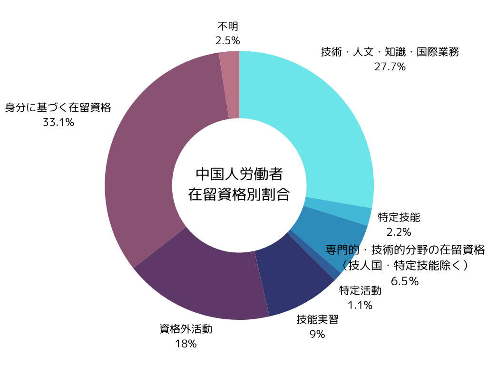
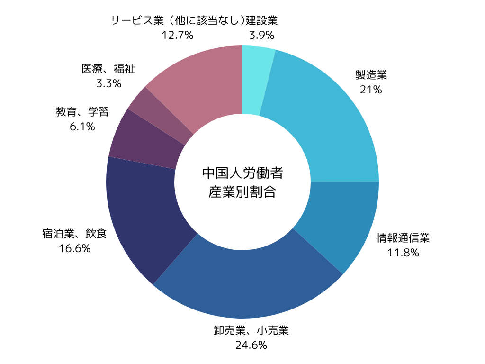

日本で働く外国人労働者数に占める割合がベトナムに次ぐ2番目。中国人材を採用する際には、その文化的背景や特徴を理解し、適切なアプローチを取ることが重要です

本記事は、日本での就労経験が豊富な弊社スタッフへのインタビューをもとに特徴・注意点のコンテンツを作成しております。ただし、内容はあくまでもスタッフ個々の経験に基づくものであり、国籍ごとに一概に当てはまるものではございません。参考情報としてご覧いただければ幸いです。

## **中国人材採用の現状と基本情報**

### **中国の基本情報**

中国は世界第4位の国土面積を持つ広大な国で、約960万平方キロメートルに及びます。この広大さゆえに、地域によって気候や文化、住民の気質も大きく異なります。例えば、北京は政治の中心地として知られ、上海は経済の中心地として発展しています。こうした地域差は、中国人材を採用する際に考慮すべき重要な要素となります。

### **日本における中国人労働者の雇用状況**

厚生労働省の「外国人雇用状況」の届出状況まとめによると、日本で働く中国人労働者は39.7万人（令和5年10月時点）となっています。これは外国人労働者全体の19.4%を占め、ベトナム人（51.8万人）に次いで2番目に高い割合です。少子高齢化の影響で日本人労働者が減少傾向にある中、多くの中国人労働者が日本で働き、日本の労働力不足を補っています。

出典：[「外国人雇用状況」の届出状況まとめ（令和５年10月末時点）｜厚生労働省](https://www.mhlw.go.jp/stf/newpage_37084.html)

### **中国人労働者の在留資格と業種別内訳**

中国人労働者の在留資格は多岐にわたりますが、最も多いのが「専門的・技術的分野の在留資格（技術・人文・知識・国際業務、特定技能、その他）」で、全体の約36%を占めています。この在留資格は、高度な専門知識や技術を持つ人材に与えられ、IT技術者、エンジニア、研究者などが該当します。

次に多いのが「身分に基づく在留資格」で、約33%を占めています。これは日本人の配偶者や永住者、日系人などが該当し、就労に制限がありません。

三番目に多いのが「資格外活動」で、約18%となっています。これは主に留学生のアルバイトなどが該当し、本来の在留目的以外の活動を許可されたものです。これら上位3つの在留資格で、日本で働く中国人労働者の約9割を占めています。

業種別では、卸売業・小売業が24.6％（82,909人）と最も多く、次いで製造業21％（70,919人）、宿泊業・飲食サービス業16.6％（55,814人）と続きます。情報通信業や建設業でも多くの中国人労働者が活躍しています。

出典：[「外国人雇用状況」の届出状況まとめ（令和５年10月末時点）｜厚生労働省](https://www.mhlw.go.jp/stf/newpage_37084.html)

### **中国国内の厳しい就職事情**

中国国内の就職状況は厳しさを増しています。16〜24歳の若者の約2割が失業中であり、特に新卒者の就職難が深刻です。この背景には以下のような要因があると考えられています。

・学歴偏重：中国では学歴によって給与が大きく左右される傾向があり

・オーバースペック：大卒で十分な職位に院卒者が応募するケースが多く、下位層の就職が困難に

・経済状況：コロナ禍の影響で景気回復が遅れ、給与やボーナスへの影響もあり

このような状況を背景に、中国政府は新たな教育政策を打ち出しています。しかし、国内の厳しい状況から、海外での就職を視野に入れる学生も増えているのが現状です。

### **中国人材が日本を就労先として選ぶ理由**

中国人材が日本を就労先として選ぶ理由は複数あり、主に以下のような理由が挙げられます。

- 一般的に日本の給与水準は中国本土と比較して高いこと中国では地域差が非常に大きく、沿岸部の主要都市（北京、上海、広州、深圳）では給与水準が高い一方で、内陸部や地方都市では給与水準が低い傾向があります。日本でも地域差はありますが、中国ほどの極端な差はなく、主に大都市（東京、大阪）で若干高い水準となっています。

- 中国国内の厳しい就職事情近年、中国では大学進学率が向上し、就職市場の競争が激化しています。その結果、希望する職種に就くことが難しく、満足のいく収入を得られない人も少なくありません。一方、日本では人手不足が深刻化しており、必要なスキルや経験を持つ人材であれば、比較的容易に就職できる環境が整っています。

- 地理的な近さと文化的な親和性日本は中国の隣国として古くから交流があり、文化や言語に共通点が多いため、中国人にとって生活しやすい環境となっています。日本の治安の良さや衛生面での優れた環境も、魅力です。

## **中国人労働者の特徴**

###  **家族を大切にする文化**

中国人労働者の特徴として、家族を非常に大切にする文化があります。共働きが一般的な中国では、子どもの世話を祖父母が担当することも珍しくありません。職場でも家族の話題が頻繁に出ることがあります。

特に春節（旧正月）は最も重要な祝日とされ、家族と過ごすために帰省を希望する従業員が多くなります。この時期は通常1月か2月頃に当たります。

### **給与・待遇重視の傾向**

中国人労働者の多くは、仕事を生活のための手段として捉える傾向があります。「やりがい」よりも、給与や待遇を重視する傾向が強いです。職場でのストレスも含めて給与の対価と考える傾向があるため、自身の能力や負担に見合わないと判断した場合、昇給交渉や転職を選択しやすい傾向があります。

### **地域性による多様性**

中国の広大な国土は、それぞれの地域に独自の文化や気質、方言をもたらしています。例えば、北京は政治の中心地、上海は経済の中心地として知られていますが、それぞれの地域で人々の価値観や行動様式が異なることがあります。

また、地域間の経済格差も大きいため、同じ中国人であっても出身地域によって考え方や価値観が大きく異なる場合があります。このため、「中国人だから」と一括りにせず、個々の背景や特性を理解することが重要です。

## **採用の際の注意点**

### **公平で明確な評価制度**

中国人材を採用する際は、公平で明確な評価制度を設けることが重要です。特に以下の点に注意が必要です。

- 年功序列は避け、能力主義の評価を心がける

- 評価基準を明確にし、透明性を確保する

- 定期的なフィードバックを行い、改善点や期待を明確に伝える

### **文化の相互理解と尊重**

お互いの文化を尊重し、理解を深めることが重要です。

-  中国の文化や習慣に興味を持ち、理解しようとする姿勢を示す

- 相手の文化や習慣に対し、否定的な態度は避ける

- 日本の文化や習慣についても丁寧に説明し、理解を促す

### **個人としての尊重**

「中国人だから」という言い方は避け、一人の人材として扱うことが重要です。

- 国籍を理由にせず、能力やスキルに基づいて評価する

- 個々の特性や背景を理解し、それぞれに合わせたコミュニケーションを心がける

## **まとめ**

中国人材の採用は、日本企業にとって貴重な人材確保の機会となります。しかし、文化の違いや個々の背景を理解し、適切な対応を心がけることが成功の鍵となります。公平な評価制度の構築、相互理解の促進、個人の尊重を基本に、良好な労働環境を整えることが重要です。

TCJグローバルでは、優秀な中国人材の日本への就労支援も行っており、企業が求めるスキルや経験を持った中国材をご紹介しています。また、就職後の日本語フォローや受け入れ企業向けの社内研修も提供し、スムーズな労働環境の整備をサポートします。中国人材の採用をお考えの企業様は、ぜひお気軽にご相談ください。
