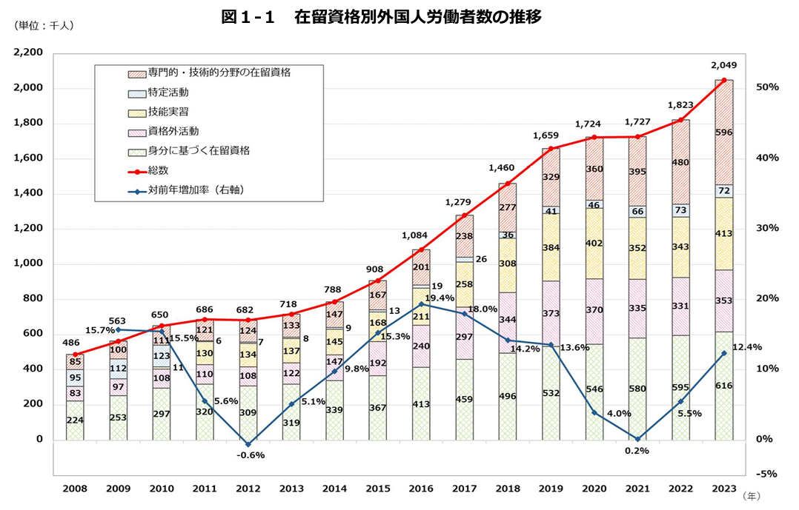

近年、日本企業における外国人材の需要が高まる中、「技術・人文知識・国際業務」（通称：技人国）は、多くの外国人労働者が取得を目指す就労系在留資格の一つとなっています。しかし、その申請プロセスは複雑で、許可基準が明確でないことから、多くの企業が困難を感じています。本記事では、在留資格「技人国」の概要、必要要件、申請時の注意点などを詳しく解説し、企業の人事担当者の皆様に役立つ情報をお届けします。

## 「技人国」の概要と取得者数

「技術・人文知識・国際業務（技人国）」は、一般企業でのホワイトカラー職種に従事する外国人材を対象とした在留資格です。2015年に「技術」と「人文知識・国際業務」が統合されて誕生しました。

この特徴は以下の通りです。

- 単純労働ではなく、専門的な知識や技能を要する業務に従事すること

- 大学で習得した知識や外国語能力を活かせる仕事であること

- その他の活動は原則として認められないこと

厚生労働省の2023年10月の調査によると、日本国内の外国人労働者数は2,048,675人となっており、そのうち「専門的・技能的分野の在留資格」に含まれる「技術・人文知識・国際業務（技人国）」の在留資格を持つ外国人労働者は366,168人で、全体の約17.9％を占めています。この数値は、日本の労働市場において「技人国」の外国人労働者が重要な役割を果たしていることを示しています。現在、IT、エンジニアリング、通訳・翻訳、国際ビジネスなど、様々な専門分野で活躍しています。

出典：[「外国人雇用状況」の届出状況まとめ（令和５年10月末時点）｜厚生労働省](https://www.mhlw.go.jp/stf/newpage_37084.html)

## 「技人国」の対象となる職種

「技人国」は主に以下の3つの分野に分類されます。

### 1\. 技術分野

対象：理学、工学、自然科学分野の技術を要する業務

例：機械工学技術者、ITエンジニア、プログラマー、情報セキュリティ専門家

### 2\. 人文知識分野

対象：法律学、経済学、社会学など人文科学分野の知識を要する業務

例：法務担当者、経済アナリスト、貿易関係の事務職・営業職

### 3\. 国際業務分野

対象：外国文化に基づく思考や感受性を必要とする業務

例：通訳、翻訳者、海外取引担当者、外国人向けデザイナー、語学教師

これらの職種は、高度な専門知識や経験が求められ、日本の経済成長や国際競争力の向上に貢献することが期待されています。

## 「技人国」申請時の重要ポイント

「技人国」の申請には、以下の点に特に注意が必要です.

###  1. 専攻と職務内容の関連性

申請者の学歴や専門分野と、日本で従事する予定の業務内容が密接に関連していることが求められます。特に専門学校卒業者の場合、この点が厳格に審査される傾向にあります。

###  2. 外国人労働者本人の経歴

申請には、下記の通り、本人の学歴もしくは実務経験が必要になります。

**学歴要件**

- 本国または日本の大学・短大・大学院を卒業（学士以上の学位取得）

-  日本の専門学校を卒業（専門士の称号取得）※注意：外国の専門学校は対象外

必要書類：学位証明書、卒業証明書、専門士称号証明書、履修証明書、成績証明書　等

上記の基本的な学歴要件に加えて、特別な例外規定も設けられております。それは、「情報処理技術の資格」に関するものです。具体的には、日本で実施される「情報処理安全確保支援士試験」や「情報処理技術者試験」をはじめとして、中国、フィリピン、ベトナム、ミャンマー、台湾、マレーシア、タイ、モンゴル、バングラデシュ、シンガポール、韓国など、各国で実施される情報処理技術に関する特定の資格を取得された方々も、申請要件を満たすことができます。この特例により、より多様な経歴を持つ方々にも、日本での就労の機会が開かれております。なお、資格取得を証明する際には、成績証明書の提出が求められ、どのような科目を履修したかが確認されます。

**実務経験要件**

- 技術・人文知識分野：10年以上の実務経験

- 国際業務分野：3年以上の実務経験

必要書類：過去の勤務先からの在職証明書

実務経験を証明する際には、過去に勤務した企業から在職証明書を取得する必要があります。しかしながら、以前の勤務先が既に倒産している場合や、その他の理由で証明書の発行が困難な状況では、取得が難しくなってしまいます。雇用の際には、その点も確認が必要です。

### 3\. 会社経営の安定性

申請企業の経営状況が安定しており、外国人従業員に適切な給与を支払える能力があることを示す必要があります。特に新設企業や中小企業は、より詳細な審査を受ける傾向があります。

必要書類：決算書、事業計画書（新設企業や赤字企業の場合）等

### 4\. 雇用の必要性

申請企業の業務において、外国人材を雇用する正当なニーズがあることを示す必要があります。例えば、外国人労働者のいない小規模な会社で労務管理専門の外国人を雇用したり、外国人顧客がほとんどいない企業で通訳を雇用するような場合、許可が下りない可能性があります。

### 5\. 日本人同等以上の報酬

同じ職務に就く日本人従業員と同等以上の報酬を支払うことが求められます。地域や同業他社の賃金水準も参照されるため、不当に低い給与での採用はできません。

必要書類：雇用契約書、派遣契約書、請負契約書　等

### 6\. 外国人労働者本人の素行

本人の過去の行動も審査対象となります。逮捕歴やオーバーワークの有無、資格外活動許可の範囲を超えた就労などがないかチェックされます。

##  申請から許可までの期間

「技人国」の申請から許可までの期間は、申請者や企業の状況によって大きく異なります。

新規申請：平均約50日

変更申請：平均約40日

ただし、実際には1週間程度から半年程度かかるケースもあります。また、大企業ほど審査期間が短くなる傾向があります。雇用開始までに余裕をもって申請しましょう。

## まとめ

「技人国」の取得は、外国人材を採用する企業にとって重要なステップです。申請時には、専攻と職務の関連性、申請者の経歴、企業の経営状態、雇用の必要性、適切な報酬、申請者の素行など、多くの要素が考慮されます。これらの点に十分注意を払い、必要な書類を適切に準備することで、スムーズな申請プロセスを実現できる可能性が高まります。

外国人材の採用をお考えの企業様は、専門家のアドバイスを受けることをおすすめします。株式会社TCJグローバルは、日本語教育における36年の実績を基に、国内外において日本語教育を軸とした人材育成に取り組んでおります。特にベトナムやネパールをはじめとする海外拠点において、日本語教育と日本語教師養成サービスの運営や日本への就労支援等、様々な活動を展開しております。また、外国人労働者を雇用されている企業様向けに、日本語教育コンサルティングや、ニーズに応じた外国人材のご紹介サービスを提供しております。ご相談やお問い合わせは、どうぞお気軽にご連絡ください。
