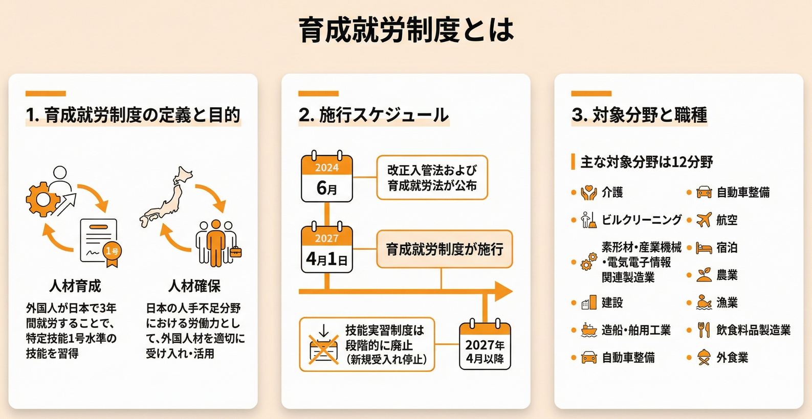

**育成就労制度とは、技能実習制度を発展的に解消し、「人材育成と人材確保」を目的とした新しい外国人雇用制度です。**2024年6月に改正入管法が公布され、2027年4月1日に施行されます。

「技能実習制度が廃止されると聞いたけど、育成就労制度って何？」「現在受け入れている技能実習生はどうなるの？」と不安に感じている企業担当者の方も多いのではないでしょうか。

育成就労制度は、従来の技能実習制度の問題点を改善し、外国人材を日本の労働力として適切に育成・確保することを目指しています。特に「転籍の条件付き容認」「日本語要件の強化」「特定技能制度への明確な移行パス」が大きな変更点です。

本記事では、育成就労制度の全体像から、技能実習制度との具体的な違い、企業が2027年施行までに準備すべきことまで、わかりやすく解説します。

育成就労制度の準備でお困りですか？ TCJグローバルなら、日本語教育から受入れ体制の整備まで一気通貫でサポートします。

[無料で相談してみる →](https://tcj-education.com/ja/foreign-recruitment/)

## 育成就労制度とは？2027年4月施行の新制度を3分で理解

 

育成就労制度は、技能実習制度を発展的に解消し、「就労を通じた人材育成および人材確保」を明確な目的とした新しい外国人雇用制度です。2027年4月1日に施行されます。

従来の技能実習制度が「開発途上地域への技能移転を通じた国際貢献」を建前としていたのに対し、育成就労制度では、外国人材を日本の労働力として育成し、人手不足分野を支えることが主眼となります。この目的の転換により、制度の透明性が高まり、外国人材の権利保護も強化されます。

### 育成就労制度の定義と目的

育成就労制度の正式名称は「外国人の育成就労の適正な実施及び育成就労外国人の保護に関する法律（育成就労法）」に基づく制度です。以下の2つを目的としています：

- **人材育成**：外国人が日本で3年間就労することで、特定技能1号水準の技能を習得
- **人材確保**：日本の人手不足分野における労働力として、外国人材を適切に受け入れ・活用

この2つの目的を明確にすることで、従来の技能実習制度で問題視されていた「実質的には労働力確保なのに、建前は国際貢献」という矛盾が解消されます。（出典：出入国在留管理庁「育成就労制度の概要」令和6年12月改訂版）

### いつから始まる？施行スケジュール

育成就労制度の施行スケジュールは以下の通りです：

| 時期 | 内容 |
| --- | --- |
| **2024年6月** | 改正入管法および育成就労法が公布 |
| **2027年4月1日** | 育成就労制度が施行 |
| **2027年4月以降** | 技能実習制度は段階的に廃止（新規受入れ停止） |

2027年4月1日の施行日まで、あと約1年3ヶ月です。企業は今から準備を進める必要があります。

### 対象分野と職種

育成就労制度の受け入れ対象分野は、特定技能制度の対象分野（特定産業分野）と原則として一致します。これにより、育成就労3年間で習得した技能を、そのまま特定技能1号で活かすことができます。

主な対象分野は以下の12分野です：

- 介護
- ビルクリーニング
- 素形材・産業機械・電気電子情報関連製造業
- 建設
- 造船・舶用工業
- 自動車整備
- 航空
- 宿泊
- 農業
- 漁業
- 飲食料品製造業
- 外食業

各分野には、さらに細かい業務区分が設定されています。例えば建設分野では、型枠施工、左官、コンクリート圧送など12の業務区分があります。

## 育成就労制度と技能実習制度の5つの違いとは？【比較表付き】

育成就労制度と技能実習制度の最大の違いは、「転籍の条件付き容認」「日本語要件の強化」「特定技能への明確な移行パス」の3点です。これらの変更により、外国人材の権利保護と定着率向上が期待されています。

### 比較表で一目瞭然！育成就労 vs 技能実習

| 項目 | 技能実習 | 育成就労 |
| --- | --- | --- |
| **目的** | 国際貢献（技能移転） | 人材育成・人材確保 |
| **転籍** | 原則不可 | 条件付きで可能 |
| **日本語要件** | なし | 入国前A1以上、就労中A2目標 |
| **在留期間** | 最長5年 | 3年（特定技能へ移行） |
| **特定技能への移行** | 試験合格が必要 | 円滑に移行可能 |
| **監理組織** | 監理団体 | 監理支援機関 |

### 違い1: 転籍が条件付きで可能に

技能実習制度では、原則として企業間の転籍（転職）が認められていませんでした。これが外国人労働者の権利を制限し、人権問題の温床となっていました。

育成就労制度では、以下の条件を満たせば、同一業務区分内での転籍が可能になります：

- **就労期間**：1年以上の就労経験
- **技能水準**：一定の技能試験に合格
- **日本語能力**：一定の日本語能力試験に合格
- **業務区分**：同一業務区分内での転籍に限る

この変更により、外国人材は劣悪な労働環境から逃れる選択肢を持つことができ、企業側も優秀な人材を引き留めるために労働環境の改善が求められます。

### 違い2: 日本語要件の強化

育成就労制度では、日本語能力の要件が明確化されました：

**入国前（必須）**：

- 日本語能力A1相当（日本語能力試験N5レベルなど）以上の試験に合格
- または、相当する日本語講習を受講

**就労中（義務）**：

- A2レベル（日本語能力試験N4レベル相当）を目指す日本語講習の受講が義務化
- 企業または監理支援機関が講習を提供

TCJグローバルでは、37年の日本語教育実績を活かし、企業向けにA1からA2レベルへの日本語研修プログラムを提供しています。業界特化型のカリキュラムで、実務で使える日本語能力を効率的に習得できます。

### 違い3: 特定技能制度への明確な移行パス

育成就労制度は、特定技能制度への円滑な移行を前提として設計されています：

**キャリアパス**：

1. 育成就労（3年間）→ 特定技能1号水準の技能を習得
2. 特定技能1号（最長5年）→ 即戦力として活躍
3. 特定技能2号（無期限）→ 家族帯同も可能

技能実習制度では、特定技能へ移行するために別途試験合格が必要でしたが、育成就労制度では3年間の就労を通じて自然に特定技能1号水準に到達することを目指します。これにより、外国人材のキャリアパスが明確になり、長期的な定着が期待できます。

### 違い4: 監理・支援体制の厳格化

技能実習制度における不適切な運営や外国人からの搾取を防ぐため、育成就労制度では監理・支援体制が厳格化されます：

- **名称変更**：監理団体 → 監理支援機関
- **要件強化**：より適切な監理・指導、外国人材の支援・保護が求められる
- **透明性向上**：監理支援機関の活動内容の公開義務化

### 違い5: 費用負担の透明化

外国人材が送り出し機関に支払う手数料について、不当に高額な費用が問題視されてきました。育成就労制度では、手数料の透明化と適正な負担ルールの導入が進められます。

これにより、外国人材の経済的負担が軽減され、来日後の生活の安定につながります。

日本語教育体制の整備でお悩みの方へ

創業37年の実績を持つTCJグローバルが、A1からA2レベルへの日本語研修をサポートします。

[資料請求はこちら（無料）](https://tcj-education.com/ja/foreign-recruitment/)

## 育成就労制度と特定技能の違いは？どう使い分ける？

育成就労制度は「未経験者を3年かけて育成する」、特定技能制度は「即戦力を採用する」という位置づけです。企業のニーズに応じて使い分けることが重要です。

### 目的の違い

| 制度 | 目的 | 対象者 |
| --- | --- | --- |
| **育成就労** | 人材育成 | 未経験者OK |
| **特定技能** | 即戦力採用 | 試験合格者（経験者） |

### 期間とキャリアパス

育成就労制度と特定技能制度は、連続したキャリアパスとして設計されています：

育成就労（3年）→ 特定技能1号（最長5年）→ 特定技能2号（無期限）

合計で最長8年以上、日本で就労することが可能です。特定技能2号に移行すれば、家族帯同も認められ、永住権取得への道も開けます。

### どちらを選ぶべき？

企業のニーズに応じて、以下のように使い分けることをおすすめします：

- **未経験者を育てたい場合** → 育成就労制度
    - 時間をかけて自社の業務に合わせた人材を育成できる
    - 初期費用は抑えられるが、教育コストがかかる
- **即戦力が欲しい場合** → 特定技能制度
    - 試験合格者なので、すぐに現場で活躍できる
    - 採用コストは高いが、教育期間が短縮できる

## 現在の技能実習生はどうなる？移行措置を解説

現在の技能実習生は、育成就労制度施行後も技能実習を継続できます。ただし、特定技能への移行を検討することも可能です。

2027年4月1日の育成就労制度施行後、技能実習制度は新規受入れを停止しますが、既に受け入れている技能実習生については、以下の3つの選択肢があります：

### 移行措置の3パターン

1. **技能実習を継続**
    - 在留期間満了まで技能実習を継続できる
    - 最長5年間の技能実習が可能
2. **育成就労制度へ切り替え**
    - 一定の条件を満たせば、育成就労制度へ移行可能
    - 転籍ルールなど、新制度のメリットを享受できる
3. **特定技能へ移行**
    - 技能試験・日本語試験に合格すれば、特定技能1号へ移行可能
    - 即戦力として、より高い給与での就労が期待できる

### 企業が取るべき対応

企業は、現在受け入れている技能実習生と面談を実施し、以下の点を確認することをおすすめします：

- 技能実習生本人の希望（継続、移行、帰国など）
- 日本語能力の現状（特定技能移行に必要なレベルか）
- 技能水準の現状（特定技能試験に合格できるか）
- 企業側の受入れ方針（育成就労、特定技能のどちらで受け入れるか）

技能実習生の希望と企業のニーズを擦り合わせ、最適なキャリアパスを提案することが、定着率向上につながります。

## 企業が2027年施行までに準備すべき5つのこと

今から準備を始めれば、2027年4月の施行にスムーズに対応できます。以下の5つのステップで、計画的に準備を進めましょう。

### 準備1: 制度の全体像を理解する（今すぐ）

まずは、育成就労制度の基礎知識を習得しましょう：

- 本記事で制度の概要を把握
- 出入国在留管理庁の公式資料（PDF）を確認
- 業界団体のセミナーや説明会に参加

### 準備2: 監理支援機関の選定（2026年中）

現在の監理団体が、育成就労制度の監理支援機関に移行するかを確認しましょう：

- 現在の監理団体に移行予定を確認
- 移行しない場合、新しい監理支援機関を探す
- 複数の機関を比較検討し、サポート内容・費用を確認

### 準備3: 日本語教育体制の整備（2026年中）

育成就労制度では、A1からA2レベルへの日本語講習が義務化されます。企業は、以下のいずれかの方法で日本語教育を提供する必要があります：

- **自社で講習を実施**：日本語教師を雇用または外部講師を招聘
- **監理支援機関に委託**：監理支援機関が講習を提供
- **専門機関に委託**：TCJグローバルなど、日本語教育の専門機関に委託

TCJグローバルでは、37年の日本語教育実績を活かし、企業向けにA1からA2レベルへの日本語研修プログラムを提供しています。業界特化型のカリキュラムで、製造業・建設業・介護など、各業界の実務で使える日本語能力を効率的に習得できます。

### 準備4: 社内規程の見直し（2026年後半）

育成就労制度の導入に伴い、社内規程を見直す必要があります：

- **転籍ルールへの対応**：転籍を希望する外国人材への対応手順を策定
- **就業規則の改定**：育成就労外国人の労働条件を明記
- **日本語講習の実施規程**：講習時間、費用負担などを明確化

### 準備5: 受入れ計画の策定（2027年初頭）

2027年4月の施行に向けて、受入れ計画を策定しましょう：

- 育成就労制度での受入れ人数を計画
- 予算確保（監理支援機関費用、日本語教育費用など）
- 受入れスケジュールの策定

## 育成就労制度のメリット・デメリット

育成就労制度には、技能実習制度の問題点を改善したメリットがある一方で、企業にとっての新たな課題もあります。

### メリット

1. **転籍容認で外国人材の権利保護**
    - 劣悪な労働環境から逃れる選択肢を提供
    - 企業は労働環境改善のインセンティブが働く
2. **特定技能への明確な移行パス**
    - 外国人材のキャリアパスが明確化
    - 長期的な定着が期待できる
3. **日本語要件強化で定着率向上**
    - コミュニケーション能力が向上
    - 職場でのトラブル減少
4. **制度の透明性向上**
    - 目的が「人材確保」と明確化
    - 費用負担の透明化

### デメリット

1. **日本語教育コストの増加**
    - A1→A2レベルの講習が義務化
    - 講習費用、講師費用が発生
2. **転籍リスク**
    - 優秀な人材が他社へ転籍する可能性
    - 育成コストが無駄になるリスク
3. **手続きの複雑化**
    - 新制度への対応で事務負担が増加
    - 監理支援機関との調整が必要

デメリットを最小化するには、労働環境の改善と日本語教育の充実が重要です。TCJグローバルでは、企業の日本語教育体制の整備をサポートしています。

## FAQ（よくある質問）

### Q1: 育成就労制度はいつから始まりますか？

**A:** 2027年4月1日に施行されます。技能実習制度は同日以降、新規受入れを停止し、段階的に廃止されます。

### Q2: 技能実習制度はいつ廃止されますか？

**A:** 2027年4月1日以降、新規受入れが停止されます。既に受け入れている技能実習生は、在留期間満了まで技能実習を継続できます。

### Q3: 育成就労で何年働けますか？

**A:** 最長3年です。その後、特定技能1号へ移行すれば、さらに最長5年（合計8年）就労できます。特定技能2号へ移行すれば、無期限で就労可能です。

### Q4: 転籍は自由にできますか？

**A:** 条件付きで可能です。1年以上の就労、技能試験・日本語試験の合格、同一業務区分内での転籍という条件を満たす必要があります。

### Q5: 日本語要件はどのくらいですか？

**A:** 入国前にA1相当（日本語能力試験N5レベル）以上、就労中にA2レベル（N4レベル相当）を目指す講習の受講が義務化されます。

### Q6: 家族帯同はできますか？

**A:** 育成就労制度では原則不可です。特定技能1号も不可ですが、特定技能2号へ移行後は家族帯同が認められます。

### Q7: 費用はどのくらいかかりますか？

**A:** 監理支援機関への費用（月額3〜5万円程度）、日本語教育費用（年間10〜30万円程度）などが発生します。詳細は監理支援機関により異なります。

### Q8: 現在の技能実習生はどうなりますか？

**A:** 技能実習を継続するか、育成就労・特定技能へ移行するか選択できます。企業は技能実習生と面談し、最適なキャリアパスを提案することをおすすめします。

## まとめ：育成就労制度で外国人材を適切に育成しよう

育成就労制度は、技能実習制度の問題点を改善し、外国人材を日本の労働力として適切に育成・確保するための重要な制度です。2027年4月の施行まで、あと約1年3ヶ月。今から準備を始めれば、スムーズに新制度へ移行できます。

**本記事のポイントをおさらいしましょう：**

1. **育成就労制度は2027年4月施行**：技能実習制度を発展的に解消し、「人材育成と人材確保」を目的とした新制度
2. **技能実習との最大の違いは「転籍容認」「日本語要件強化」**：外国人材の権利保護と定着率向上が期待される
3. **特定技能への明確な移行パスがある**：育成就労3年 → 特定技能1号5年 → 特定技能2号（無期限）
4. **現在の技能実習生は継続または移行を選択可能**：企業は面談を実施し、最適なキャリアパスを提案
5. **今から準備を始めれば、スムーズに対応できる**：制度理解、監理支援機関選定、日本語教育体制整備、社内規程見直し、受入れ計画策定の5ステップ

育成就労制度の導入は、企業にとって新たな課題もありますが、適切に対応すれば、外国人材の長期的な定着と人手不足の解消につながります。特に日本語教育体制の整備は、定着率向上の重要なポイントです。

### 育成就労制度の準備をお考えですか？

TCJグローバルでは、貴社のニーズに合わせた日本語研修プログラムのご提供はもちろん、 育成就労制度への移行準備、受入れ体制の整備まで、一気通貫でご支援します。

創業37年の日本語教育のノウハウを活かし、外国人材の定着率向上をサポートいたします。

[今すぐ無料相談する →](https://tcj-education.com/ja/foreign-recruitment/)
