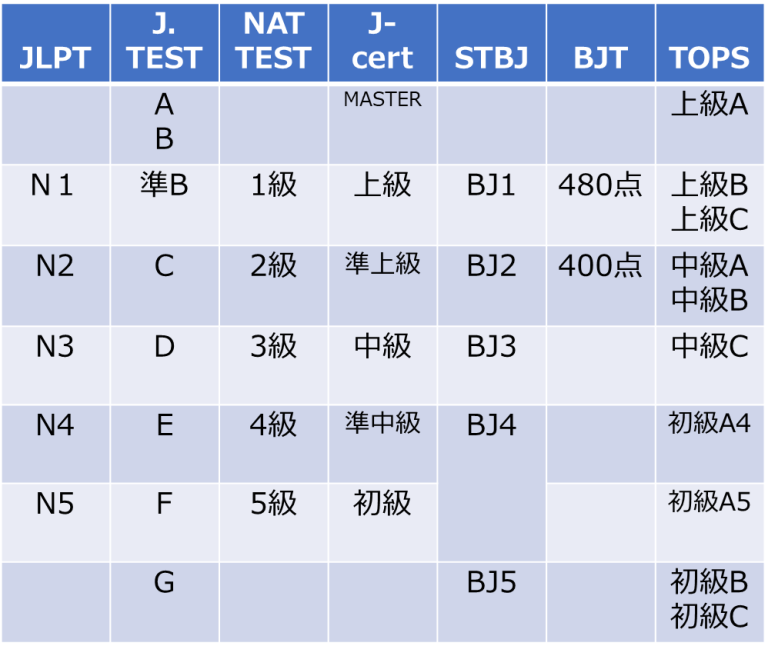

「JLPT N1でも業務の会話ができない…」そんな採用の失敗は、日本語能力の見極めミスが原因です。ミスマッチは、採用コストと現場の大きな負担に繋がります。

この記事では、資格スコアの落とし穴から、本当に「使える」日本語力を見抜く面接術、採用後の定着の仕組みまでを網羅。採用担当者の不安を解消し、自信を持って選考に臨むための実践的なガイドです。

* * *

### なぜ多くの企業が日本語能力の見極めに失敗するのか？

外国人材の採用を成功させるには、まず「よくある失敗」のパターンを知ることが近道です。多くの企業が陥りがちな3つの落とし穴を理解し、採用活動の精度を高めましょう。

### 【落とし穴1】資格スコアの過信：「JLPT N1でも話せない」現実

外国人材の日本語レベルを測る客観的な指標として、最も広く利用されているのが「日本語能力試験（JLPT）」です。そのため、「N1取得者ならビジネスレベルの会話も問題ないだろう」と判断してしまう採用担当者の方は非常に多いのではないでしょうか。しかし、ここに最初の、そして最大の落とし穴が潜んでいます。

実際、**「N1を取得しているからと採用したものの、会議ではほとんど発言できず、業務上の細かいニュアンスも伝わらなかった」**というご相談は後を絶ちません。なぜ、このような事態が起こるのでしょうか。

その理由は、JLPTが主として「読む能力（読解）」と「聞く能力（聴解）」という、インプット能力を測定するマークシート形式の試験だからです。ビジネスの現場で不可欠となる「話す（スピーキング）」や「書く（ライティング）」といったアウトプット能力は、試験の評価項目に直接含まれていないのが実情です。

試験対策に特化して高得点を取得した方の場合、実践的なコミュニケーション能力が必ずしもスコアに伴っているわけではないのです。もちろん、JLPTのスコアは候補者の語彙力や文法理解度を示す重要な参考指標にはなります。ですが、その点数だけを信じて「仕事で使える日本語力」があると判断するのは、極めて危険な考え方だと言えるでしょう。

### 【落とし穴2】コミュニケーションの壁：「伝わる」と「使える」は違う

面接で流暢に自己紹介ができ、会話もスムーズに進んだとしても、まだ安心はできません。それは、日常会話レベルで言葉が「伝わる」ことと、ビジネスの現場で言語として「使える」ことの間にある、深くて大きなギャップが存在するからです。

例えば、日本特有の「あれ、うまくやっといて」といった、いわゆる「空気を読む」ことを前提とした曖昧な指示は、外国人材にはまず伝わりません。また、業界特有の専門用語や社内用語が飛び交う会議では、会話の輪に入ることさえ難しくなります。

敬語の使い分けが不正確なために、意図せず顧客を不快にさせてしまう可能性も考えられます。このような「伝わる」と「使える」のギャップが、業務上のミスや人間関係の悪化に繋がる火種となり得ます。採用段階でこの違いを認識しておくことが欠かせません。

### 【落とし穴3】育成視点の欠如：採用後の「こんなはずじゃなかった」

採用をゴールだと捉えてしまい、入社後の「育成」という視点が欠けているのも危険です。「入社さえすれば、周りの日本人とコミュニケーションをとるうちに、自然と業務に必要な日本語も上達するだろう」という期待は、多くの場合、双方にとって不幸な結果を招きます。

十分なサポートがないまま現場に配属された外国人材は、言葉の壁から孤立し、本来の能力を発揮できずに自信を失っていきます。一方、受け入れた現場の社員も、どう接して良いかわからず、コミュニケーションに過度な負担を感じてしまうでしょう。

こうした状況は、企業と本人の双方にとって「こんなはずじゃなかった」という事態に繋がり、早期離職の大きな原因となります。これは本人の資質の問題ではなく、企業の受け入れ体制の問題なのです。採用段階から「入社後にどう育てるか」までを見据える視点が、長期的な活躍には不可欠となります。

> 日本語教育のプロの視点から、貴社に最適な人材のご紹介、選考のサポート、採用後の定着支援までワンストップでご支援します。
> 
> 外国人材の採用や選考でお困りの方は、まずはお気軽に資料請求・お問い合わせください。  
> [\>>資料請求する（無料）](https://tcj-education.com/ja/foreign-recruitment/)  
> [\>>今すぐお問合せする](https://gaikoku-jinzai.tcj-education.com/#contact)

## 【結論】どのレベルが必要？職種・業務別に見る日本語能力の目安

「結局のところ、どのくらいの日本語レベルの人材を採用すればいいのか？」 これは、採用担当者様が最初に直面する最も大きな疑問でしょう。

結論から言うと、必要な日本語レベルは「**どの職種か**」によって大きく異なります。ここでは、一般的な目安を提示しますが、これを参考に、自社の状況に合わせた基準を考えることが重要です。

| JLPTレベル | 求められる能力のイメージ | 主な職種の例 |
| --- | --- | --- |
| N1 | 高度な専門知識に関する議論や交渉ができる | 専門職（研究・開発）、管理職、コンサルタント、海外営業 |
| N2 | ビジネス上の会話や文書作成がある程度できる | 総合職、営業職、広報、顧客折衝が多いIT職 |
| N3 | 定型的な業務や社内での日常的な連携ができる | 一般事務、サービス・接客業、社内連携が主のIT職 |
| N4 | 簡単な指示を理解し、基本的な報告ができる | 製造業（ライン作業）、建設業、介護（現場作業）、清掃 |

### IT、介護、製造…主要な業種で求められる能力の違い

上記の表を、より具体的な業種の視点で見ていきましょう。

- **IT業界**: 同じエンジニアでも、顧客と直接仕様の打ち合わせを行うポジションであればN2以上が望ましいでしょう。一方、開発がメインで社内コミュニケーションが中心であれば、N3レベルでも十分に活躍できる可能性があります。

- **介護・サービス業**: マニュアルに沿った定型的な会話力（N3相当）に加え、お客様や利用者様の気持ちを汲み取る細やかな聴解力や、緊急時に的確な報告ができる会話力が求められることも少なくありません。

- **製造業**: まず最優先されるのは、安全に関する指示を絶対に聞き逃さない聴解力（N4以上）です。その上で、チームでの改善活動や報告業務などが加わる場合は、N3以上の能力が求められることになります。

### 最重要：自社の「誰と、何をするか」でレベルを定義する

最終的に、最適な日本語レベルを判断するために最も重要なのは、**「採用する人材が、自社で『誰と、何をするのか』を具体的に想定すること」**です。

以下の問いを、ぜひ社内で検討してみてください。

- **コミュニケーションの相手は誰か？**（日本人社員のみ？ 顧客？ 海外の取引先？）

- **読む必要がある資料は何か？**（作業マニュアル？ 専門的な仕様書？ 顧客へのメール？）

- **行うべきアウトプットは何か？**（口頭での報告？ チャットでの連絡？ 報告書の作成？）

画一的な基準に頼るのではなく、これらの業務内容に落とし込んで考えることで、貴社にとって本当に必要な日本語能力のレベルが、自ずと見えてくるはずです。

## 候補者の日本語能力を「客観的に」測る7つの主要試験

面接での主観的な評価に加えて、候補者の日本語能力を客観的な指標で把握することも、採用のミスマッチを防ぐ上で非常に重要です。その代表的な手段が、各種の日本語能力試験です。

ここでは、日本国内の企業が採用選考で参考にすることが多い、7つの主要な試験をご紹介します。それぞれの特徴を理解し、自社の採用基準を設ける際の参考にしてください。

#### ① 日本語能力試験（JLPT）：最も一般的な指標だが注意点も

日本語能力試験（JLPT）は、国内外で最も広く認知されている日本語試験です。そのため、応募者の多くが何らかのレベルのスコアを保有している可能性が高く、日本語能力を測る上での「共通言語」と言えるでしょう。レベルはN1からN5までの5段階に分かれており、企業の募集要項でも頻繁に基準として用いられます。

ただし、先の「落とし穴」でも触れた通り、この試験は主に「読解」と「聴解」の能力を測るものです。そのため、JLPTのスコアだけで会話力や実務遂行能力を判断せず、必ず面接でのコミュニケーションと併せて評価することが求められます。

**公式HP**：[日本語能力試験 JLPT](https://www.jlpt.jp/)

### ② BJTビジネス日本語能力テスト：ビジネス特化型なら最有力

オフィスワークや営業職など、ビジネスシーンでの日本語コミュニケーション能力を特に重視したい場合に非常に有効なのが、BJTビジネス日本語能力テストです。この試験は、ビジネスメールの読解や電話応対、グラフを用いた情報理解など、より実践的なビジネス場面を想定した問題で構成されています。

また、年間を通じて都合の良い時にテストセンターで受験できるため、多忙な社会人や、日本語能力をすぐに証明したい求職者にも利用しやすい点が特徴です。

**公式HP**：[BJTビジネス日本語能力テスト](https://www.kanken.or.jp/bjt/)

### ③ J.TEST 実用日本語検定：会話・実践力重視の検定

J.TEST（実用日本語検定）は、聴解試験の比重が高いことが特徴で、より「生きた日本語」の実践的なコミュニケーション能力を客観的に測定することに長けています。年6回実施されるため、JLPTの受験機会を逃した候補者の直近の実力を測る際にも役立ちます。

**公式HP**：[J.TEST実用日本語検定](https://j-test.jp/)

### ④〜⑦ その他のおもな日本語試験

上記3つの他にも、特定の目的や状況に応じて活用できる試験があります。

- **日本語 NAT-TEST**：JLPTに準拠した形式のため、学習者の実力や学習進捗を測るのに適しています。年6回実施。  
    **公式HP**：[日本語NAT-TEST](https://www.google.com/search?q=https://www.nat-test.com/)

- **J-cert 生活・職能日本語検定**：JLPTのN1を超える、さらに高度な日本語能力を測定できるレベルが設定されています。  
    **公式HP**：[J-cert生活・職能日本語検定](https://j-cert.jp/)

- **STBJ 標準ビジネス日本語テスト**：ビジネス日本語に特化していますが、実施地域が限られるため、受験を検討する際は開催国の確認が必要です。  
    **公式HP**：[STBJ 標準ビジネス日本語テスト](https://www.google.com/search?q=http://www.ajlea.jp/stbj.html)

- **TOPJ 実用日本語運用能力試験**：日本の文化や社会への理解度も評価対象となるユニークな試験です。年6回実施。

**公式HP**：[TOPJ 実用日本語運用能力試験](https://topj-test.org/)

上記7つの日本語試験は、日本の出入国在留管理庁も公式に認めますが、  
JLPT日本語能力試験のN5レベル相当あるいはそれ以上のレベルのみ、  
日本語能力の証明として、留学申請に使用できるので、ご注意ください。

下記は、TCJがまとめた各日本語能力テストのレベル比較表です。

## 面接で「本当に使える日本語力」を見抜く実践的な質問術

日本語試験のスコアはあくまで参考情報です。候補者の「本当に使える日本語力」は、実際の対話、つまり面接の場でしか見極めることはできません。

ここでは、書類選考の段階から面接本番まで、候補者の日本語能力を多角的に評価するための具体的な手法と、そのまま使える質問テンプレートをご紹介します。

### 書類選考で見るべきは「資格」より「具体性」

面接に進む前の書類選考の段階でも、日本語能力を推し量るヒントは隠されています。チェックすべきは、JLPTのスコアだけではありません。

- **文章の正確さと丁寧さ**：誤字脱字がなく、自然な日本語で書かれているかは、基本的なライティング能力と仕事に対する真摯な姿勢を示します。

- **志望動機の具体性**：定型文をコピー＆ペーストしたような内容ではなく、自社の事業内容をきちんと理解した上で、自分の言葉で「なぜこの会社で働きたいのか」が書かれているかを確認しましょう。これは、読解力と思考力の高さを表します。

- **職務経歴の説明**：過去の業務内容が、誰にでも分かるように具体的かつ論理的に説明されているか。これも、自身の経験を言語化する能力の重要な指標となります。

これらの書類から得た「仮説」を、次の面接で検証していくという意識を持つことが重要です。

## オンライン面接・対面面接それぞれのチェックポイント

面接形式によっても、見るべきポイントは少し異なります。

- **対面面接**：入室から退室までの一連の立ち居振る舞いや、相槌、表情といった非言語コミュニケーションも評価の対象になります。対面ならではの緊張感の中で、どれだけ落ち着いて話せるかを見ることができます。

- **オンライン面接**：事前に接続環境を整えられているか（計画性）、相手に伝わるようハキハキと話す意識があるか、画面越しでもリアクションを返せるか、といった点を確認しましょう。通信のタイムラグがある中で、会話のテンポを合わせようとする姿勢も大切な評価ポイントです。

## 能力別に見抜く！面接質問テンプレート

面接では、質問の投げかけ方を工夫することで、様々な側面の日本語能力を測ることが可能です。

### ① 基本的な会話のスムーズさを測る質問

アイスブレイクを兼ねて、自然な会話のキャッチボールができるかを確認します。

> **質問例：**
> 
> 「今日はここまでどうやって来られましたか？時間はかかりましたか？」
> 
> 「日本の生活にはもう慣れましたか？最近、何か面白い発見はありましたか？」
> 
> 「週末はいつも何をされていることが多いですか？」

ここでは回答の内容そのものよりも、淀みなく話せるか、適切な語彙を選べているか、会話を続けようとする意欲があるか、といった点に注目します。

### ② 論理的思考力と言語化能力を測る「深掘り質問」

表面的な回答に対し、「なぜ？」「具体的には？」と一歩踏み込むことで、物事を構造的に捉え、自分の言葉で説明する能力があるかを見極めます。

> **質問例：**
> 
> （成功体験について）「そのプロジェクトが成功した一番の要因は、何だったと**ご自身で分析**しますか？」
> 
> （あなたの強みについて）「その強みを発揮できた**具体的なエピソード**を、当時の状況と併せて教えてください。」
> 
> （志望動機について）「当社のどのような点に魅力を感じましたか？**なぜそう思われた**のでしょうか？」

回答に論理的な一貫性があるか、抽象的な言葉だけでなく具体的な事実を交えて話せるかがポイントです。

### ③ 業務遂行能力を測る「シチュエーション質問」

実際の業務で起こりうる場面を想定した質問は、候補者の実践的な日本語能力と問題解決能力を同時に測るのに非常に有効です。

> **質問例：**
> 
> （オフィスワーク向け）「もし、上司からの指示内容が一度で理解できなかった場合、あなたなら何と言って聞き返しますか？」
> 
> （接客業向け）「お客様から、注文と違う商品が届いたとご指摘を受けた場合、まず最初に何と謝罪し、どう対応しますか？」
> 
> （チームワーク）「会議で、あなたの意見に他のメンバーから反対意見が出ました。どのようにあなたの考えを伝えますか？」

適切な敬語が使えるか、パニックにならず冷静に対応しようとする姿勢があるか、といった点も重要な評価基準となります。

### ④ 候補者の本当の理解度を知る「逆質問」の促し方

面接の最後に「何か質問はありますか？」と逆質問を促すのは、候補者の意欲だけでなく、日本語の聴解力と理解度を測る絶好の機会です。

こちらが話した会社説明や業務内容を正確に理解していなければ、的を射た質問はできません。「調べれば分かること」ではなく、面接の場でしか聞けないような本質的な質問が出てくるかどうかに注目しましょう。鋭い質問ができるということは、高いレベルの日本語能力と思考力を備えている証左と言えます。

## 採用して終わりじゃない！定着・活躍を支援する3つの仕組み

無事に採用が決まったとしても、それで終わりではありません。むしろ、ここからが本当のスタートです。どんなに優秀な人材を採用できても、受け入れる側の土壌が整っていなければ、その能力は十分に発揮されず、残念ながら早期離職に繋がってしまうでしょう。

ここでは、採用した外国人材が安心して定着し、最大限のパフォーマンスを発揮するために不可欠な「仕組みづくり」について、3つのポイントを解説します。

### ① 「やさしい日本語」と異文化理解

コミュニケーションの問題は、外国人材の日本語能力だけで解決するものではありません。受け入れる日本人社員側の「伝える努力」と「歩み寄る姿勢」が、実は何よりも重要となります。

専門用語を避け、シンプルな言葉に変換する「やさしい日本語」を心がけるだけでも、業務の正確性は格段に向上します。また、日本のビジネス慣習である「報連相」や「時間厳守」といった文化は、海外では必ずしも当たり前ではありません。こうした文化の違いを前提とし、なぜそれが必要なのかを丁寧に説明することが、無用な誤解や摩擦を防ぎます。日本人社員向けに簡単な異文化理解研修を行うことも非常に効果的でしょう。

### ② 学習支援とメンター制度

「入社すれば、日々の業務の中で自然と日本語は上達するはず」という期待だけでは不十分です。企業として、本人の学習意欲を積極的にサポートする姿勢が、成長を大きく後押しします。

業務で頻繁に使う専門用語のリストを渡したり、オンライン日本語学習サービスの費用を補助したりと、企業が学習を支援する方法は様々です。また、仕事のことから生活の悩みまで気軽に相談できる日本人社員を「メンター（相談役）」としてつける制度は、本人の孤立を防ぎ、精神的な大きな支えとなるでしょう。

### ③ キャリアパスと評価制度

外国人材が日本企業で働く上で、最も大きな不安を感じるのが「キャリアの将来性」と「評価の公平性」です。

「この会社で頑張れば、将来どうなれるのか」というキャリアパスを明確に示すことが、仕事へのモチベーションを大きく左右します。同時に、「外国人だから」という理由で評価に差が生まれることのないよう、誰にとっても透明で公平な人事評価制度を構築し、その内容を本人にしっかりと説明することが不可欠です。公平な評価と将来への希望が、優秀な人材の長期的な定着に繋がります。

* * *

### H2: 外国人採用の日本語能力に関するQ&A

ここでは、採用担当者の皆様からよく寄せられる、日本語能力に関する細かいけれど重要な疑問について、Q&A形式でお答えします。

### Q. 在留資格と日本語レベルは関係ありますか？

**A.** はい、関係がある場合があります。

特に、在留資格「特定技能」を取得する際には、「日本語能力試験（JLPT）でN4以上」などが要件の一つとして定められています。一方で、「技術・人文知識・国際業務」のような専門職向けの在留資格には、明確な日本語レベルの要件はありません。ただし、業務を遂行できるコミュニケーション能力があるかは総合的に判断されるため、結果として一定の日本語能力は必要となります。

### Q. 日本語が全く話せない人の採用は可能ですか？

**A.** 職務内容によりますが、可能です。

例えば、専門スキルが重視されるITエンジニア職で、社内の公用語が英語である場合などが考えられます。ただし、その場合でもチームとの最低限の連携や、日本での生活をサポートする社内体制は不可欠です。誰の助けもなしに業務を進め、生活していくのは非常に困難であることを理解しておく必要があります。

### Q. 面接に通訳は同席させるべきですか？

**A.** 日本語能力を正確に見極めたいのであれば、おすすめしません。

面接は、候補者の「生きた日本語力」や「とっさの対応力」を見るための重要な機会です。通訳を介してしまうと、候補者本人が本当に内容を理解しているのか、自分の言葉でどれだけ表現できるのかが分からなくなってしまいます。高度な専門スキルについて深く議論したい、といった限定的な目的がある場合にのみ検討するのが良いでしょう。

### まとめ：日本語能力の見極めは、未来の仲間への「最初の支援」です

この記事では、外国人材を採用する際の日本語能力の見極め方について、陥りがちな落とし穴から、具体的な面接での質問術、そして採用後の定着・活躍を支援する仕組みまで、幅広く解説してきました。

多くの情報を紹介しましたが、最も大切な心構えは、日本語能力のチェックを単なる「選別のためのテスト」と捉えないことです。候補者の日本語レベルを正確に把握しようとすることは、その人に合った仕事や環境を準備し、入社後にスムーズにスタートを切ってもらうための、企業側ができる**「最初の支援」**に他なりません。

> 日本語教育のプロの視点から、貴社に最適な人材のご紹介、選考のサポート、採用後の定着支援までワンストップでご支援します。
> 
> 外国人材の採用や選考でお困りの方は、まずはお気軽に資料請求・お問い合わせください。  
> [\>>資料請求する（無料）](https://tcj-education.com/ja/foreign-recruitment/)  
> [\>>今すぐお問合せする](https://gaikoku-jinzai.tcj-education.com/#contact)
