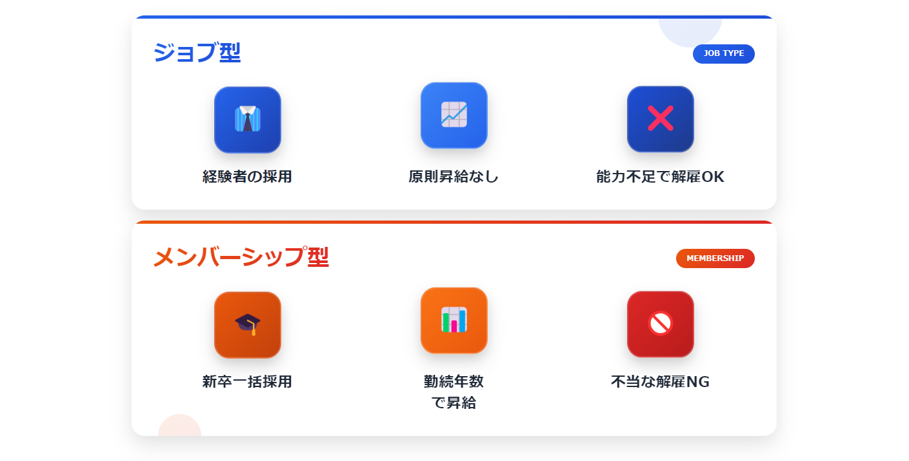

日本人と同じ感覚で作成した求人票では、求める外国人材からの応募が集まらない、あるいはミスマッチが起こりがちです。その原因は、仕事の範囲を明確にする「JOB型雇用」が主流であるなど、根本的な文化や考え方の違いにあります。

この記事では、その違いを踏まえ、具体的な書き方をOK例・NG例で解説。さらに、よくある失敗パターンや業種別の書き分け、応募を増やす募集チャネル戦略まで、実践的なノウハウを網羅しました。すぐに使えるテンプレートも提供し、貴社の採用成功を支援します。

## なぜ日本人向け求人票ではダメなのか？外国人採用の「2つの大前提」


「日本人向けと同じ求人票を出しているのに、なぜか外国人材には響かない…」 その理由は、仕事やコミュニケーションにおける根本的な「大前提」が異なるからです。

その違いは、仕事の捉え方が『JOB型』であること、そしてコミュニケーション文化が『ローコンテクスト』であること、この2点に集約されます。この「2つの大前提」を理解することが、効果的な求人票作成の絶対的な第一歩です。

### 大前提1：思考の違い「メンバーシップ型雇用」vs「JOB型雇用」



日本企業と海外企業の雇用に対する考え方の違いを、以下の表で比べてみましょう。

| 項目 | メンバーシップ型（日本で主流） | JOB型（海外で主流） |
| --- | --- | --- |
| 採用基準 | ポテンシャル、人柄（新卒一括採用など） | 特定の職務に必要なスキル、経験 |
| 仕事の範囲 | 曖昧。会社の指示で部署異動や転勤もある | 契約書（職務記述書）で明確に規定される |
| 働く人の意識 | 「〇〇会社に所属している」 | 「〇〇という仕事（職務）をしている」 |
| 求人票で重視 | 企業理念、安定性、社風 | 具体的な職務内容、責任範囲、目標 |

つまり、多くの外国人材は「どの会社に所属するか」よりも先に「自分がどんな仕事をするのか」を最重要視します。職務内容が曖昧な求人票は、彼らにとって「中身の分からない福袋」のようなもので、応募する以前の選択肢にすら入らないのです。

### 大前提2：文化の違い「ハイコンテクスト」vs「ローコンテクスト」


コミュニケーションのスタイルにも、大きな違いがあります。

- **ハイコンテクスト文化（日本）**: 「空気を読む」「行間を読む」「察する」ことが美徳とされ、言葉にされていない文脈や背景を共有していることが前提のコミュニケーションです。求人票でも「若手が活躍できる職場」と書けば、風通しの良さや裁量権の大きさを"察して"もらうことを期待します。

- **ローコンテクスト文化（海外の多く）**: 言葉にされたことが全てであり、情報は明確・具体的・直接的に伝えられるべきだと考えます。「若手が活躍できる職場」と書かれても、「具体的に、入社何年目でどのような裁量権が与えられるのか？」が書かれていなければ、その魅力は伝わりません。

この文化の違いにより、日本では「書かなくても分かるだろう」と省略しがちな福利厚生やサポート体制も、「書かれていない＝存在しない」と判断されてしまうことを忘れてはなりません。

### 求人票は「職務内容を具体的に書く」のがグローバルスタンダード

以上の『JOB型思考』と『ローコンテクスト文化』という2つの大前提から導き出される結論は一つです。

外国人採用における求人票は、「誰が読んでも誤解の余地がないほど、具体的かつ明確に書くこと」がグローバルスタンダードとなります。次のセクションからは、この大前提に基づき、具体的な項目別の書き方をOK例・NG例で見ていきましょう。

## よくある失敗パターンと改善例

求人票を作成する際、多くの企業が陥りがちな失敗パターンがあります。ここでは、実際に「応募が来なかった」「ミスマッチが起きた」という事例をもとに、改善策を解説します。

### 失敗例1：職種名が曖昧で、何をする仕事か分からない

**NG例**: 「総合職」「営業スタッフ」「マーケティング担当」

外国人材にとって、これらの職種名は具体性に欠けます。「総合職」は日本特有の概念であり、海外では通用しません。また、「営業」といっても、新規開拓なのかルート営業なのか、法人向けなのか個人向けなのかで必要なスキルが全く異なります。

**改善例**: 「法人向け新規開拓営業（SaaS製品）」「Webマーケター（SEO・コンテンツ制作）」「グローバル市場アナリスト」

このように、職種名だけで「何をする仕事か」が具体的にイメージできるようにすることが重要です。

### 失敗例2：給与の内訳が不明で、手取りが分からない

**NG例**: 「月給25万円〜」「年収350万円〜500万円」

「〜」という幅のある表現は、最低額で提示されるのではないかという不安を煽ります。また、その金額に何が含まれているのか（残業代、手当など）が不明瞭だと、生活設計ができません。

**改善例**:
```
月給：300,000円
【内訳】
・基本給：240,000円
・固定残業代：60,000円（月30時間分を含む。超過分は別途支給）
想定年収：4,200,000円（月給×12ヶ月＋賞与2回）
```

基本給と手当を分けて記載し、固定残業代がある場合は時間数も明記することで、透明性が高まります。

### 失敗例3：福利厚生が「完備」のみで、具体的な内容が分からない

**NG例**: 「福利厚生完備」「各種手当あり」

「完備」という言葉だけでは、何が提供されるのか全く分かりません。特に外国人材が気にする「ビザサポート」「住宅支援」「日本語研修」などの情報がないと、応募をためらってしまいます。

**改善例**:
```
【福利厚生】
・各種社会保険完備
・交通費全額支給
・住宅手当（月3万円）
・年間休日125日

【外国人社員向けサポート】
・就労ビザ取得・更新手続きの費用全額会社負担
・提携不動産会社の紹介による住居探しサポート
・入社後3ヶ月間のビジネス日本語研修（週1回）
```

このように、具体的な内容を箇条書きで列挙することで、安心感を与えられます。

## 【項目別】OK例/NG例で学ぶ！外国人材に"響く"求人票の書き方


「2つの大前提」を踏まえ、ここからは具体的な求人票の項目別に、候補者の心に「響く」書き方をOK例・NG例で徹底解説します。なぜその表現がNGで、どうすれば魅力的に伝わるのか、その思考プロセスをぜひ盗んでください。

### 職務内容（Job Description）：具体的でなければ"存在しない"のと同じ

最も重要な項目です。JOB型思考の候補者は、ここが曖昧な時点で求人票を閉じてしまいます。

- **NG例**  
`営業職として、当社のサービスを広めていただきます。`  
`マーケティング業務全般をお任せします。`

- **なぜNGか？**  
「サービスを広める」「マーケティング全般」では、具体的に何をするのか全く想像できません。新規開拓なのかルート営業なのか、SNS運用なのか広告分析なのか、候補者は自分のスキルが活かせるか判断できないのです。

- **OK例**  
**【営業職の例】**  
`法人向け新規開拓営業担当として、以下の業務を担っていただきます。`  
`・ターゲットリストに基づくテレアポ、メールでのアポイント獲得（1日30件程度）`  
`・顧客へのオンライン商談、サービス提案、クロージング`  
`・Salesforceへの活動記録入力`

**【マーケティング職の例】**  
`Webマーケターとして、自社メディアの集客をお任せします。`  
`・SEOコンテンツの企画、キーワード分析`  
`・外部ライターへの記事執筆ディレクション`  
`・Google Analyticsを用いた効果測定と改善提案（月次レポート作成）`

### 応募資格（Qualifications）：スキルレベルを明確に定義する

必要なスキルは、誰が読んでも同じ解釈ができるレベルまで具体化することが重要です。

- **NG例**  
`コミュニケーション能力が高い方`  
`PCの基本操作ができる方`  
`日本語が堪能な方`

- **なぜNGか？**  
「高い」「基本」「堪能」といった形容詞は、人によって基準がバラバラです。候補者は応募すべきか判断に迷い、結果として応募をためらってしまいます。

- **OK例**  
`法人営業経験（3年以上）`  
`Excel（VLOOKUP関数、ピボットテーブル）を使用したデータ集計スキル`  
`日本語能力試験（JLPT）N2以上、または同等のビジネス会話能力`

### 歓迎要件（Preferred Qualifications）：「あれば尚可」の伝え方

必須ではないが、持っていると有利なスキルを記載します。これも具体的に書くことで、企業が求める人物像をより明確に伝えられます。

- **NG例**  
`マーケティング経験があれば尚可`  
`英語力歓迎`

- **OK例**  
`BtoB SaaS業界でのマーケティング経験`  
`ビジネスレベルの英語力（TOEIC 800点以上目安）。海外支社とのメールやり取りで活用できます。`

### 給与・待遇（Salary & Benefits）：誤解を生まない透明性が命

給与は、候補者が生活を設計する上で最も重要な情報の一つです。曖昧な表現は不信感に繋がります。

- **NG例**  
`月給25万円〜（経験・能力を考慮し決定）`  
`年収350万円〜500万円`

- **なぜNGか？**  
「〜」という幅のある表現は、最低額で提示されるのではないかという不安を煽ります。また、その金額に何が含まれているのか（残業代、手当など）が不明瞭です。

- **OK例**  
`月給：300,000円`  
`【内訳】`  
`・基本給：240,000円`  
`・固定残業代：60,000円（月30時間分を含む。超過分は別途支給）`  
`想定年収：4,200,000円（月給×12ヶ月＋賞与2回）`

### 福利厚生・サポート体制（Welfare & Support）：彼らが本当に知りたい情報を書く

ローコンテクスト文化の候補者にとって、「書かれていない＝存在しない」も同然です。特に外国人材が不安に感じるであろうサポート体制は、積極的にアピールしましょう。

- **NG例**  
`福利厚生完備`  
`アットホームな職場です`

- **OK例**  
`【福利厚生】`  
`・各種社会保険完備`  
`・交通費全額支給`  
`・住宅手当（月3万円）`  
`・年間休日125日`

`【外国人社員向けサポート】`  
`・就労ビザ取得・更新手続きの費用全額会社負担`  
`・提携不動産会社の紹介による住居探しサポート`  
`・入社後3ヶ月間のビジネス日本語研修（週1回）`

### 会社紹介・ビジョン（About Us & Vision）：共感を呼ぶストーリーを伝える

ここは、候補者の心に訴えかけるチャンスです。単なる事業内容の羅列ではなく、ストーリーで伝えましょう。

- **NG例**  
`当社は、〇〇年に設立されたIT企業です。主な事業は××です。`

- **OK例**  
`私たちは「テクノロジーで、国境の壁をなくす」というミッションを掲げるITベンチャーです。現在、主力製品である多言語翻訳ツール「△△」は世界15カ国で利用されています。あなたには、この「△△」をさらに多くの人に届けるための重要な役割を担っていただきます。`

### 業種別の書き方のポイント

業種によって、外国人材が重視する情報は異なります。ここでは、IT、製造、介護の3業種について、求人票作成のポイントを解説します。

#### IT業界：技術スタックとリモートワーク可否を明記

IT業界の外国人エンジニアは、使用する技術スタックとリモートワークの可否を最も重視します。

**記載すべき情報**:
- 使用言語・フレームワーク（例：Ruby on Rails, Vue.js, AWS）
- 開発環境（例：GitHub, Docker, Slack）
- リモートワークの可否（例：週2日まで可）
- 技術的な裁量権（例：新技術の導入提案歓迎）

#### 製造業：労働環境と安全対策を詳しく

製造業では、労働環境の安全性と具体的な作業内容が重要です。

**記載すべき情報**:
- 具体的な作業内容（例：自動車部品の組立、検査）
- 労働環境（例：空調完備、安全装備支給）
- 安全対策（例：月1回の安全研修実施）
- 夜勤の有無と手当（例：夜勤手当 月3万円）

#### 介護業界：資格取得支援と日本語研修を強調

介護業界では、資格取得支援と日本語研修の充実度が応募の決め手になります。

**記載すべき情報**:
- 資格取得支援（例：介護福祉士資格取得費用全額補助）
- 日本語研修（例：週2回の日本語レッスン無料）
- キャリアパス（例：入社3年後にリーダー候補）
- 利用者とのコミュニケーション支援（例：翻訳アプリ支給）

## 【コピペOK】今すぐ使える！外国人採用の求人票テンプレート&フレーズ集


具体的な書き方が分かっても、ゼロから作成するのは大変な作業です。

そこで、これまでのポイントを全て盛り込んだ、コピー&ペーストしてすぐに使える「求人票テンプレート」と、各項目でそのまま使える「アピールフレーズ集」をご用意しました。ぜひ、貴社の求人票作成にご活用ください。

### 外国人採用向け求人票テンプレート

以下の\[ \]の部分を貴社の情報に書き換えるだけで、外国人材に響く求人票の骨格が完成します。

* * *

**【職種名】** \[例：Webアプリケーションエンジニア（リーダー候補）\]

**【キャッチコピー】** \[例：あなたの開発スキルで、日本の医療DXを加速させませんか？\]

**【私たちのミッション／事業について】** \[例：私たちは「テクノロジーで、100年先の健康を創る」をミッションに掲げるヘルステック・ベンチャーです。主力製品であるオンライン診療システム「〇〇」は、現在全国500以上の医療機関で導入されています。\]

**【具体的な職務内容（Job Description）】** \[例： ・オンライン診療システム「〇〇」の追加機能開発（要件定義、設計、実装） ・開発チーム（5名）のタスク管理、コードレビュー ・利用技術：Ruby on Rails, Vue.js, AWS, Docker, GitHub\]

**【応募資格（必須スキル）】** \[例： ・Webアプリケーションの開発実務経験（3年以上） ・Ruby on Railsを用いた開発経験 ・日本語能力試験（JLPT）N2以上、または同等のビジネス会話能力\]

**【歓迎要件（歓迎スキル）】** \[例： ・AWSを用いたインフラ構築・運用経験 ・開発チームのリーダーまたはマネジメント経験 ・ビジネスレベルの英語力\]

**【給与・待遇】** \[例： ・想定年収：6,000,000円 〜 8,000,000円 ・月給：420,000円〜 （内訳：基本給 318,000円〜、固定残業代 102,000円〜/月40時間分）※超過分は別途支給 ・賞与：年2回\]

**【福利厚生・外国人社員向けサポート体制】** \[例： ・各種社会保険完備 ・交通費全額支給 ・住宅手当（月3万円） ・就労ビザ取得・更新手続きの費用全額会社負担 ・提携不動産会社の紹介による住居探しサポート ・ビジネス日本語研修（週1回、オンライン）\]

**【勤務地】** \[例：東京都渋谷区〇〇（リモートワーク週2日まで可）\]

**【勤務時間】** \[例：10:00〜19:00（休憩1時間）\]

**【休日・休暇】** \[例：完全週休2日制（土日祝）、年間休日125日、年末年始休暇、有給休暇\]

**【選考プロセス】** \[例：書類選考 → 1次面接（オンライン） → 最終面接（対面） → 内定\]

* * *

### 項目別・そのまま使える！アピールフレーズ集

上記のテンプレートを、さらに魅力的にするための言い回しをご紹介します。ターゲットに合わせて使い分けてみてください。

1. **候補者の心をつかむ「キャッチコピー」**  
**・（スキルアップ志向の候補者向け）**  
`「あなたの〇〇スキルで、日本の××業界に新しい風を吹き込みませんか？」`  
**・（社会貢献志向の候補者向け）**  
`「テクノロジーの力で、日本の△△問題を解決する仲間を募集しています。」`  
**・（グローバル志向の候補者向け）**  
`「多国籍チームで、世界基準のプロダクトを一緒に作りましょう！」`

2. **仕事のやりがいを伝える「職務内容」**  
**・（裁量権をアピールしたい場合）**  
`「入社1年目から、〇〇プロジェクトの主要メンバーとして大きな裁量を持って活躍できます。」`  
**・（チームワークをアピールしたい場合）**  
`「国籍の異なる5名のチームで、毎日アイデアを出し合いながら業務を進めています。」`  
**・（成長環境をアピールしたい場合）**  
`「経験豊富なシニアエンジニアのコードレビューを受けながら、スキルを磨ける環境です。」`

3. **安心感を醸成する「サポート体制」**  
**・（総合的なサポートを伝えたい場合）**  
`「私たちは、あなたの日本での新しい挑戦を、仕事と生活の両面から全力でサポートします。」`  
**・（ビザサポートを強調したい場合）**  
`「複雑なビザの更新手続きは、当社の専門スタッフが全面的にサポートするのでご安心ください。」`  
**・（生活サポートを強調したい場合）**  
`「初めて日本で生活する方も歓迎します。住居探しから銀行口座の開設まで、私たちが一緒にお手伝いします。」`

## ターゲット別のカスタマイズ戦略

外国人求職者は、出身国や文化的背景によって求める情報や優先する条件が異なります。ここでは、ターゲットに応じた求人票のカスタマイズ方法を解説します。

### 求職者の国籍・文化に合わせたアプローチの違い

外国人求職者の国籍ごとに、労働文化や働き方の価値観が異なります。

**欧米出身者**: ジョブディスクリプションを重視する傾向があり、職務内容の具体性と裁量権の大きさを求めます。キャリアパスや昇進の基準を明確に示すことが効果的です。

**アジア出身者**: 職場環境や福利厚生を気にすることが多く、特に住宅支援やビザサポートなどの生活面でのサポート体制を重視します。また、チームワークや安定性をアピールすることも有効です。

### 多言語対応の実践方法

外国人応募者にとって、母国語や英語での情報提供があると応募のハードルが下がります。求人票を多言語対応することで、より広範囲の求職者にアプローチできます。

**多言語求人票の作成時に意識すべきポイント**:
- 直訳ではなく、文化に適した表現を用いる
- 日本特有のビジネス用語（例：「総合職」「新卒一括採用」）は避け、グローバルに通用する表現に置き換える
- 数字や固有名詞は正確に翻訳する

**翻訳時のミスを防ぐためのチェックリスト**:
- ネイティブスピーカーによる確認を受ける
- 専門用語の統一を徹底する
- 文化的な誤解を招く表現がないか確認する

## 応募を増やす募集チャネル戦略

魅力的な求人票を作成しても、それを適切なチャネルで発信しなければ、ターゲットに届きません。ここでは、外国人材にリーチするための効果的な募集チャネルを解説します。

### 効果的な募集チャネル5選

1. **外国人材特化型求人サイト**  
外国人材に特化した求人サイト（例：GaijinPot Jobs、Jobs in Japan、YOLO JAPANなど）は、多言語対応しており、外国人求職者が集まりやすいプラットフォームです。

2. **大学・日本語学校のキャリアセンター**  
大学や日本語学校のキャリアセンターに求人票を掲示することで、学生に直接アプローチできます。学校側も学生の就労支援に積極的なため、協力を得やすいメリットがあります。

3. **ハローワークの外国人雇用サービスセンター**  
ハローワークには外国人専門の窓口があり、無料で求人を掲載できます。特に地方での採用に有効です。

4. **人材紹介会社**  
外国人材に特化した人材紹介会社を活用することで、スクリーニング済みの候補者を紹介してもらえます。採用コストはかかりますが、ミスマッチを減らせるメリットがあります。

5. **自社Webサイト・採用ページ**  
自社のWebサイトに多言語対応の採用ページを設けることで、企業の魅力を直接伝えられます。SEO対策を施すことで、検索エンジンからの流入も期待できます。

### SNS・コミュニティ活用法

FacebookやLinkedInなどのSNSは、外国人材へのリーチに非常に効果的です。

**Facebook**: 国籍別のコミュニティグループ（例：「ベトナム人 in 東京」「ネパール人 留学生」など）に求人情報を投稿することで、ターゲット層に直接アプローチできます。

**LinkedIn**: ビジネスSNSであるLinkedInは、特にホワイトカラー職種の採用に有効です。企業ページを充実させ、求人情報を定期的に投稿しましょう。

**Instagram**: 若い世代の外国人材にリーチするには、Instagramも有効です。職場の雰囲気や社員の声を写真や動画で発信することで、企業の魅力を視覚的に伝えられます。

## 求人票公開前に最終確認！法的な注意点とNG表現

魅力的な求人票が完成したら、公開前の最終チェックです。意図せず法律違反やトラブルを招くことがないよう、在留資格の適合性、差別的表現の有無、労働条件の明示義務という3つの法的注意点を必ず確認しましょう。

これらは、企業を守るための重要な防波堤となります。

### 在留資格の記載における注意点

採用後に「この在留資格では働けなかった」という最悪の事態を防ぐため、求人票の段階で在留資格について明記しておくことが、双方の無駄をなくします。

- **ポイント1：募集職種に必要な在留資格を明記する**  
**【例文】**  
応募資格：在留資格「技術・人文知識・国際業務」をお持ちの方、または取得見込みの方

- **ポイント2：就労制限のない在留資格も歓迎することを伝える**  
**【例文】**  
※「永住者」「日本人の配偶者等」「定住者」の在留資格をお持ちの方は、職務内容に制限なくご応募いただけます。

このように事前に明記しておくことが、採用プロセスの効率化とコンプライアンス遵守に繋がります。

### 国籍や年齢による差別表現は絶対にNG【NG/OK表記例】


日本の法律（雇用対策法）では、募集・採用において国籍や年齢などを理由とした差別は固く禁じられています。悪気なく使った表現が、意図せず差別と受け取られることもあるため、特に注意が必要です。

| 目的 | NG表現 | OK表現（代替案） |
| --- | --- | --- |
| 特定の国の人材が欲しい | 「ベトナム人歓迎」「中国人の方限定」 | 「ベトナム語がネイティブレベルの方」「中国市場への深い知見をお持ちの方」 |
| 若手が欲しい | 「20代〜30代の方を募集」 | 「若手社員が多数活躍中の活気ある職場です」 |
| 日本語能力を求めたい | 「外国人お断り」「日本人のみ」 | 「業務上、日本語能力試験N1レベルの高度な日本語力が必須です」 |
| 日本文化への適応 | 「日本の文化に馴染める方」 | 「チームワークを重視し、積極的にコミュニケーションを取れる方を歓迎します」 |

「〇〇人だから」ではなく、「業務のために〇〇というスキルや経験が必要だから」という視点で求人票を作成することが、トラブル回避の鉄則です。

### 労働条件の明示義務と個人情報保護

最後に、基本的なルールですが、非常に重要な2点を確認します。

- **労働条件の明示**: 労働基準法により、賃金、労働時間、休日、就業場所などの労働条件を明示することが義務付けられています。特に、給与に固定残業代が含まれる場合は、その金額と相当する時間数を明確に分ける必要があります。曖昧な記載は、入社後のトラブルの最大の原因となります。

- **個人情報保護**: 応募者の個人情報を、採用活動以外の目的で使用しないことを明記しましょう。求人票の末尾に「ご応募いただいた個人情報は、採用選考の目的でのみ利用いたします。」といった一文を加えるだけで、応募者に安心感を与え、企業の信頼性を高めることができます。

## FAQ

### Q1. 求人票は日本語だけでいいですか？英語版も必要ですか？

ターゲットとする外国人材の日本語レベルによります。日本語能力試験N2以上を応募条件とする場合は、日本語のみでも問題ありません。ただし、英語版や母国語版を用意することで、応募のハードルが下がり、より多くの候補者にリーチできます。

### Q2. 固定残業代を含む給与の場合、どう記載すればいいですか？

固定残業代を含む場合は、基本給と固定残業代を明確に分けて記載し、固定残業代が何時間分に相当するかを明記する必要があります。また、超過分は別途支給することも記載しましょう。

例：月給300,000円（基本給240,000円、固定残業代60,000円/月30時間分を含む。超過分は別途支給）

### Q3. 「アットホームな職場」という表現は使ってもいいですか？

「アットホームな職場」という表現は、具体性に欠けるため避けるべきです。代わりに、「社員同士の距離が近く、困ったときは先輩がすぐにサポートします」など、具体的な状況を説明する方が効果的です。

### Q4. 特定技能外国人を採用する場合、求人票に特別な記載は必要ですか？

特定技能外国人を採用する場合は、職種・仕事の内容、就業場所、賃金、福利厚生、就業時間、休日・休暇、雇用契約期間、社会保険・雇用保険の8項目の記載が必須です。また、在留資格「特定技能」を明記することも重要です。

### Q5. 求人票を作成したのに応募が来ません。どうすればいいですか？

応募が来ない原因はいくつか考えられます。まず、求人票の内容が具体的で魅力的かを再確認しましょう。次に、募集チャネルが適切かを見直します。外国人材特化型の求人サイトやSNSを活用しているか、大学や日本語学校にアプローチしているかをチェックしてください。

## まとめ

外国人採用における求人票は、「JOB型雇用」と「ローコンテクスト文化」という2つの前提を理解し、具体的かつ明確に作成することが成功の鍵です。

この記事で紹介したOK例やテンプレートを参考に、まずは自社の求人票の「職務内容」や「福利厚生」の項目を見直すことから始められます。より多くの候補者にアプローチしたい場合は、多言語での情報発信や、外国人材に特化した求人媒体の活用も有効な手段です。

採用活動を進める中で、「ターゲットに響く言葉が分からない」「専門的な知見が必要だ」といった課題に直面した際は、外部の専門家や支援会社に相談するのも一つの選択肢です。

もし求人票の作成から採用戦略の立案まで、専門的なサポートが必要な場合は、ぜひ私たちTCJグローバルにご相談ください。

> 日本語教育のプロの視点から、貴社に最適な人材のご紹介、選考のサポート、採用後の定着支援までワンストップでご支援します。  
>   
> 外国人材の採用や選考でお困りの方は、まずはお気軽に資料請求・お問い合わせください。  
> [>>資料請求する（無料）](https://tcj-education.com/ja/foreign-recruitment/)  
> [>>今すぐお問合せする](https://tcj-education.com/ja/foreign-recruitment/)
