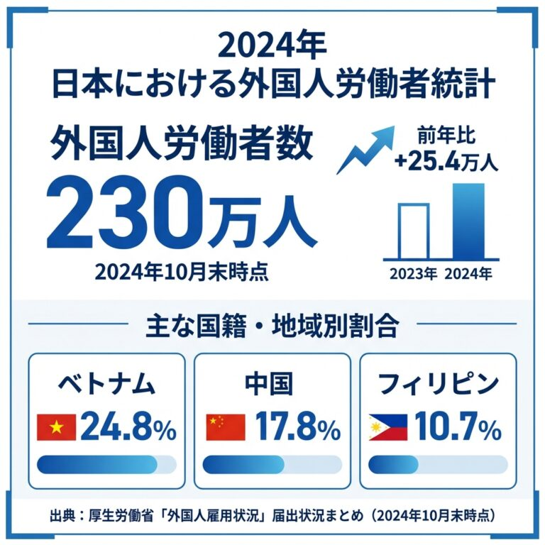

**外国人オンボーディングとは、外国人社員が入社後、組織に馴染みながら能力を発揮できるようにするための体系的な受け入れプロセスです。**適切なオンボーディングを実施した企業では、入社3ヶ月以内の離職率を50%以上削減できたという事例も報告されています。

「せっかく採用した外国人社員が、半年も経たずに辞めてしまった」「現場は『教える時間がない』と言い、人事は『現場が協力してくれない』と嘆いている」――そんな状況に心当たりはありませんか？

実は、外国人社員の早期離職の多くは、本人の能力やモチベーションの問題ではありません。受け入れる側の「準備不足」と「連携不足」が原因です。逆に言えば、しっかりとした受け入れ体制さえ整えれば、外国人材は想像以上に力を発揮し、長く定着してくれます。

本記事では、外国人オンボーディングの基礎から、「入社前」「入社直後」「定着期」の3フェーズに分けた具体的な施策、そして多くの企業が見落としがちな失敗パターンまで、実例を交えてお伝えします。

外国人オンボーディングでお困りですか？ TCJグローバルなら、日本語教育から受入れ体制整備まで一気通貫でサポートします。

[無料で相談してみる →](https://tcj-education.com/ja/foreign-recruitment/)

## 外国人オンボーディングとは？今すぐ始めるべき理由

外国人オンボーディングとは、単なる「入社手続き」や「初日のオリエンテーション」ではありません。外国人社員が「この会社で頑張ろう」と思えるまでの、すべてのプロセスを指します。

日本人社員の場合、入社すれば「暗黙のルール」や「空気を読む」といった文化的な共通認識がある程度あります。しかし、外国人社員にはそれがありません。日本人にとっては当たり前のことが、彼らにとっては「誰も教えてくれない謎」になってしまうのです。

### 3つの壁を越えなければ定着はない

外国人社員が職場に馴染むまでには、**言語・文化・生活**という3つの壁を越える必要があります。これを無視したまま「とりあえず現場に入れる」という対応をすると、ほぼ確実に問題が起きます。

| 壁の種類 | 具体例 | 乗り越えるための施策 |
| --- | --- | --- |
| **言語の壁** | 専門用語、敬語、報連相の言い回し | やさしい日本語の導入、業務マニュアルの多言語化 |
| **文化の壁** | 空気を読む、上下関係、会議での発言タイミング | 暗黙知の明文化、異文化理解研修 |
| **生活の壁** | 住居探し、銀行口座、ゴミ出しルール | 生活支援サポート、来日前オリエンテーション |

この3つの壁は、どれか1つでも放置すると、他の2つにも悪影響を及ぼします。たとえば、住居が不安定で睡眠不足になれば、仕事のパフォーマンスが落ち、言語の習得も遅れる。するとコミュニケーションがうまくいかず、孤立感が深まる――という悪循環です。

### データが示す「今すぐ始めるべき」理由

厚生労働省「外国人雇用状況」（2024年10月公表）によると、日本で働く外国人労働者数は約230万人。過去最高を更新し、前年比約12%増という急成長を見せています。

 

特に注目すべきは、**特定技能ビザが前年比約54%増**と急増していること。2027年には「育成就労制度」も施行される見込みで、外国人材の受け入れはさらに加速します。つまり、今オンボーディング体制を整えなければ、競合他社に人材を取られるだけでなく、採用しても定着させられない企業として取り残されてしまうのです。

## 多くの企業が陥る5つの失敗パターン

「うちも外国人社員を受け入れたけど、うまくいかなかった」という企業に共通するパターンがあります。ここでは、よくある5つの失敗とその背景を見ていきましょう。自社に当てはまるものがないか、チェックしてみてください。

### 経営・人事・現場の「すれ違い」が離職を生む

外国人オンボーディングがうまくいかない最大の原因は、**三者がそれぞれ異なる期待を抱えたまま、連携が取れていない**ことです。

経営層は「グローバル展開のために多様な人材が必要だ」と考え、人事部は「手続きを滞りなく終わらせたい」と考え、現場は「すぐに戦力になってほしい」と考えている。この三者の期待がすれ違ったまま採用が進むと、誰も新入社員の「定着」に責任を持たない状態が生まれます。

| 立場 | 典型的な期待 | よくある不満 |
| --- | --- | --- |
| **経営層** | イノベーション、多様性の確保 | 「なぜ採用してもすぐ辞めるのか」 |
| **人事部** | 手続き完了、トラブル回避 | 「現場が協力してくれない」 |
| **現場** | 即戦力、業務効率化 | 「教える時間がない」 |

あるIT企業では、経営層が「多様な視点でイノベーションを起こしてほしい」と期待して優秀なベトナム人エンジニアを採用しました。しかし現場では受け入れ態勢が整っておらず、そのエンジニアは単純なテスト業務だけを任され、わずか4ヶ月で退職。採用コスト約80万円が無駄になっただけでなく、現場には「やっぱり外国人はうまくいかない」というネガティブな印象だけが残ってしまいました。

### 入社日からでは遅すぎる理由

多くの企業が「オンボーディングは入社日から始まる」と考えています。しかし、これでは遅すぎます。

内定から入社までの期間は、外国人社員にとって「本当にこの会社で大丈夫だろうか」という不安が最も高まる時期です。この期間に何のコンタクトもなければ、内定辞退のリスクが高まるだけでなく、入社初日に「放置されている」と感じて一気にエンゲージメントが下がります。

入社前の期間を「プリボーディング」と呼び、この時期から歓迎メッセージを送ったり、配属先のメンバーを紹介したりすることで、入社初日のハードルを大幅に下げることができます。

### 「日本人と同じ研修」では通用しない

「日本人社員と同じ研修に参加させているから大丈夫」という考えは、残念ながら通用しません。外国人社員からはこんな声が寄せられています。

「ちゃんとした研修はなく、すべて自分で学ばなければなりませんでした」

「日本人社員だけの研修があり、理由を聞くと『外国人のためのものではないから』と言われました」

日本人向けの研修は、日本の文化や慣習を「当たり前」として設計されています。しかし外国人社員には、その「当たり前」の部分こそが最も理解しにくいポイントなのです。研修内容をそのまま適用するのではなく、「なぜそうするのか」という背景説明を加えたり、やさしい日本語で補足資料を作ったりする工夫が必要です。

### 生活サポートを怠った企業の末路

仕事面だけサポートして、生活面を放置する企業は少なくありません。しかし、住居が決まらない、銀行口座が作れない、携帯電話が使えない——こうした生活基盤の問題は、仕事のパフォーマンスに直結します。

ある介護施設では、フィリピン人スタッフの住居手配を本人任せにした結果、外国人NGの物件に何度も断られ、入社から2週間も仮住まいの状態が続きました。睡眠不足で体調を崩し、せっかくの研修にも集中できない。結局、その施設への不信感から3ヶ月で退職してしまいました。

生活サポートは「おもてなし」ではなく、「投資」です。最初に手間をかけることで、その後の定着率が大きく変わります。

### フォローアップなしが招く「静かな離職」

入社時の研修だけで終わり、その後のフォローがない——これが5つ目の失敗パターンです。

外国人社員は、問題があっても「迷惑をかけたくない」「自分で解決すべきだ」と考え、声を上げないことが多いです。定期的な1on1面談がなければ、「静かな離職」（心理的には離職を決意している状態）に気づけないまま、ある日突然「辞めます」と言われることになります。

## ある製造業が3ヶ月で離職率を半減させた方法

ここまで失敗パターンを見てきましたが、「じゃあ、どうすればいいの？」という疑問が湧いてくるでしょう。ここからは、実際に成果を出した企業の事例を紹介します。

従業員50名ほどの製造業A社では、技能実習生を含む外国人社員10名ほどを雇用していました。しかし、入社1年以内の離職率が40%を超えており、「採用しても定着しない」という悩みを抱えていました。

A社が直面していたのは、まさに「三者連携の不足」でした。現場は「忙しいから研修に時間を割けない」と言い、人事は「現場が協力してくれない」とこぼし、経営層は「なぜうまくいかないのか」と首をかしげる——典型的なパターンです。

### A社が取り組んだ3つの改革

A社がまず行ったのは、**「ゴール共有会議」の開催**でした。経営層も含めて全員が同じテーブルにつき、「入社3ヶ月で基本業務を一人で遂行できる状態」という具体的なゴールを設定。誰が何を担当するかを明確にしました。

次に、**バディ制度を導入**しました。入社1〜3年目の若手社員を「バディ」として新入社員につけ、業務の質問だけでなく、ランチや休憩時間も一緒に過ごすようにしました。「気軽に聞ける相手がいる」という安心感が、定着率に大きく影響したそうです。

そして、**30-60-90 days目標**を設定。入社30日目、60日目、90日目にそれぞれマイルストーンを設け、達成度を確認する面談を実施しました。これにより、問題の早期発見と軌道修正が可能になりました。

結果、A社の入社1年以内の離職率は**40%から20%以下**に改善。採用コストの削減だけでなく、現場の負担も軽減され、「外国人社員の受け入れに前向きになった」という声も聞かれるようになりました。

## 成功する外国人オンボーディング7つのステップ

A社の事例を踏まえて、ここからは成功するオンボーディングの7つのステップを詳しく見ていきましょう。「入社前」「入社直後」「定着期」の3フェーズに分けて解説します。

### なぜプリボーディングが「辞退防止」の決め手になるのか

内定から入社までの期間を「プリボーディング」と呼びます。この期間は、外国人社員にとって不安が最も高まる時期。だからこそ、ここで「歓迎されている」と感じさせることが、内定辞退の防止と入社初日の成功につながります。

具体的には、内定直後に経営層や配属先の上司からの歓迎メッセージを送ること、入社2ヶ月前にはオンライン面談で配属先のメンバーを紹介すること、入社1ヶ月前には持ち物リストや住居情報を共有すること——これらを「待っている」のではなく、こちらから積極的に働きかけることがポイントです。

| 時期 | 実施内容 | 狙い |
| --- | --- | --- |
| 内定直後 | 歓迎メッセージの送付（動画があれば尚よし） | 安心感、帰属意識の醸成 |
| 入社2ヶ月前 | オンライン面談（配属先紹介・期待の共有） | 役割の明確化、不安解消 |
| 入社1ヶ月前 | 必要書類・持ち物リストの送付 | 準備の漏れ防止 |
| 入社2週間前 | 住居・生活情報の共有 | 生活基盤の早期安定 |

### 経営・人事・現場がすれ違わないための「ゴール共有会議」

オンボーディング開始前に、経営・人事・現場の三者で「ゴール共有会議」を開催しましょう。ここで大切なのは、抽象的な目標ではなく、**具体的で測定可能な目標**を設定することです。

たとえば「3ヶ月で戦力になってほしい」ではなく、「入社3ヶ月で○○業務を一人で遂行でき、○○のチェックリストを80%以上達成している状態」というように、誰が見ても達成度がわかる形にします。

また、役割分担も明確にしておくこと。「誰もやらない」を防ぐためには、「誰がやるか」を決めておく必要があります。TCJの支援先では、現場のリーダーだけでなく若手社員にも参加してもらったところ、「自分たちが新人の頃に欲しかったサポート」というリアルな意見が出て、プログラムの質が大きく向上したケースもあります。

### 入社初日の印象が1年後の定着を左右する

入社初日の体験は、その後1年間のエンゲージメントに大きく影響します。「歓迎されている」と感じるか、「放置されている」と感じるか——その印象は、初日で決まるといっても過言ではありません。

初日のスケジュールは、余裕を持って設計しましょう。朝一番に経営層からの歓迎の挨拶があると、「この会社は自分を大切にしてくれている」という印象を強く与えられます。その後、チーム全員への紹介、デスクやPCの設定、そして午後には就業規則や社内ツールの説明。詰め込みすぎず、質問の時間を十分に取ることが大切です。

1週間目の終わりには、必ず最初の1on1面談を実施してください。「何か困っていることはありませんか？」と声をかけるだけで、問題の芽を早期に摘むことができます。

### 生活サポートは「投資」と考える

仕事面だけでなく、生活面のサポートが定着の鍵を握ります。住居探し、銀行口座開設、携帯電話契約、住民登録——日本人には当たり前のことが、外国人には大きなハードルになります。

「それは本人の問題だから」と突き放すのではなく、初期投資として手厚くサポートすることをおすすめします。最初の1〜2週間で生活基盤が安定すれば、その後の業務への集中度が格段に上がります。逆に、生活が不安定なままだと、仕事のパフォーマンスも上がらず、結局は早期離職につながる——という悪循環に陥ってしまいます。

外国人対応可の不動産会社リストを用意しておく、銀行口座開設に同行する担当者を決めておく、ゴミ出しルールを多言語で説明した資料を作っておく——こうした準備が、「この会社は自分のことを考えてくれている」という信頼につながります。

### バディ制度と30-60-90 days目標で「放置」を防ぐ

**インクルーシブオンボーディング**という言葉をご存知でしょうか。これは、新入社員が「組織に受け入れられている」と感じながら職場に定着できるよう支援する、包括的なオンボーディング手法です。排除しない、仲間はずれにしない——そんな「当たり前」を、仕組みで実現するのがポイントです。

そのための具体策が、**バディ制度**と**30-60-90 days目標**です。

バディとは、新入社員に寄り添う「相棒」のこと。上司やメンターとは別に、入社1〜3年目の若手社員をバディとして任命し、日常的な質問対応やランチの同伴を担当してもらいます。「気軽に聞ける人がいる」という安心感は、定着率に大きく影響します。

| 役割 | 担当者 | 責任範囲 |
| --- | --- | --- |
| **上司** | 配属先マネージャー | 業務指導、目標設定、評価 |
| **バディ** | 入社1〜3年目の社員 | 日常の質問対応、ランチ同伴、人間関係の橋渡し |
| **人事** | 人事担当者 | 全体進捗管理、問題発生時の仲介、外部機関連携 |

30-60-90 days目標とは、入社後の最初の3ヶ月間を「30日」「60日」「90日」のマイルストーンに分け、段階的な目標を設定するフレームワークです。

| 期間 | 目標例 | 確認ポイント |
| --- | --- | --- |
| **30日目** | 社内ルール・ツールの理解、チームメンバーとの関係構築 | 「質問できる相手」がいるか |
| **60日目** | 基本業務を一人で遂行、小さなプロジェクトで貢献 | 自信を持って業務に取り組めているか |
| **90日目** | 主要業務を自立して遂行、改善提案ができる | チームに貢献できていると感じているか |

このフレームワークを使えば、「なんとなく様子を見る」のではなく、具体的な進捗を確認しながらサポートできます。問題があれば早期に発見し、軌道修正することも可能です。

### 「この会社で成長できる」と思わせるには

「この会社で頑張り続けても、自分はどうなるんだろう」——この疑問は、離職を考える最大のきっかけです。特に外国人社員は、将来のキャリアパスが見えないと、「もっと成長できる会社に移ろう」と考えがちです。

だからこそ、入社後の早い段階で\*\*キャリアパスを明示\*\*することが重要です。「3年後にはリーダーポジションに挑戦できる」「5年後には管理職への道も開かれている」——具体的なステップを見せることで、「この会社で頑張る意味がある」と感じてもらえます。

また、先輩外国人社員のキャリア事例を共有することも効果的です。「自分と同じ国から来た先輩が、今はチームリーダーとして活躍している」という事実は、何よりも説得力があります。

### 日本語研修を継続する企業だけが勝ち残る

入社時の日本語レベルがどれほど高くても、ビジネス日本語や業界専門用語は別物です。入社後も継続的な日本語研修を用意することで、コミュニケーションの質が上がり、業務効率も定着率も向上します。

「日本語研修はコストがかかる」と考える企業もあるでしょう。しかし、日本語力の不足によるミスコミュニケーション、それに伴う業務のやり直し、そして最終的な離職コストを考えれば、継続的な日本語研修は十分にペイする「投資」です。

TCJグローバルでは、創業37年の日本語教育実績を活かし、企業向けにビジネス日本語研修プログラムをお届けしています。業界特化型のカリキュラムで、実務で使える日本語能力を効率的に習得できます。

日本語教育体制の整備でお悩みの方へ

創業37年の実績を持つTCJグローバルが、外国人材の日本語研修から定着支援までサポートします。

[資料請求はこちら（無料）](https://tcj-education.com/ja/foreign-recruitment/)

## 外国人オンボーディング「三者連携」チェックリスト

ここまで読んで、「で、うちは何から始めればいいの？」と思われたかもしれません。そこで、経営・人事・現場の三者が「次に何をすべきか」を共通認識できるよう、フェーズごとのチェックリストを用意しました。

### 入社前（プリボーディング）

| ✓ | 項目 | 担当 |
| --- | --- | --- |
| ☐ | 歓迎メッセージの送付 | 人事 |
| ☐ | ゴール共有会議の開催 | 人事・経営・現場 |
| ☐ | バディの選定・依頼 | 現場 |
| ☐ | 住居・生活情報の整備 | 人事 |
| ☐ | 業務マニュアルの多言語化 | 現場 |

### 入社直後（1週間〜1ヶ月）

| ✓ | 項目 | 担当 |
| --- | --- | --- |
| ☐ | 経営層からの歓迎挨拶 | 経営 |
| ☐ | チーム紹介・社内ツアー | 現場 |
| ☐ | 生活サポート（銀行・携帯等） | 人事 |
| ☐ | OJT開始・業務説明 | 現場 |
| ☐ | 1週間目の1on1面談 | 現場・人事 |

### 定着期（3ヶ月〜1年）

| ✓ | 項目 | 担当 |
| --- | --- | --- |
| ☐ | 30-60-90 days目標の確認面談 | 人事・現場 |
| ☐ | キャリアパスの提示 | 人事・経営 |
| ☐ | 継続的な日本語・スキル研修 | 人事 |
| ☐ | 異文化理解研修（日本人社員向け） | 人事 |
| ☐ | 1年後の総括面談・改善計画 | 人事・経営・現場 |

## FAQ（よくある質問）

### Q1: 外国人オンボーディングとは何ですか？

**A:** 外国人社員が入社後、組織に馴染みながら能力を発揮できるようにするための体系的な受け入れプロセスです。言語・文化・生活の3つの壁を越え、早期戦力化と長期定着を実現するための取り組みを指します。

### Q2: オンボーディングはいつから始めるべきですか？

**A:** 内定直後からです。「プリボーディング」として入社前から歓迎メッセージを送ったり、配属先との面談を設定したりすることで、内定辞退の防止と入社初日の不安軽減につながります。

### Q3: オンボーディング期間はどのくらいが適切ですか？

**A:** 一般的に、入社から3ヶ月〜1年間が目安です。最初の1ヶ月は週1回の1on1面談、その後は月1回のフォローアップを続けることで、問題の早期発見と定着率の向上が期待できます。

### Q4: 経営・人事・現場の連携がうまくいかない場合は？

**A:** まず「ゴール共有会議」を開催し、三者で具体的な目標と役割分担を明確にしましょう。外部の専門家を交えることで、客観的な視点も得られます。

### Q5: 日本語がまだ不十分な外国人社員への対応は？

**A:** 業務マニュアルの多言語化、やさしい日本語での説明、図や写真を多用した資料作成が有効です。また、継続的な日本語研修で業務に必要な表現から優先的に学べるプログラムが効果的です。

### Q6: 生活サポートはどこまで行うべきですか？

**A:** 最低限、住居探し、銀行口座開設、携帯電話契約、住民登録のサポートは必要です。近隣施設の案内やゴミ出しルールの説明なども行うと、安心感が高まります。

### Q7: オンボーディングの効果をどう測定すればいいですか？

**A:** 入社3ヶ月/6ヶ月/1年後の定着率、新入社員アンケート（満足度）、上司・バディからの評価、業務目標の達成度などで測定できます。

### Q8: 外部の支援を使うメリットは？

**A:** 社内リソースの負担軽減、専門的なノウハウの取り入れ、客観的な視点でのプログラム設計が可能になります。TCJグローバルでは、日本語教育から受入れ体制整備まで一気通貫でサポートしています。

## まとめ：今日から始める3つのアクション

外国人オンボーディングの成功は、研修内容だけでなく「経営・人事・現場」の連携で決まります。この記事で解説したポイントを踏まえて、今日から始められることを3つにまとめました。

**1\. ゴール共有会議を開催する** まずは経営・人事・現場の三者で集まり、「入社3ヶ月後にどんな状態になっていてほしいか」を具体的に話し合いましょう。目標と役割分担を明確にすることで、「誰もやらない」を防げます。

**2\. バディ制度を導入する** 入社1〜3年目の若手社員をバディとして任命し、新入社員の「日常的な質問対応役」を設けましょう。気軽に聞ける相手がいるだけで、定着率は大きく変わります。

**3\. 30-60-90 days目標を設定する** 入社後の最初の3ヶ月間にマイルストーンを設け、段階的に成長を確認する仕組みを作りましょう。問題の早期発見と軌道修正が可能になります。

効果的なオンボーディングは、一人の社員を定着させるだけでなく、組織全体の成長を加速させます。「自社だけでこの連携体制を築くのは難しい」と感じられた場合は、ぜひ私たちにご相談ください。

### 外国人オンボーディングでお困りですか？

TCJグローバルでは、日本語研修プログラムの作成から、 オンボーディング体制の構築、定着支援まで一気通貫でサポートします。

創業37年の日本語教育ノウハウを活かし、外国人材の早期戦力化と定着率の向上をご支援します。

[今すぐ無料相談する →](https://tcj-education.com/ja/foreign-recruitment/)
