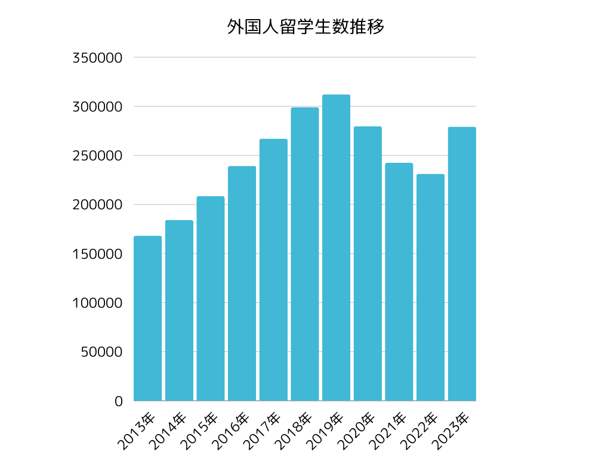
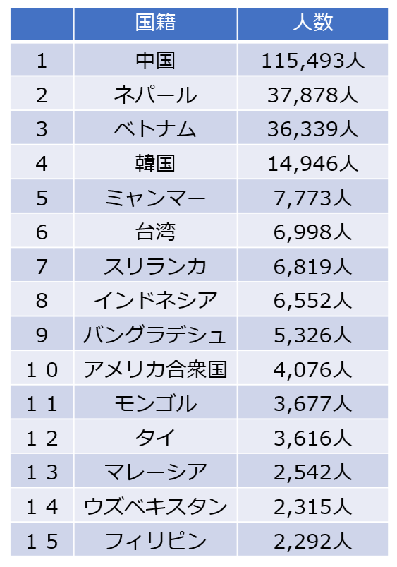
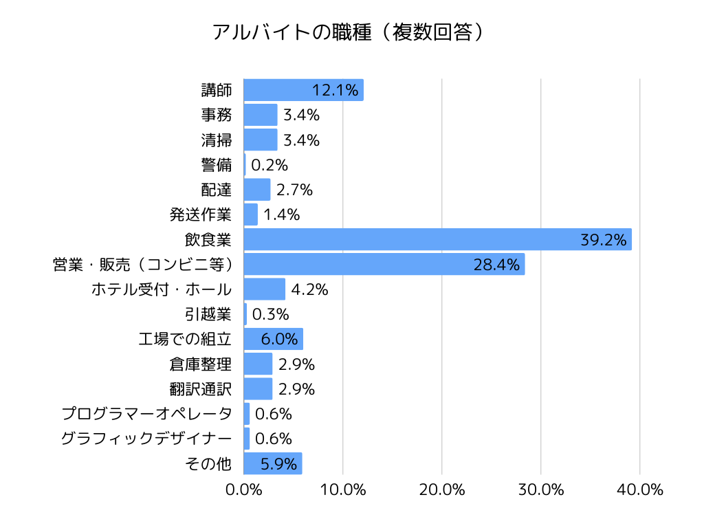
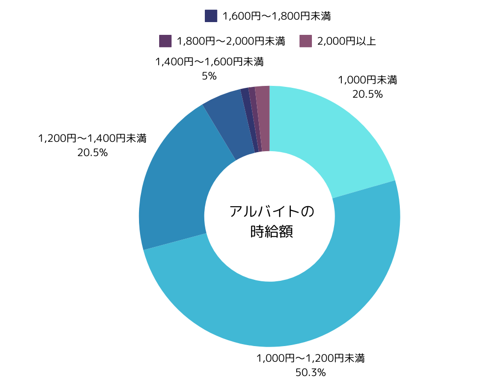
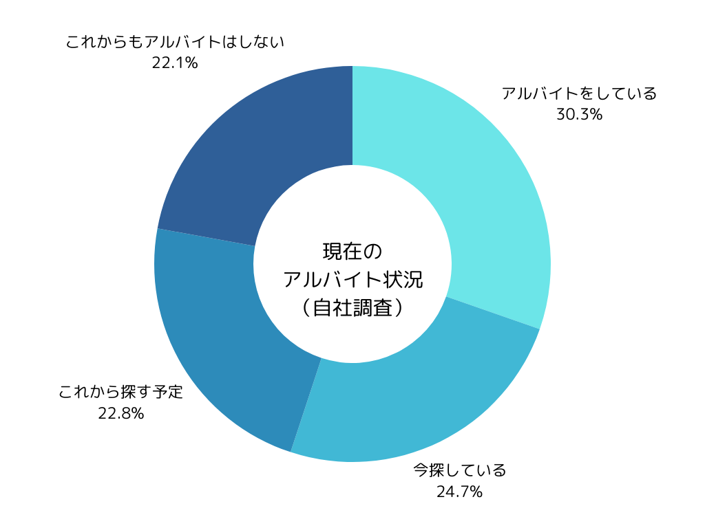
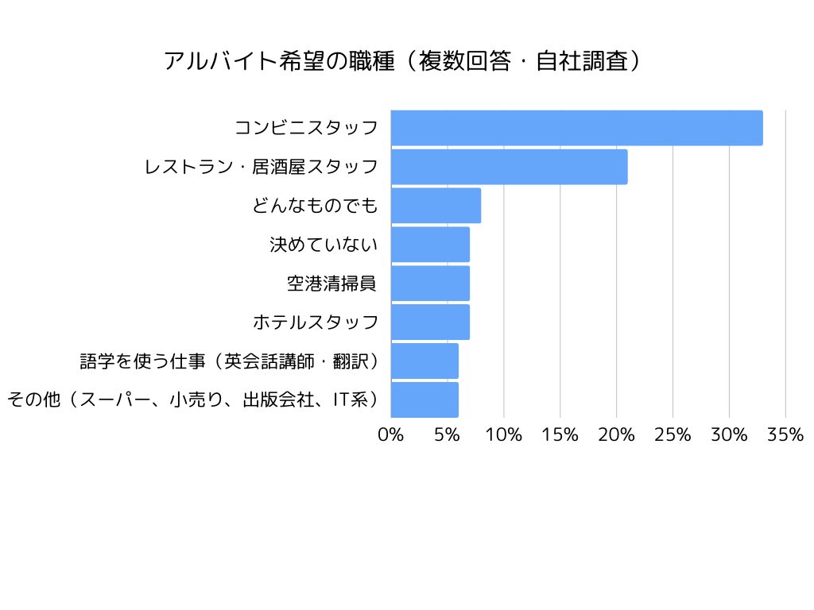

「留学生アルバイトを雇いたいけど、28時間ルールが複雑で不安...」そんな声を、採用現場で数多く耳にします。

実は、計算方法を誤解して違反してしまう企業が後を絶ちません。「週28時間」と聞くと単純に思えますが、「どの7日間を切り取っても28時間以内」という計算ルールを知らずに、気づかないうちに違反しているケースが多いのです。

違反した場合、企業は不法就労助長罪(3年以下の懲役または300万円以下の罰金)に問われ、企業名が公表されるリスクもあります。さらに近年では、SNSでの拡散により企業イメージが大きく損なわれる事例も増えています。

本記事では、28時間ルールの正確な計算方法と、違反リスクを回避する実務的な管理法を解説します。日本語教育37年の実績をもつTCJが、外国人雇用の現場で培ったノウハウをお伝えします。

> 日本語教育のプロの視点から、貴社に最適な人材のご紹介、選考のサポート、採用後の定着支援までワンストップでご支援します。  
>   
> 外国人材の採用や選考でお困りの方は、まずはお気軽に資料請求・お問い合わせください。  
> [>>資料請求する(無料)](https://tcj-education.com/ja/foreign-recruitment/)  
> [>>今すぐお問合せする](https://gaikoku-jinzai.tcj-education.com/#contact)

## 外国人留学生アルバイトの現状

### 留学生数の推移と国籍別内訳

日本学生支援機構の「外国人留学生在籍状況調査」によると、2023年5月1日現在の外国人留学生数は279,274人で、前年度比20.8%増加しました。

国・地域別では、中国が115,493人(前年度比11.2%増)と最多で、次いでネパール37,878人(56.2%増)、ベトナム36,339人(2.8%減)となっています。2022年3月以降の水際対策緩和や10月からの入国者数上限撤廃により、留学生の新規入国が進み、コロナ禍以降初めて留学生総数が増加に転じました。在学段階別では、日本語教育機関の留学生数が過去最多を記録し、出身地域別では概ねすべての地域で大幅な増加が見られました。

参考：[https://www.mext.go.jp/a_menu/koutou/ryugaku/1412692_00003.htm](https://www.mext.go.jp/a_menu/koutou/ryugaku/1412692_00003.htm)

出典：[https://www.studyinjapan.go.jp/ja/_mt/2024/04/data2023z.pdf](https://www.studyinjapan.go.jp/ja/_mt/2024/04/data2023z.pdf)　

### 留学生のアルバイト従事状況

留学生のアルバイト従事率は65.2%に上ります。職種別では、「飲食業」が39.2%と最も多く、次いで「営業・販売(コンビニ等)」が28.4%、「工場での組立作業」が6.0%となっています。

出典：[https://www.studyinjapan.go.jp/ja/_mt/2024/10/Seikatsu2023.pdf](https://www.studyinjapan.go.jp/ja/_mt/2024/10/Seikatsu2023.pdf)

### 外国人留学生アルバイトの時給

外国人留学生の時給は、日本人アルバイト同様、最低賃金を遵守する必要があります。調査によると、「1,000円以上1,200円未満」が50.2%と最も多く、次いで「1,200円以上1,400円未満」が20.5%となっています。

出典：[https://www.studyinjapan.go.jp/ja/_mt/2024/10/Seikatsu2023.pdf](https://www.studyinjapan.go.jp/ja/_mt/2024/10/Seikatsu2023.pdf)

### 日本語学校留学生のアルバイト従事状況

日本語学校では主に年4回の入学時期があり、そのタイミングで仕事を探す学生が増加します。2024年4月下旬に実施したTCJ独自の留学生向けアルバイトの意識調査では、アルバイト中の学生が30.3%、アルバイトを探している、またはこれから探す予定の学生が合わせて47.5%と、多くの学生がアルバイトを希望していることがわかりました。

出典：TCJ留学生向けアルバイトの意識調査(調査期間/2024年4月23日～30日、回答数/267名)

### 日本語学校留学生の希望職種

同調査によると、学生が希望する職種はコンビニスタッフと飲食店スタッフが大半を占めています。また、ホテルや英会話講師・翻訳といった語学を活かした職種も人気があります。一方で、具体的な職種を決めていない、どんな職種でもよいという学生も一定数存在します。

出典：TCJ留学生向けアルバイトの意識調査(調査期間/2024年4月23日～30日、回答数/267名)

> 日本語教育のプロの視点から、貴社に最適な人材のご紹介、選考のサポート、採用後の定着支援までワンストップでご支援します。  
>   
> 外国人材の採用や選考でお困りの方は、まずはお気軽に資料請求・お問い合わせください。  
> [>>資料請求する(無料)](https://tcj-education.com/ja/foreign-recruitment/)  
> [>>今すぐお問合せする](https://gaikoku-jinzai.tcj-education.com/#contact)

## 外国人留学生アルバイト雇用の注意点

具体的な手続きに入る前に、まず留学生を雇用する上で絶対に押さえておかなければならない「大原則」が3つあります。

これらの原則は、留学生の本分である「学業」を守るために国が定めたルールです。もし知らずに破ってしまえば、企業側が「不法就労助長罪」という重い罪に問われる可能性も否定できません。安心して留学生に活躍してもらうためにも、この3つの原則は必ず覚えておきましょう。

### なぜ週28時間なのか?法律の趣旨

そもそも、なぜ「週28時間」という制限があるのでしょうか。

在留資格「留学」は、あくまで日本で学業に専念するための資格です。アルバイトは、学費や生活費を補うための「補助的な活動」として認められているに過ぎません。

週28時間という上限は、「学業に支障をきたさない範囲」として設定されています。一般的な学校のスケジュールを考えると、週5日×1日5.6時間=28時間という計算になります。これを超えると、授業への出席や学習時間が確保できなくなり、本来の目的である「学業」がおろそかになってしまうためです。

この趣旨を理解しておくことで、「なぜ厳格に守らなければならないのか」という納得感が生まれます。

### 原則1:「資格外活動許可」なくして就労はあり得ない

大前提として、在留資格「留学」は、あくまで日本で勉強するための資格です。そのため、留学生がアルバイトとして働くことは、本来の活動の「資格外」にあたります。

留学生がアルバイトをするためには、必ず事前に入国管理局から「資格外活動許可」を得ていなければなりません。この許可を得ずに留学生を働かせてしまうと、その時点で不法就労となり、雇用主もその責任を問われることになります。これは、留学生アルバイトを雇用する上での、基本中の基本と言えるでしょう。

### 原則2:「週28時間」の壁は1分でも超えてはいけない

留学生のアルバイトは、学業との両立が前提となるため、労働時間にも厳格な制限が設けられています。その上限が「1週間で28時間以内」というルールです。

ここで特に注意すべきは、この時間は**掛け持ちしている全てのアルバイト先の労働時間を合計した時間**であるという点です。たとえ自社での勤務が数時間であっても、合計で28時間を1分でも超えればルール違反となってしまいます。

ただし、学校が定める夏休みなどの長期休業期間中は、この制限が「1日8時間・週40時間以内」まで緩和されます。この特例を適用する際は、学則上の正確な休業期間を確認することが求められます。

#### 28時間の正しい計算方法

「週28時間」の計算方法について、よくある誤解を解消しておきましょう。

**❌ 間違い**: 月曜日〜日曜日で28時間以内  
**⭕ 正解**: **任意の7日間で28時間以内**

つまり、「今週は20時間だったから、来週は36時間働いても大丈夫」という考え方は完全に誤りです。出入国在留管理局は、**どの7日間を切り取っても28時間を超えていないか**をチェックします。

**具体例**:
- 月曜〜日曜: 28時間(OK)
- 火曜〜翌週月曜: 30時間(NG!)

このように、週をまたいだ計算でも28時間を超えてはいけません。

カレンダーで考えると分かりやすいでしょう。例えば、月曜日に5時間、火曜日に4時間、水曜日に6時間、木曜日に5時間、金曜日に4時間、土曜日に2時間、日曜日に2時間働いたとします。この場合、月曜〜日曜の合計は28時間でOKです。

しかし、翌週の月曜日に5時間働いた場合、火曜日〜翌週月曜日の7日間で計算すると、4+6+5+4+2+2+5=28時間となり、ギリギリセーフです。ところが、もし日曜日に3時間働いていたら、火曜日〜翌週月曜日の合計が29時間となり、違反になってしまいます。

このように、「どの7日間を切り取っても28時間以内」という計算は非常に複雑です。企業側は、留学生のシフトを組む際に、この点を十分に注意する必要があります。

#### 長期休暇中の特例(週40時間)

学校が定める長期休業期間中(夏休み、冬休み、春休み)は、以下の条件で労働時間が緩和されます。

- **通常期**: 週28時間以内
- **長期休暇中**: **1日8時間・週40時間以内**

**重要な注意点**:
1. **学則で定められた休業期間のみ適用**(学生の自主的な休みは不可)
2. **学校発行の「長期休業期間証明書」の確認が必須**
3. **1日8時間の制限も守る必要がある**

#### 違反した場合の罰則

28時間ルールを違反した場合、以下の重大なペナルティが科されます。

**留学生本人への罰則**:
- ❌ 在留資格の更新不許可
- ❌ 強制退去処分
- ❌ 今後の日本への入国拒否

**雇用主(企業)への罰則**:
- ❌ **不法就労助長罪**(3年以下の懲役または300万円以下の罰金)
- ❌ 企業名の公表
- ❌ 今後の外国人雇用に支障
- ❌ SNSでの拡散による企業イメージの損失

「知らなかった」では済まされません。企業側にも厳格な管理責任が求められます。

近年では、外国人労働者も労働基準法を理解し、違反があれば労働基準監督署に通報するケースが増えています。また、SNSでの拡散により、企業の評判が一瞬で損なわれるリスクもあります。

### 原則3:「禁止されている職種」は清掃業務でもNG

「資格外活動許可」があれば、どんな仕事でもできるわけではない、という点も忘れてはなりません。風俗営業等が営まれている店舗での就労は、法律で固く禁じられています。

具体的には、以下のような店舗が該当します:

- パチンコ店
- 麻雀店
- 照度の低いバー
- ナイトクラブ
- ゲームセンター(一部の射幸心をそそる筐体が設置されている場合)
- ラブホテルやそれに類する施設
- 施錠できる個室があり、広さが5平方メートル以下のネットカフェや漫画喫茶
- ダンスホール

そして最も重要なのは、これらの店舗では**直接的な接客だけでなく、皿洗いや清掃、店舗のビラ配りといった間接的な業務も一切許可されていない**ということです。この認識が不足しているために、意図せず法律違反を犯してしまうケースが後を絶ちません。判断に迷う業態の場合は、安易に自己判断しないことが肝要です。

## 留学生アルバイトの募集方法と採用チャネル

留学生アルバイトを効果的に採用するには、適切な募集チャネルの選択が重要です。ここでは、主要な募集方法とそれぞれの特徴を解説します。

### 主な募集チャネル

留学生アルバイトの募集には、以下のようなチャネルが効果的です。

**1. 求人サイト**

一般的な求人サイトに加え、外国人材に特化した求人サイトを活用することで、より多くの留学生にアプローチできます。多言語対応のサイトを選ぶことで、日本語が不得意な留学生にも情報が届きやすくなります。

**2. 大学・日本語学校のキャリアセンター**

大学や日本語学校のキャリアセンターに求人票を掲示することで、学生に直接アプローチできます。学校側も学生の就労支援に積極的なため、協力を得やすいメリットがあります。

**3. 紹介制度（リファラル採用）**

既に働いている留学生スタッフからの紹介は、信頼性が高く、定着率も良い傾向があります。紹介者・被紹介者双方にインセンティブを設けることで、制度を活性化できます。

**4. SNS・コミュニティ**

FacebookやInstagramなどのSNS、留学生コミュニティでの募集も効果的です。特に同国籍のコミュニティでは口コミが広がりやすく、応募につながりやすい特徴があります。

### 募集時の重要ポイント

募集情報を作成する際は、以下のポイントを明確に記載しましょう。

- **勤務時間**: 週28時間以内であることを明記
- **日本語要件**: 必要な日本語レベル（JLPT N3以上など）
- **業務内容**: 具体的な仕事内容を詳しく説明
- **サポート体制**: 日本語研修、ビザサポートなどの支援内容
- **給与**: 時給、交通費支給の有無

多言語での情報提供や、やさしい日本語での記載も、応募のハードルを下げる効果があります。

## 採用担当者のための留学生雇用の流れ&チェックリスト

留学生アルバイトの雇用は、正しい手順さえ踏めば、決して難しいものではありません。ここでは、応募から採用後の管理までを3つのステップに分け、それぞれの段階で「何をすべきか」を具体的に解説します。

### STEP1:応募〜面接での確認事項【必須チェックリスト】

候補者と初めて会う面接の場は、日本語能力だけでなく、法律で定められた就労条件を満たしているかを確認する最も重要な機会です。以下の項目は、必ず候補者に提示してもらい、一つひとつ指差し確認をしながら進めましょう。

**□ 在留カードの「表面」**  
まず、カードの表面で**在留資格が「留学」になっていることを確認します。次に、「在留期間」の満了日が過ぎていないか**も必ずチェックしてください。

**□ 在留カードの「裏面」**  
次に、カードの裏面を確認します。下部にある**「資格外活動許可欄」に「許可」のスタンプ**が押されていなければ、アルバイトとして雇用することはできません。もし、この許可を得ていない学生を採用したい場合は、まず本人に最寄りの出入国在留管理局で許可申請を行うよう促してください。

**□ 在留カードの「有効性」**  
念のため、出入国在留管理庁のウェブサイトにある**「在留カード等番号失効情報照会」**システムを利用し、提示された在留カードが有効なものかを確認することをお勧めします。これにより、偽造カードによるトラブルを未然に防ぐことができます。

**□ 就労時間の「上限」**  
「アルバイトは週に28時間まで、と決められていますが、このルールは知っていますか?」と、必ず口頭で質問し、本人がルールを正しく理解しているかを確認しましょう。

**□ 掛け持ちの「有無」**  
「今、他にアルバイトはしていますか?」と質問し、もし掛け持ちをしている場合は、その勤務時間と自社での勤務時間を合わせて週28時間を超えないかを必ず確認してください。この合計時間の管理が、最もトラブルになりやすいポイントです。

### STEP2:採用決定〜入社までの手続き

面接で上記の項目をクリアし、無事に採用が決定したら、次に入社に向けた手続きを進めます。

**雇用契約書の作成と説明**  
後のトラブルを防ぐため、必ず書面で雇用契約を締結します。その際、給与や労働時間、業務内容といった重要な条件は、本人の母国語を併記するか、少なくとも平易な「やさしい日本語」で丁寧に説明し、双方の認識にズレがない状態にしておくことが大切です。

**ハローワークへの届出**  
外国人(留学生を含む)を雇用した場合、企業はハローワークへ**「外国人雇用状況の届出」**を行う義務があります。これは、採用した月の翌月末までが提出期限となっているため、忘れずに行いましょう。届出は、管轄のハローワーク窓口のほか、オンラインでも申請可能です。

### STEP3:雇用開始後の厳格な管理

実際に働き始めてからの労務管理も、日本人アルバイトとは異なる注意が必要です。

**シフト管理の徹底**  
特に掛け持ちをしている留学生の場合、本人の自己申告だけに頼らず、定期的に他社でのシフト状況を確認するなど、企業側が責任をもって合計労働時間を管理する体制を整えることが、リスク回避に繋がります。

**長期休暇の特例適用**  
夏休みなどの長期休暇中は、労働時間の上限が「1日8時間・週40時間」まで緩和されます。ただし、これはあくまで大学や日本語学校の学則で定められた公式な休業期間に限られます。その期間を正確に把握し、特例を適用することが重要です。

## 留学生アルバイトの社会保険・雇用保険

留学生アルバイトを雇用する際、社会保険や雇用保険の扱いについて疑問を持つ企業は多いでしょう。ここでは、実務上の注意点を解説します。

### 雇用保険の加入条件

雇用保険の加入条件は、以下の2つです:

1. **週20時間以上の労働**
2. **31日以上の雇用見込み**

留学生は週28時間制限があるため、週20時間以上働くことは可能です。しかし、実際には週28時間ギリギリまで働く留学生は少なく、多くの場合は週20時間未満となるため、雇用保険の加入対象外となるケースが多いです。

ただし、長期休暇中(週40時間まで可)に週20時間以上働く場合は、雇用保険の加入義務が発生する可能性があります。

### 厚生年金・健康保険の適用

厚生年金と健康保険の加入条件は、**週30時間以上の労働**です。

留学生は週28時間制限があるため、通常期は厚生年金・健康保険の加入対象外となります。

ただし、長期休暇中(週40時間まで可)に週30時間以上働く場合は、厚生年金・健康保険の加入義務が発生する可能性があります。この場合、短期間であっても加入手続きが必要になるため、注意が必要です。

### 労災保険は全員加入必須

労災保険は、労働時間に関わらず**全ての労働者が加入対象**です。留学生アルバイトも例外ではありません。

### 実務上の注意点

社会保険の加入義務は、労働時間によって判断されます。留学生の場合、以下の点に注意してください:

1. **通常期(週28時間制限)**: 原則として社会保険の加入対象外
2. **長期休暇中(週40時間まで可)**: 週20時間以上で雇用保険、週30時間以上で厚生年金・健康保険の加入義務が発生する可能性
3. **労災保険**: 労働時間に関わらず全員加入必須

長期休暇中に労働時間を増やす場合は、社会保険の加入義務が発生するかどうかを事前に確認し、必要に応じて手続きを行いましょう。

不明な点がある場合は、社会保険労務士や管轄の年金事務所・ハローワークに相談することをお勧めします。TCJでも、外国人雇用に関する社会保険の相談をサポートしていますので、お気軽にお問い合わせください。

## 給与計算と税金の取り扱い

留学生アルバイトの給与計算と税金の取り扱いについて、実務上の注意点を解説します。

### 所得税の源泉徴収

留学生アルバイトの所得税は、**日本人と同じ扱い**です。給与から所得税を源泉徴収し、年末調整で精算します。

ただし、一部の国との間で「租税条約」が結ばれており、一定の条件を満たす場合は所得税が免除される場合があります。例えば、中国やベトナムなどの国籍の留学生は、租税条約により一定額まで免税となる可能性があります。

租税条約の適用を受けるためには、「租税条約に関する届出書」を税務署に提出する必要があります。詳しくは、管轄の税務署にお問い合わせください。

### 住民税の課税

住民税は、**前年の所得に基づいて課税**されます。

1月1日時点で日本に住所がある場合、前年の所得が一定額以上であれば住民税が課税されます。留学生の場合、アルバイト収入が少ないため、多くの場合は非課税となります。

住民税は、翌年6月から徴収が開始されます。留学生が帰国してしまった場合、住民税の徴収が困難になるため、企業側は事前に本人に説明しておくことが重要です。

### 年末調整の対応

留学生アルバイトも、日本人と同じように年末調整の対象となります。

年末調整を行うためには、以下の書類が必要です:

1. **給与所得者の扶養控除等申告書**
2. **給与所得者の保険料控除申告書**(該当する場合)
3. **給与所得者の基礎控除申告書**(該当する場合)

年末調整後、源泉徴収票を発行し、本人に交付します。

留学生が年の途中で帰国した場合や、年末調整ができなかった場合は、本人が確定申告を行う必要があります。この点も、事前に本人に説明しておくことが重要です。

### 実務上の注意点

税金の取り扱いについて、以下の点に注意してください:

1. **租税条約の確認**: 留学生の国籍によっては、租税条約により所得税が免除される場合があります
2. **住民税の説明**: 翌年6月から住民税が徴収されることを事前に説明しておく
3. **年末調整の実施**: 日本人と同じように年末調整を行う
4. **帰国時の対応**: 年の途中で帰国した場合の確定申告について説明しておく

税金の取り扱いは複雑なため、不明な点がある場合は税理士や税務署に相談することをお勧めします。TCJでも、外国人雇用に関する税金の相談をサポートしていますので、お気軽にお問い合わせください。

## 採用後の定着率を高める3つの施策

留学生アルバイトを採用した後、長く働いてもらうためには、単に28時間ルールを守るだけでは不十分です。ここでは、TCJが37年の日本語教育の実績から培った、定着率を高める3つの施策をご紹介します。

### 1. 日本語教育支援

留学生の多くは、日本語能力が十分ではありません。業務上のコミュニケーションがスムーズにいかないと、ミスが増え、本人も企業側もストレスを感じることになります。

**日本語教育支援のメリット**:
- 業務効率が向上する
- ミスが減り、顧客満足度が上がる
- 本人のモチベーションが向上し、定着率が高まる

TCJでは、企業向けに日本語教育プログラムを提供しています。業務に必要な日本語を効率的に学べるカリキュラムで、留学生の成長をサポートします。

### 2. 文化的配慮

留学生は、宗教や文化的背景が異なります。これらを理解し、配慮することで、留学生が安心して働ける環境を作ることができます。

**具体的な配慮の例**:
- **ハラール食への対応**: イスラム教徒の留学生には、ハラール食を提供する、または食事の選択肢を増やす
- **礼拝時間の配慮**: イスラム教徒の留学生には、1日5回の礼拝時間を確保する
- **宗教的な祝日への配慮**: 春節(旧正月)やラマダンなど、宗教的な祝日を理解し、シフト調整を行う

これらの配慮は、留学生にとって「この会社は自分を理解してくれている」という安心感につながり、定着率の向上に直結します。

### 3. コミュニケーション促進

留学生は、言葉の壁や文化の違いから、悩みを抱えていても相談できないことがあります。定期的な面談や悩み相談の窓口を設置することで、早期に問題を発見し、解決することができます。

**具体的な施策**:
- **定期的な面談**: 月1回程度、上司や人事担当者が面談を行い、業務上の悩みや生活上の困りごとを聞く
- **悩み相談の窓口**: 匿名で相談できる窓口を設置し、ハラスメントや人間関係の悩みを相談できるようにする
- **同国籍の先輩社員との交流**: 同じ国籍の先輩社員がいる場合、メンター制度を導入し、相談しやすい環境を作る

これらの施策により、留学生が安心して働ける環境を整えることができます。

TCJでは、採用後の定着支援もワンストップでサポートしています。日本語教育プログラムの提供や、文化的配慮のアドバイス、コミュニケーション促進の施策など、貴社のニーズに合わせたサポートを提供しますので、お気軽にお問い合わせください。

## よくある質問(FAQ)

### Q1. 28時間を超えたらどうなりますか?

**A.** 留学生本人は在留資格の更新不許可や強制退去処分、雇用主は不法就労助長罪(3年以下の懲役または300万円以下の罰金)に問われる可能性があります。「知らなかった」では済まされません。

### Q2. 複数のバイトを掛け持ちしている場合、どう管理すればいいですか?

**A.** 全てのアルバイト先の労働時間を合計して週28時間以内に収める必要があります。企業側は、定期的に他社でのシフト状況を本人に確認し、書面で記録を残すことを推奨します。

### Q3. 資格外活動許可の申請方法は?

**A.** 最寄りの出入国在留管理局で申請できます。必要書類は以下の通りです:

- 資格外活動許可申請書
- 在留カード
- パスポート
- 在学証明書(学校発行)

申請から許可まで通常2週間〜1ヶ月程度かかります。

### Q4. 長期休暇の期間はどうやって確認すればいいですか?

**A.** 学校発行の「長期休業期間証明書」または学則で確認してください。学生の自己申告だけでは不十分です。証明書のコピーを保管しておくことを推奨します。

### Q5. 在留カードの有効性はどうやって確認しますか?

**A.** 出入国在留管理庁の「在留カード等番号失効情報照会」システム(https://lapse-immi.moj.go.jp/)で確認できます。偽造カードによるトラブルを防ぐため、必ず確認しましょう。

---

## まとめ

外国人留学生アルバイトの雇用には、在留資格の確認から労働時間の管理、ハローワークへの届け出まで、様々な注意点があります。特に**「週28時間ルール」は任意の7日間で計算される**という点を理解し、厳格に管理することが重要です。

違反した場合、企業側も不法就労助長罪に問われる可能性があるため、「知らなかった」では済まされません。本記事で解説したチェックリストとFAQを活用し、適切な雇用管理を行いましょう。

また、採用後の定着率を高めるためには、日本語教育支援、文化的配慮、コミュニケーション促進といった施策が有効です。TCJでは、これらの支援をワンストップで提供していますので、お気軽にご相談ください。

留学生アルバイトの採用をご検討中の企業様は、株式会社TCJグローバルにご相談ください。当社は日本語教育における37年の実績を基に、国内外で日本語教育を軸とした人材育成に取り組んでいます。ベトナムやネパールをはじめとする海外拠点での日本語教育や就労支援、外国人労働者を雇用する企業向けの日本語教育コンサルティング、ニーズに応じた外国人材のご紹介サービスなど、幅広いサポートを提供しております。お気軽にお問い合わせください。

> 日本語教育のプロの視点から、貴社に最適な人材のご紹介、選考のサポート、採用後の定着支援までワンストップでご支援します。  
>   
> 外国人材の採用や選考でお困りの方は、まずはお気軽に資料請求・お問い合わせください。  
> [>>資料請求する(無料)](https://tcj-education.com/ja/foreign-recruitment/)  
> [>>今すぐお問合せする](https://gaikoku-jinzai.tcj-education.com/#contact)
