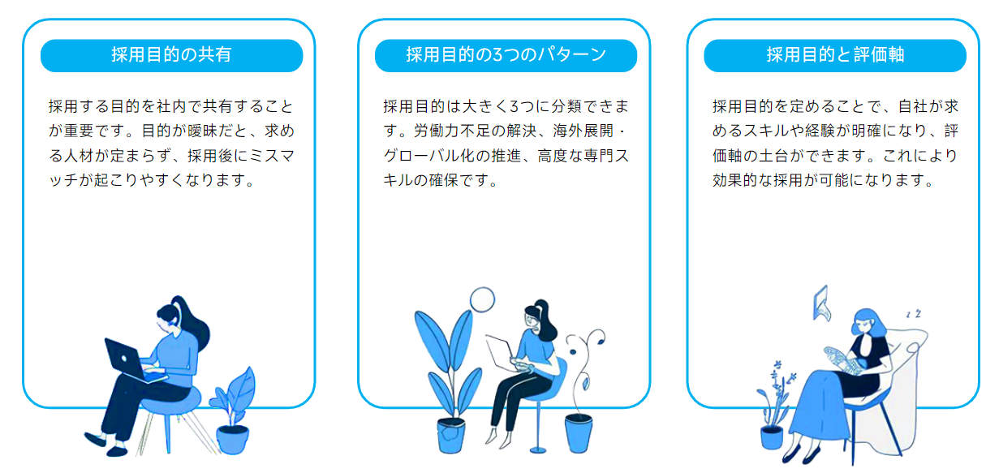
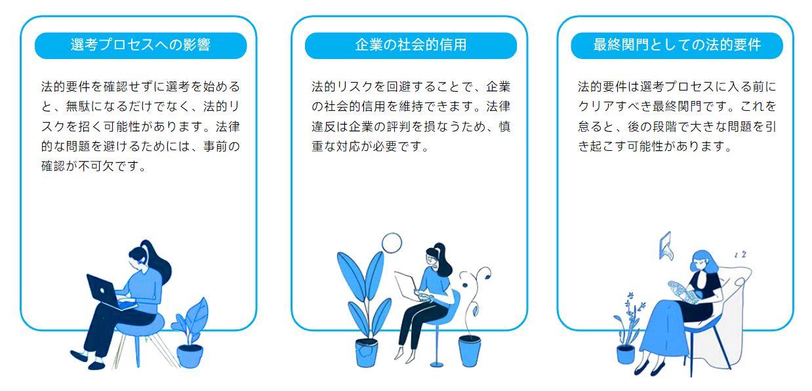

「この経歴書、どう判断すれば…？」外国人材の採用選考では、日本人と同じ物差しが通用せず、評価に迷う場面が多くあります。

この記事は、単なる注意点のリストではありません。文化の壁を越え、候補者の本質を見抜くための**「評価の考え方」と「具体的な実践術」**を解説する選考ガイドです。最後まで読めば、貴社の選考に、ぶれない自信と的確な判断基準が備わります。

## **なぜ今、外国人採用で「選考力」が問われるのか？**

結論から言うと、外国人採用が単なる人手不足対策から**「企業の成長を左右する経営戦略」へとシフト**し、同時に、**安易な選考がもたらす経営リスクが看過できないレベルになっている**からです。

正しい「選考力」を身につけることが、採用の成功と失敗を分ける時代になったと言えるでしょう。

### **深刻化する人手不足と、戦略的採用の重要性**

ご存知の通り、日本では少子高齢化による労働力不足が深刻化しており、もはや外国人材の活躍なくして事業の成長は考えにくい状況です。政府も「特定技能」や「高度専門職」といった在留資格を整備し、企業が外国人材を受け入れやすい環境づくりを推進しています。

もはや外国人採用は、「人手が足りないから」という短期的な穴埋めではありません。

- **海外市場への展開**現地文化に精通した人材による、グローバルビジネスの加速

- **専門スキルの確保**国内では希少なITエンジニアや研究者といった高度専門人材の獲得

- **組織の活性化**多様な価値観を取り入れることによる、イノベーションの創出

このように、企業の持続的な成長を実現するための**「戦略的投資」**として、外国人採用の重要性はますます高まっています。

### **【要注意】安易な選考が招く3つの経営リスク**

一方で、戦略の重要性が高まると同時に、選考の失敗がもたらすリスクも増大しています。日本人と同じ感覚で安易な選考を行うと、企業は以下のような深刻なリスクを負うことになります。

1.  **法的リスク（不法就労助長罪など）** 在留資格の確認を怠ったり、許可されていない業務に従事させたりした場合、企業側が「不法就労助長罪」に問われる可能性があります。これは罰金だけでなく、企業の社会的信用を大きく損なう重大なリスクです。

3. **経済的リスク（早期離職によるコスト損失）** スキルやカルチャーのミスマッチは、早期離職の最大の原因となります。採用や教育にかけた時間と費用が無駄になるだけでなく、再度募集を行うための追加コストが発生し、経営を圧迫します。

5. **組織的リスク（現場の混乱と生産性低下）** コミュニケーションの壁や価値観の違いから、現場の業務がスムーズに進まなくなったり、既存の日本人社員に過度な負担がかかったりするケースは少なくありません。これはチーム全体の士気を下げ、組織全体の生産性を低下させる要因となります。

> 日本語教育のプロの視点から、貴社に最適な人材のご紹介、選考のサポート、採用後の定着支援までワンストップでご支援します。  
>   
> 外国人材の採用や選考でお困りの方は、まずはお気軽に資料請求・お問い合わせください。  
> [\>>資料請求する（無料）](https://tcj-education.com/ja/foreign-recruitment/)  
> [\>>今すぐお問合せする](https://gaikoku-jinzai.tcj-education.com/#contact)

## **STEP1：採用前の準備｜ぶれない「評価軸」を作る**

選考を成功させる鍵は、面接を始める前の「準備段階」にあります。

具体的には、**①採用目的の明確化、②受け入れ体制の整備、③法的要件の確認**という3つの土台を固め、採用活動全体の「ぶれない評価軸」を作ることが不可欠です。

### **なぜ採用するのか？目的の明確化が全ての土台**

まず最初に、「なぜ、何のために外国人材を採用するのか」という目的を社内で明確に共有しましょう。目的が曖撮なままでは、どのような人材を探すべきか基準が定まらず、採用後のミスマッチに繋がってしまいます。

貴社の目的は、主に以下のどれに当てはまるでしょうか？

- **【目的1】労働力不足の解決****概要**: 国内での人材確保が困難な職種を、外国人材で補う。**職種例**: 介護職、製造業のライン作業、飲食店のホールスタッフなど。**求める人物像**: 定型業務を正確にこなせる、日本の労働文化に意欲的に適応しようとする人材。

- **【目的2】海外展開・グローバル化の推進****概要**: 特定の国・地域の言語能力や文化への知見を活かし、事業を拡大する。**職種例**: 海外営業担当、国際マーケター、インバウンド対応スタッフなど。**求める人物像**: 高い語学力に加え、ターゲット市場の文化や商習慣に精通した人材。

- **【目的3】高度な専門スキルの確保****概要**: 国内では希少な特定の専門技術や知識を持つ、即戦力人材を獲得する。**職種例**: AIエンジニア、データサイエンティスト、最先端医療の研究者など。**求める人物像**: 特定分野で高い専門性を持ち、自律的に業務を遂行できる人材。

このように目的を定めることで、自社が求めるスキルや経験がクリアになり、評価軸の土台ができます。

### **誰が活躍できるか？受け入れ体制から考える**

次に、定めた目的を達成できる人材が、自社で「本当に活躍できるか」という視点で、社内の受け入れ体制を確認することが重要です。どんなに優秀な人材を採用しても、受け入れる土壌がなければ定着は望めません。

以下の項目について、自社で対応が可能か事前にチェックしておきましょう。

- **言語サポート**□社内で日本語研修を実施したり、費用を補助したりできるか？□業務で使う専門用語や社内用語のリストを用意できるか？□契約書やマニュアルを「やさしい日本語」や多言語で準備できるか？

- **生活支援**□ 住居探しや賃貸契約のサポートは誰が行うか？□ 役所の手続きや銀行口座の開設に同行できる人員はいるか？□ ゴミの分別など、日本の生活ルールを教える体制はあるか？

- **社内文化**□ 日本人社員向けの異文化理解研修を実施できるか？□宗教上の配慮（お祈りの場所、食事制限など）は可能か？□ 国籍に関わらず、気軽に相談できる雰囲気や制度（メンターなど）はあるか？

これらの準備が難しい場合、採用する人材の「日本語レベル」や「日本での生活経験」の要件を上げる、といった評価軸の調整が必要になります。

### **そもそも採用できるか？法的要件の最終確認**

最後に、そもそも法律的に採用が可能かどうか、という大前提を確認します。これを怠ると、選考が無駄になるばかりか、法的なリスクを負うことにもなりかねません。

- **在留資格と業務内容の適合性**採用したいポジションの業務内容は、どの在留資格に該当するのかを必ず確認してください。例えば、「技術・人文知識・国際業務」の在留資格を持つ人材に、単純作業をメインで担当させることは法律で認められていません。

- **雇用契約の適法性**提示する給与が、国籍に関わらず同じ地域の同じ職種の日本人と同等以上であり、最低賃金を下回っていないかを確認します。また、社会保険への加入は企業の義務です。

これらの法的要件は、選考プロセスに入る前に必ずクリアしておくべき最終関門となります。

## **STEP2：書類選考｜経歴書の「裏側」を読む技術**

外国人材の書類選考を成功させるコツは、**日本の「常識」という物差しを一旦脇に置くこと**です。国や地域によって異なる文化や教育制度を理解し、経歴書の文字面だけでは分からない候補者のポテンシャルや背景を読み解く「技術」が求められます。

### **学歴・職歴は「日本の常識」で測らない**

まず、日本の当たり前が海外では通用しないことを認識しましょう。以下のような違いを知らないまま評価すると、候補者の能力を大きく見誤る可能性があります。

- **学歴の違い**`大学の修業年数`：日本の4年制とは限らず、3年制（イギリスなど）や5年制の国もあります。`学校の種類`：「専門学校」や「職業訓練校」の位置づけやレベルは国によって大きく異なります。

- **職歴・履歴書の違い**`ジョブホッピング`：短期間での転職を「キャリアアップ」と前向きに捉え、多様な経験をアピールする文化があります。`記載しない経歴`：試用期間での退職や、短期のインターンシップなどを経歴に記載しない文化も珍しくありません。`個人情報`：差別防止の観点から、顔写真や年齢、性別を履歴書に記載しないのがグローバルスタンダードの国も多く存在します。

### **国・地域別の履歴書と思考のクセ**

さらに一歩踏み込み、特に応募者の多い4つのエリアに分け、それぞれの文化的な傾向と選考時に注目すべきポイントを解説します。この背景を理解することで、より本質的な評価が可能になります。

- **欧米（アメリカ・ヨーロッパ）圏**大学のランキングよりも**「専攻分野」や「インターンシップ経験」**が重視される傾向があります。リベラルアーツ教育の影響で、専攻と職歴が必ずしも一致しないことも特徴です。また、ジョブホッピングがキャリアアップの手段として一般化しており、多様な経験を積んでいることが評価されるケースも少なくありません。

- **アジア（中国・インド・東南アジア）圏**中国やインドでは、国内トップ大学のネームバリューが非常に高く評価されます。一方で、近年は伝統的な大企業だけでなく、**スタートアップや外資系企業での実務経験**も高く評価される傾向にあります。終身雇用文化が根強い国もありますが、若手層を中心にキャリア観は多様化しています。

- **中東・アフリカ圏**候補者の学歴が国際的な基準でどのレベルに相当するか、慎重な確認が重要です。特に中東では、欧米やインドの大学で学位を取得した優秀な人材も多く、**学歴の国際的な信頼性**をチェックする必要があります。オイル・ガス産業や建設業、国際機関（NGO）など、その地域特有の産業での経験が強みとなることもあります。

- **南米圏**一部の名門私立大学が公立大学よりも高く評価されるケースや、**欧米への留学経験**がキャリアに大きく影響することがあります。経済状況の変動が激しい地域も多いため、キャリアの途中でフリーランスや起業を経験している候補者も多いのが特徴です。

### **【要注意】見落とせない確認事項（兵役・技能実習経験など）**

最後に、日本人採用にはない、外国人材特有の確認事項があります。これらは後のトラブルや在留資格申請の不許可に繋がる可能性があるため、書類の段階で気づいた場合は面接で必ず確認しましょう。

- **兵役の義務** 韓国、台湾、タイなど、国によっては兵役が義務付けられています。入社直後に長期休職が必要になるリスクを避けるため、兵役を既に終えているか（「兵役済み」か「免除」か）は、確認しておくと安心です。

- **技能実習制度の経験** 過去に「技能実習生」として日本で働いた経験がある場合、再度日本で就労ビザを申請する際に審査が厳しくなることがあります。これは、技能実習制度が「母国への技術移転」を目的としているためです。該当する可能性がある場合は、本人へのヒアリングが重要となります。

## **STEP3：面接｜「本音」と「本質」を引き出す対話術**

書類選考を通過した候補者との面接は、選考プロセスにおける最重要ステップです。成功の秘訣は、**文化の違いを前提とした「対話の場」を作ること**にあります。

表面的なやり取りに終始せず、①相手が安心して話せる環境を整え、②戦略的な質問で候補者の「本質」を引き出し、③スキルは「客観的な証拠」で評価する、という3つのステップで進めることが重要です。

### **文化の壁を越える3つの心構え**

効果的な質問をする前に、面接官自身が以下の3つの心構えを持つことが、候補者の本音を引き出す土台となります。

1. **シンプルな言葉で、明確に伝える**専門用語や「よしなに」「いい感じで」といった曖昧な日本語は避けましょう。一つの質問に複数の要素を詰め込まず、「〇〇について教えてください」と簡潔に問いかけることが、正確なコミュニケーションの第一歩です。

3. **価値観の違いを「間違い」と捉えない**例えば、自己アピールが強いことを「謙虚さがない」、転職回数が多いことを「忍耐力がない」と、日本の物差しだけで判断してはいけません。「なぜそう考えるのですか？」と、その背景にある文化や価値観を理解しようとする姿勢が、候補者の本質を見抜く鍵となります。

5. **非言語コミュニケーションも意識する**穏やかな表情や、意識的なうなずきは、言語の壁を越えて「あなたの話に興味があります」というメッセージを伝えます。特にオンライン面接では、少し大きめのリアクションが、候補者に安心感を与え、リラックスした対話を促します。

> 日本語教育のプロの視点から、貴社に最適な人材のご紹介、選考のサポート、採用後の定着支援までワンストップでご支援します。  
>   
> 外国人材の採用や選考でお困りの方は、まずはお気軽に資料請求・お問い合わせください。  
> [\>>資料請求する（無料）](https://tcj-education.com/ja/foreign-recruitment/)  
> [\>>今すぐお問合せする](https://gaikoku-jinzai.tcj-education.com/#contact)

## **候補者の本質を見抜く「戦略的質問」テンプレート**

候補者の能力や人柄を深く理解するためには、意図を持った「戦略的な質問」が不可欠です。以下の3つの軸で質問を組み立てることをお勧めします。

1.  **過去の「行動」から再現性を測る質問****目的**: 過去にどのような状況で、どう考え、行動し、結果を出したかを聞くことで、将来の活躍度を予測します。**質問例**:「これまでの仕事で、最も困難だった課題は何ですか？その課題に対し、**具体的にどのように取り組み、解決しましたか？**」「プロジェクトでチームの意見が対立した際、あなたは**どのような役割を果たしましたか？**」

3.  **未来の「価値観」からカルチャーフィットを測る質問****目的**: 候補者が何を大切にし、どのような環境で力を発揮するタイプかを知り、自社の文化に合うかを見極めます。**質問例**:「あなたが仕事をする上で、最も大切にしていることは何ですか？**それはなぜですか？**」「私たちの会社のどのような点に共感し、日本で働きたいと思いましたか？」

5. **日本への「適応力」と「学習意欲」を測る質問****目的**: 未知の環境や文化に対する柔軟性や、困難を乗り越えようとする姿勢があるかを確認します。**質問例**:「日本の働き方について、何か不安に感じていることはありますか？」「仕事で分からないことがあった時、あなたはどのようにして解決しようとしますか？」

### **スキル評価：客観的な「証拠」で判断する**

面接での会話を補完するために、専門スキルについては客観的な「証"拠」で評価することがミスマッチを防ぎます。

- **実技試験・コーディングテスト**ITエンジニアや技術職の場合、実際のスキルレベルを測るために非常に有効です。

- **ポートフォリオの確認**デザイナーやクリエイター職であれば、過去の制作物を見せてもらい、その意図やプロセスを説明してもらうことで、能力と実績を同時に評価できます。

- **第三者機関の資格**IT分野のAWS認定や、建設分野の技能実習修了証など、客観的なスキル証明となる資格の有無も重要な判断材料となります。

## **外国人採用選考チェックリスト**

外国人採用は確認事項が多岐にわたるため、抜け漏れが起こりがちです。ここでは、これまでの内容を**「書類選考」「面接」「内定後」の3つのフェーズに分けた、実践的なチェックリスト**としてまとめました。

### **書類選考フェーズ・チェックリスト**

書類上で候補者の基本情報を確認し、法的な前提条件をクリアしているかを判断します。

- □ **在留資格の適合性**募集職種と、候補者が持つ（または取得見込みの）在留資格の種類は合致していますか？

- □ **学歴・職歴の背景理解**日本の常識だけで判断していませんか？国・地域ごとの文化や教育制度の背景を考慮して評価していますか？

- □ **日本語能力の目安把握**JLPTなどの資格スコアを、あくまで参考情報として把握していますか？

- □ **特有事項の確認**兵役義務のある国籍ではないか？過去に技能実習生としての経験はないか？（面接での確認項目としてメモ）

### **面接フェーズ・チェックリスト**

対話を通じて、書類だけでは分からない「生きた能力」と「候補者の本質」を見極めます。

- □ **面接官の心構え**「シンプルな言葉」「価値観の尊重」「非言語コミュニケーション」という3つの心構えを意識できていますか？

- □ **基本的な会話力**自然な会話のキャッチボールは可能ですか？

- □ **論理的思考力・言語化能力**「なぜ？」「具体的には？」という深掘り質問に対し、自分の行動や考えを論理的に説明できていますか？

- □ **カルチャーフィット**仕事への価値観やキャリアプランは、自社の文化や方針と大きく乖離していませんか？

- □ **日本への適応力・学習意欲**環境変化への柔軟性や、困難を乗り越えようとする姿勢は感じられますか？

- □ **専門スキルの客観的評価**専門職の場合、ポートフォリオの提示や実技テストなど、客観的な証拠でスキルレベルを確認しましたか？

### **内定～入社前フェーズ・チェックリスト**

内定後の手続きを円滑に進め、入社前の認識のズレや内定辞退を防ぎます。

- □ **労働条件の明確な提示**雇用契約書を作成し、給与（手当や残業代の扱いを含む）、休日などの条件を、誤解が生まれないよう丁寧に説明しましたか？

- □ **在留資格の手続き**在留資格の変更・更新が必要な場合、その手続きの段取り（誰が、いつまでに、どう進めるか）は明確になっていますか？

- □ **生活面のサポート体制**住居探しの手伝いや、初期費用の負担など、入社にあたって必要なサポート内容を確認・伝達できていますか？

## **まとめ：公正な選考が企業の未来を創る**

外国人材の選考を成功に導くために最も大切なことは、**選考を「評価テスト」ではなく、互いを理解するための「対話」と捉える姿勢**です。文化や経歴の違いという表面的な情報に惑わされず、候補者の本質を見抜こうとする公正な選考プロセスこそが、企業の未来を創るための重要な第一歩となります。

外国人材の選考は、単に候補者をふるいにかける作業ではありません。多様な才能の中から、貴社の未来を共に創るパートナーを見つけ出す、非常に創造的で価値のあるプロセスです。

この記事が、貴社にとって素晴らしい仲間と出会うための一助となれば幸いです。また、採用後の定着と活躍には、彼らのキャリアアップを支援する視点も不可欠です。ぜひ、以下の記事も併せてご覧ください。

> 日本語教育のプロの視点から、貴社に最適な人材のご紹介、選考のサポート、採用後の定着支援までワンストップでご支援します。  
>   
> 外国人材の採用や選考でお困りの方は、まずはお気軽に資料請求・お問い合わせください。  
> [\>>資料請求する（無料）](https://tcj-education.com/ja/foreign-recruitment/)  
> [\>>今すぐお問合せする](https://gaikoku-jinzai.tcj-education.com/#contact)
