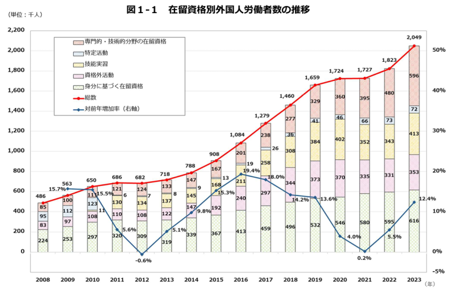
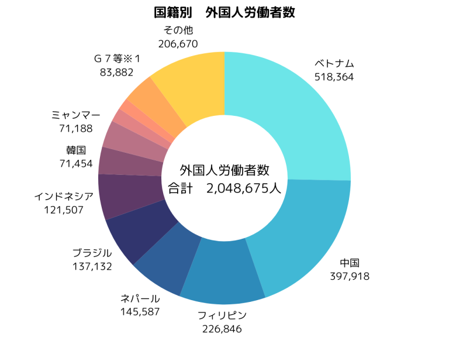

```
国内の労働者不足を背景に、外国人採用を検討する企業が増加しています。しかし、外国人雇用の手続きは複雑で、初めての企業にとっては難しい面があります。本記事では、在留資格や外国人雇用に関する注意点、さらに採用のステップについて解説します。外国人労働者雇用の基本的な情報をお届けします。
```

## 外国人労働者雇用の現状

### 国内で働く外国人労働者の推移

2023年10月末時点で、日本国内における外国人労働者数は約204.9万人に達しました。これは前年同期比で12.4%の増加を示しており、初めて200万人を超える結果となりました。

在留資格別の内訳を見ると、最も多いのは「技術・人文知識・国際業務」（頭文字を取って、通称「技人国ビザ」）の在留資格を意味する「専門的・技術的分野の在留資格」を持つ労働者で、約59.6万人に上ります。この分野は前年比24.2%と大幅に増加しており、全体の29.1%を占めています。

次いで多いのは「身分に基づく在留資格」を持つ労働者で、全体の30.1%を占めています。また、技能実習生も約41.3万人と増加傾向にあり、前年比20.2%の伸びを示しています。国籍別では、ベトナム人労働者が約51.8万人で全体の25.3%を占め最多となっています。続いて中国が約39.7万人（19.4%）、フィリピンが約22.6万人（11.1%）となっています。

これらのことから、日本における外国人労働者の需要が年々高まっており、特に専門的・技術的分野での雇用が急増していることがわかります。





出典：「外国人雇用状況」の届出状況まとめ（令和５年10月末時点）｜厚生労働省

### 外国人労働者の在留資格区分

外国人労働者の在留資格区分は、日本での合法的な滞在と就労を管理する重要な制度です。在留資格とは、外国人が日本に合法的に滞在するための資格を指し、全部で29種類存在します。これらの資格は、就労の可否や範囲によって大きく分類されます。在留資格は主に以下の４つのカテゴリーに分けられます。

- 定められた範囲で就労可能な在留資格

- 制限なく就労可能な在留資格

- 就労不可能な在留資格

- 定められた範囲で就労可能な在留資格

「就労ビザ」ともいわれる在留資格は、現在19種類あり、特定の職種や分野での就労を認める資格です。この資格を持つ外国人は、指定された範囲内でのみ就労が可能です。

- 外交

- 公用

- 教授

- 芸術

- 宗教

- 報道

- 高度専門職

- 経営・管理

- 法律・会計業務

- 医療

- 研究

- 教育

- 技術・人文知識・国際業務（技人国ビザ）

- 企業内転勤

- 介護

- 興行

- 技能

- 特定技能

- 技能実習

- 制限なく就労可能な在留資格

身分系の在留資格は、現在4種類あり、日本との個人的な関係や身分に基づいて付与される資格です。この資格を持つ外国人は、就労の範囲に制限がなく、様々な職種で働くことができます。

- 永住者

- 日本人の配偶者等

- 永住者の配偶者等

- 定住者

- 就労不可能な在留資格

就労以外の活動を目的とした在留資格のため、正社員としての雇用はできません。ただし、文化活動・留学・家族滞在の在留資格に限っては「資格外活動の許可」を受けていれば本来の在留資格の活動を阻害しない範囲内で（留学生：1週28時間以内）就労が可能です。「資格外活動許可」の取得については、在留カード裏面のスタンプで確認可能です。

1. 文化活動

3. 短期滞在

5. 留学

7.  研修

9. 家族滞在

11. 特定活動

※特定活動は、個々の外国人に対して特定の活動を指定して許可される在留資格です。この資格には、外交官の家事使用人やワーキングホリデーなどが含まれます。活動内容は様々なパターンがあり、一律に「就労可能な在留資格」とは言い切れない側面があります。

外国人を雇用する際は、候補者の在留資格を確認し、その資格で認められている活動範囲内で雇用することが重要です。

## 外国人雇用時の注意点

外国人労働者を雇用する際には、日本人労働者と同様に慎重に取り扱わなければならない点がいくつかあります。文化的な違いや法律に基づいた義務、そして雇用契約に関する重要な留意点が多いため、これらを理解し、対策を講じることが求められます。以下では、外国人労働者を雇用する際の注意点について、より詳細に解説します。

### ① 在留資格と期間の確認

外国人を雇用する際、最も重要なのは在留資格と在留期間の確認です。雇用しようとする外国人が就労可能な在留資格を持っているか、その在留期間が有効であるかを必ず確認しましょう。適切な資格を持っていないと不正就労と見なされ、企業側も法律に違反したことになり、罰則を受ける可能性もあり注意が必要です。

代表的な就労の在留資格には以下のものがあります。

- 技術・人文知識・国際業務：主に大学や今までの職務経験と関連する専門職に従事するための就労ビザで、機械工学等の技術者，通訳，デザイナー，私企業の語学教師，マーケティング業務従事者等が該当します。単純労働に従事させることは原則として認められていないので、申請時に実際の業務内容が単純労働とみなされる場合、申請が不許可になる可能性があります。

- 特定技能：特定の産業分野で即戦力となる外国人労働者を受け入れる在留資格です。主に介護、建設、外食業など12分野（今後16分野に拡大）が対象で、取得要件に学歴は含まれず、特定技能試験に合格または技能実習2号などからの移行によって在留資格を得ることができます。コロナ禍による渡航制限解除後は、特定技能を取得して海外から日本に入国する人も増加しており、今後拡大が見込まれる在留資格です。

### ② 日本語コミュニケーションを支える工夫

外国人労働者を雇用する場合、その日本語能力に応じたサポートを行うことが重要です。日本語が不自由な場合、業務の指示や社内のルール、コミュニケーションに問題が生じる可能性があります。特に、製造業や接客業、医療・介護業などでは、正確なコミュニケーションが求められます。

外国人労働者の日本語コミュニケーションを支えるため、以下のような方法が効果的です：

- 日本語研修の実施  
    日本語能力が十分でない外国人労働者に対して、業務に必要な専門用語やビジネスマナーなど含めた日本語を学ぶ機会を提供します。

- 業務マニュアルの多言語化  
    日本語以外の言語（英語や母国語など）で業務マニュアルや資料を作成することで、外国人労働者が内容を理解した上で業務に取り組める環境を整えます。

- 通訳やサポートスタッフの配置  
    日本語に不安がある外国人労働者に対して、必要に応じ定期的に通訳を手配する、あるいは日本語が堪能なスタッフを配置してサポートを行います。

- 受入れ側のやさしい日本語の活用  
    受け入れ企業の日本人労働者が「やさしい日本語」を使う意識を持つことも重要です。「やさしい日本語」とは、外国人や日本語が不慣れな人にも分かりやすく伝えるための工夫です。短い文、簡単な言葉、平易な表現を用いることで、情報を正確に伝え、誤解を防ぐことができます。これにより、外国人労働者が業務内容をスムーズに理解し、安心して働ける環境づくりに寄与します。

このようなコミュニケーションの支援をすることで、外国人労働者が業務をスムーズにこなせるようになり、また職場内でのトラブルを減少させることができます。

### ③ 文化的な配慮と職場の理解

外国人労働者を雇用する際には、彼らの文化的な背景を理解し、職場環境に適応できるよう、企業と既存の労働者が適切に配慮することが重要です。文化的な違いが原因で誤解やトラブルが生じることもあるため、以下の点に注意しましょう：

- 働き方の違い  
    外国人労働者の出身国では、労働時間、休暇、労働条件が日本とは異なる場合があります。そのため、日本の労働文化や企業の就業規則について、事前に分かりやすく説明し、理解を深めてもらうことが必要です。

- 宗教や食文化への配慮  
    特にイスラム教徒の場合、ハラール食品の提供や礼拝の時間確保など、宗教的なニーズに配慮することが求められます。こうした文化的配慮を行うことで、労働者の満足度が高まり、定着率の向上につながります。

- 社内の多文化対応  
    外国人労働者が職場に馴染むためには、同僚や上司が文化的な違いを理解し、適切にサポートすることが重要です。研修や社内イベントを通じて、相互理解を深める機会を設けるとよいでしょう。

さらに、外国人労働者が持つ文化や価値観を尊重し、職場全体で多様性を受け入れる環境を作ることが、円滑な職場運営につながります。多様な視点を取り入れることは、組織の成長にも大きく貢献するでしょう。

### ④ 雇用契約書の取り決め

外国人労働者を雇用する際には、雇用契約書をしっかりと取り交わすことが必要不可欠です。雇用契約書は、業務内容や労働条件、給与額、勤務時間、休日などの基本的な労働条件を明記する書面です。特に外国人労働者にとっては、契約内容を十分に理解できるよう配慮することが重要です。

外国人労働者には日本語が十分でない場合もあるため、契約書を日本語と外国人労働者が理解できる言語（例えば、英語や母国語）で作成することを推奨します。また、労働条件や給与についての誤解を防ぐため、細かい部分まで明確に記載し、双方が納得のいく契約を結ぶことが大切です。

具体的な内容としては、以下の点を契約書に含めることが求められます。

- 業務内容（職種、職務）

- 勤務時間、休日、休暇の規定

- 給与額、支払方法（給与の額面、手当、賞与など）

- 福利厚生、社会保険の加入について

- 雇用期間や契約更新の条件

- 雇用契約を終了する条件（解雇や退職に関する規定）

これらの情報を明確にすることで、契約に基づいたトラブルを避け、労働者と企業の双方が納得した上で働ける環境を作ることができます。

### ⑤ 雇用時・離職時の正しい手続き

外国人労働者を雇う際には、日本の労働法を遵守することはもちろん、外国人労働者に対して特有の法的義務が生じる場合もあります。例えば、在留資格に基づいた雇用契約を結ぶことはもちろん、外国人労働者の社会保険加入、労働保険の適用なども適切に行う必要があります。

特に、外国人労働者に関する法的な規定は頻繁に変わることがあるため、常に最新の法令に基づいた運営が求められます。労働法に関する最新の情報を得るためには、定期的に専門家からアドバイスを受けることが有効です。

## 外国人雇用前に必要な準備事項

外国人労働者を雇用するためには、いくつかの事前準備が必要です。以下に、採用までに行うべき基本的な準備事項を紹介します。

### 求人要件と在留資格の確認

まず、雇用したい外国人労働者に求めるスキルや資格、業務内容を明確にしましょう。その上で、決定した職務内容に基づき、適切な在留資格を確認します。在留資格によって認められる活動範囲が異なるため、求めるスキルセットや条件に合致する資格を選定することが重要です。

### 入社後のフォロー体制の確立

外国人労働者が円滑に業務を行えるよう、入社後のサポート体制を確立しましょう。日本語能力に不安がある場合は、研修を提供したり、メンター制度を設けるなど、フォロー体制を整えておくことが重要です。

### 面接時に外国人向け質問の用意

面接時には、日本語能力を適切に評価することが重要です。日本語能力試験（JLPT）のレベルを参考にしつつ、実際のコミュニケーション能力も確認しましょう。JLPTは話す力を測れないため、実際の会話力は試験結果より一段階下と考えるのが良いでしょう。通常の面接質問に加え、外国人特有の質問も用意しましょう。例えば、「自由に自己紹介してください」といった制限のない質問を通じて、より自然なコミュニケーション能力を評価できます。

## 外国人雇用の基本的な流れ

外国人雇用の流れは、以下の主要なステップで構成されています。この流れは、海外在住者と国内在住者で基本的に変わりません。

- 人材募集  
    職務内容、勤務条件、必要なスキル、言語要件を明確に定義した求人広告を作成し、募集

- 候補者選考  
    履歴書審査や面接を通じて、応募者の能力、経験、文化適合性を総合的に評価国内在住の外国人の場合、在留カードと在留資格の有効性を必ず確認

- 採用決定と契約締結  
    最終候補者を選定し、内定通知を発行職務内容、労働条件、給与体系などを詳細に記載した雇用契約書を作成し、双方で合意

- 在留資格手続き  
    必要に応じて、就労ビザの新規申請または既存の在留資格の変更手続き申請

- 入社準備  
    住居の手配支援、オリエンテーションや事前研修の実施、必要な場合は渡航手続きのサポートを行う

- 雇用開始  
    雇用後は、言語や文化の壁を感じることがあるため、サポート体制を強化し、困った時に相談できる場所を作ることが、長期的な定着に重要

## 外国人雇用時に受給できる助成金

外国人労働者を雇用する場合、企業は助成金を受け取ることができる場合があります。以下の助成金があります。

###  人材確保等支援助成金（外国人労働者就労環境整備助成コース）

この助成金は、外国人労働者を雇用するために必要な就業環境の整備を支援するものです。研修設備の整備や日本語教育の支援など、外国人労働者の受け入れにかかる費用の一部を助成します。詳細は下記で確認できます。

参考：[人材確保等支援助成金（外国人労働者就労環境整備助成コース）｜厚生労働省](https://www.mhlw.go.jp/stf/seisakunitsuite/bunya/koyou_roudou/koyou/kyufukin/gaikokujin.html)

### その他の雇用助成金

外国人労働者専用の助成金は限られていますが、一般的な雇用助成金も多くあります。企業の雇用支援に関連する助成金を探す際は、下記のような検索ツールも活用するといいでしょう。

参考：[雇用関係助成金検索ツール｜厚生労働省](https://www.mhlw.go.jp/stf/seisakunitsuite/bunya/koyou_roudou/koyou/kyufukin/index_00007.html)

## まとめ

外国人労働者の雇用は、労働力不足解消の一つの解決策となりますが、適切な手続きと配慮が必要です。在留資格の確認、労働条件の明確な伝達など、様々な注意点があります。また、採用から就労開始までのステップを理解し、適切に対応することが重要です。さらに、利用可能な助成金制度を活用することで、外国人労働者の受け入れをより円滑に進めることができます。外国人雇用を検討する際は、これらの点に留意しつつ、自社の状況に合わせた最適な方法を選択してください。

株式会社TCJグローバルは、日本語教育における36年の実績を基に、国内外において日本語教育を軸とした人材育成に取り組んでおります。特にベトナムやネパールをはじめとする海外拠点において、日本語教育と日本語教師養成サービスの運営や日本への就労支援等、様々な活動を展開しております。また、外国人労働者を雇用されている企業様向けに、日本語教育コンサルティングや、ニーズに応じた外国人材のご紹介サービスを提供しております。ご相談やお問い合わせは、どうぞお気軽にご連絡ください。
