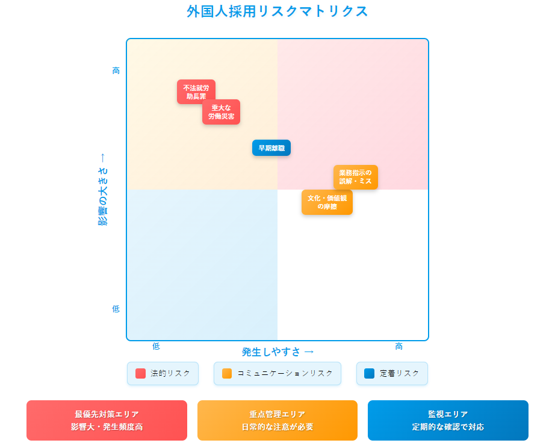

「外国人採用、何がリスクか分からず不安…」「トラブルが起きたらどうしよう…」

もしそう感じているなら、それは当然のことです。漠然とした不安は、その“正体”が分からないからこそ生まれるもの。この記事では、まず**リスクマップ**で課題の全体像を可視化し、具体的な対策を一つひとつ丁寧に解説していきます。ぜひ、最後までご覧ください。

## **まず全体像を把握しよう｜外国人採用のリスクマップ**

多岐にわたる外国人採用のリスクを効率的に管理するには、まず全体像を把握し、対策の優先順位をつけることが不可欠です。

結論として、リスクは大きく**「①法的リスク」「②コミュニケーションリスク」「③定着リスク」の3つに分類でき、それらを「影響の大きさ」と「発生しやすさ」の2軸で整理した「リスクマップ」**で可視化することが最も有効です。

### **外国人採用の3大リスクとは？**

まず、3つのリスクカテゴリーの概要を理解しましょう。

1. **法的リスク**在留資格の不適合や労働基準法違反など、法律に関わるリスクです。発生すれば企業の存続問題に発展しかねない、最も影響の大きいリスクと言えます。

3. **コミュニケーションリスク**言葉の壁はもちろん、文化や価値観の違いによる誤解や摩擦を指します。日常的に発生しやすく、現場の生産性やチームの士気に直接影響を与えます。

5. **定着リスク**キャリアパスの不透明さや職場での孤立感などにより、採用した人材が早期に離職してしまうリスクです。採用コストの損失に直結し、じわじわと組織を疲弊させます。

### **【図解】リスクの「影響度」と「発生頻度」で優先順位がわかる**

これら3大リスクに紐づく具体的な事象を、以下の「リスクマップ」で整理しました。どこから対策を始めるべきかを判断するのにご活用ください。

このマップを基に、特に注意すべきリスクを解説します。

### **【影響：大】絶対に避けるべき「致命的リスク」**

マップの右上に位置する、発生頻度は低いかもしれませんが、一度起これば企業に致命的なダメージを与える可能性のあるリスクです。

- **不法就労助長罪**在留資格の確認ミスなどにより、就労が許可されていない外国人を雇用してしまうリスクです。罰金や刑事罰の対象となり、企業の信用を完全に失います。

- **重大な労働災害**安全指示の誤解などが原因で、人命に関わる事故が発生するリスクです。

### **【影響：中】日常的に注意すべき「頻出リスク」**

マップの中央付近に位置する、日常業務の中で頻繁に発生し、放置すると大きな問題に発展するリスク群です。

- **業務指示の誤解・ミス**コミュニケーションエラーにより、業務の生産性が著しく低下するリスクです。

- **文化・価値観の摩擦**「報連相」の習慣の違いや時間感覚のズレなどが原因で、チームの雰囲気が悪化し、日本人社員が疲弊するリスクを指します。

- **早期離職**採用や教育にかけた時間とコストがすべて無駄になってしまう、経済的損失の大きいリスクです。

> 日本語教育のプロの視点から、貴社に最適な人材のご紹介、選考のサポート、採用後の定着支援までワンストップでご支援します。  
>   
> 外国人材の採用や選考でお困りの方は、まずはお気軽に資料請求・お問い合わせください。  
> [\>>資料請求する（無料）](https://tcj-education.com/ja/foreign-recruitment/)  
> [\>>今すぐお問合せする](https://gaikoku-jinzai.tcj-education.com/#contact)

## **【リスク別】具体的な回避策とアクションプラン**

リスクマップで全体像を把握したら、次はそれぞれのリスクに対する具体的な対策を講じていきます。ここでは、**「①法的リスク」「②コミュニケーションリスク」「③定着リスク」**の3つのカテゴリー別に、明日から実践できる具体的なアクションプランを解説します。

### **① 法的リスクの回避策｜コンプライアンスを完璧にする**

法的リスクは、一度発生すると企業に最も大きなダメージを与えます。「知らなかった」では済まされないため、採用プロセスにチェック体制を組み込むことが不可欠です。

- **採用前のチェックリスト****□在留資格と業務内容の適合性確認：**候補者の在留資格で、任せたい業務が本当に可能か、出入国在留管理庁のウェブサイトや専門家（行政書士など）に確認する。**□在留カードの原本確認：**面接時に必ず在留カードの「原本」を提示してもらい、有効期限や裏面の「資格外活動許可」の有無を確認する。**□在留カードの有効性確認：**出入国在留管理庁の「在留カード等番号失効情報照会」サイトを使い、偽造カードでないか最終チェックを行う。

- **雇用中の管理体制****□在留期間の管理：**従業員ごとの在留期間満了日を一覧表などで管理し、更新時期が近づいたら本人に通知する仕組みを作る。**□労働関連法令の遵守：**労働時間、休日、社会保険の適用など、日本人社員と全く同じ労働基準法が適用されることを社内（特に現場の管理職）に周知徹底する。

### **② コミュニケーションリスクの回避策｜文化の壁を"橋"に変える**

日常的に発生するコミュニケーションの壁は、小さな誤解のうちに解消する仕組みを作ることが、大きなトラブルへの発展を防ぎます。

- **日本人社員向けの準備****□「やさしい日本語」研修の実施：**専門用語を簡単な言葉に言い換える、曖昧な指示（「よしなに」など）を具体的な指示（「〇〇を△△してください」）に変える、といった社内ルールを作る。**□異文化理解の機会提供：**「報連相の文化がない国もある」「沈黙は必ずしも否定ではない」など、具体的な文化の違いを学ぶ簡単な勉強会を開く。

- **外国人材へのサポート****□業務マニュアルの多言語化・図解化：**口頭説明だけに頼らず、写真や図を多用した視覚的なマニュアルを用意する。**□メンター制度の導入：**仕事の進め方から生活の悩みまで、何でも気軽に相談できる日本人社員を「メンター（相談役）」として任命する。

### **③ 定着リスクの回避策｜「ここで働き続けたい」と思ってもらう仕組み**

採用コストの損失に直結する早期離職は、本人のモチベーションを維持・向上させる仕組みで防ぐことができます。

- **キャリアパスの提示****□具体的な昇進・昇給モデルの共有：**「〇〇のスキルを習得すれば、△△の役職に就ける」といった、将来のキャリアが見える具体的なロードマップを本人と共有する。

- **公正な評価制度****□評価基準の明確化：**何をすれば評価されるのか、その基準を明文化し、全社員に公開する。日本語能力そのものではなく、あくまで業務の成果で評価する姿勢を明確にする。

- **生活面のサポート体制****□住居探しのサポート：**賃貸契約の保証人になる、提携している不動産会社を紹介するなど、日本での生活基盤づくりを支援する。**□行政手続きのサポート：**役所での住民登録や銀行口座の開設など、慣れない手続きに同行する担当者を決めておく。

## **リアル失敗事例から学ぶ「転ばぬ先の杖」**

知識としてリスクを理解していても、実際の現場では思わぬ落とし穴に陥ることがあります。ここでは、実際に多くの企業が経験した失敗事例から、具体的な「転ばぬ先の杖」を学びましょう。

結論から言うと、失敗の多くは**「大丈夫だろう」という小さな思い込み**と、**日本の「当たり前」を相手に押し付けること**から生まれます。

### **事例1：「大丈夫だろう」という確認ミスが招いた不法就労リスク**

人手不足に悩む飲食店のA店長は、日本語が堪能で人柄も良い留学生Bさんの応募に喜び、すぐにでも採用したいと考えました。面接も和やかに進み、在留カードの確認も行いました。

**【失敗のポイント】** 面接時、Bさんは「資格外活動許可はあります！」と元気に答えたため、A店長は安心してしまいました。しかし、カードのコピーを取るのを忘れ、「後で持ってきてもらえば大丈夫だろう」と思い込んでしまったのです。

**【発覚と結果】** 数週間後、改めてカードの裏面を確認したところ、許可スタンプが押されていないことが判明。Bさん自身、許可申請が必要なことを知らなかったのです。A店長は意図せず「不法就労助長罪」の状態を作り出してしまい、慌ててBさんの就労を停止し、専門家に相談する事態となりました。

**【この事例からの教訓】**

1. **面接時の「その場での原本確認」は絶対**「後で」は通用しません。必ず面接の場でカードの原本（表と裏）を目視で確認し、コピーまたは写真で記録を残すことを徹底しましょう。

3. **本人の「大丈夫」を鵜呑みにしない**悪気なく、本人もルールを誤解しているケースは多々あります。雇用する企業側が、正しい知識をもって最終確認する責任があります。

### **事例2：「報連相」の文化の違いが引き起こした現場の崩壊**

IT企業C社のマネージャーは、母国でエース級だった外国人エンジニアDさんを採用しました。Dさんの技術力は非常に高いものの、一人で黙々と作業を進めるタイプでした。

**【失敗のポイント】** マネージャーは日本の「報連相」の感覚で、「進捗は？」と尋ねると、Dさんはいつも「問題ありません」とだけ回答。Dさんには「途中経過を細かく報告する」という文化がなく、「完成してから報告するのがプロフェッショナル」という価値観を持っていたのです。

**【発覚と結果】** 納期直前になって、プロジェクトの仕様解釈に大きなズレがあったことが発覚。大幅な手戻りが発生し、チームは納期に追われ、雰囲気は最悪に。マネージャーは「なぜ相談しなかったんだ」と不満を抱き、Dさんは「なぜ明確に指示しなかったんだ」と不信感を募らせてしまいました。

**【この事例からの教訓】**

1. **「当たり前」を言語化して共有する**「報連相」のような日本のビジネス文化は、外国人にとっては未知の習慣です。「私たちのチームでは、毎日夕方に5分だけ進捗を共有します」など、期待する行動を具体的に伝えましょう。

3. **「なぜ」という背景を説明する**ただルールを押し付けるのではなく、「なぜ報連相が必要か（＝手戻りを防ぎ、チームで問題を解決するため）」という目的を説明することで、相手の納得感が得られます。

5. **1on1ミーティングを定期的に実施する**全体会議では発言しにくくても、一対一なら相談しやすいものです。定期的な1on1の場を設け、進捗だけでなく、困っていることや文化的なギャップがないかをヒアリングすることが、すれ違いを防ぎます。

## **リスク管理は「守り」であり、最強の「攻め」でもある**

外国人採用を成功に導くための最終的なキーポイントは、**リスク管理を単なる「守り」ではなく、企業の成長を加速させる最強の「攻め」の戦略と捉えること**です。リスクを事前に管理し、誰もが安心して能力を発揮できる土壌を整えることこそが、採用した人材の活躍を最大化し、組織にイノベーションをもたらすための最も確実な投資となります。

もし、この記事を読んでもなお、「自社だけでリスク管理体制を構築するのは不安だ」「具体的なケースについて専門家のアドバイスが欲しい」と感じられたなら、ぜひご相談ください！

> 日本語教育のプロの視点から、貴社に最適な人材のご紹介、選考のサポート、採用後の定着支援までワンストップでご支援します。  
>   
> 外国人材の採用や選考でお困りの方は、まずはお気軽に資料請求・お問い合わせください。  
> [\>>資料請求する（無料）](https://tcj-education.com/ja/foreign-recruitment/)  
> [\>>今すぐお問合せする](https://gaikoku-jinzai.tcj-education.com/#contact)
