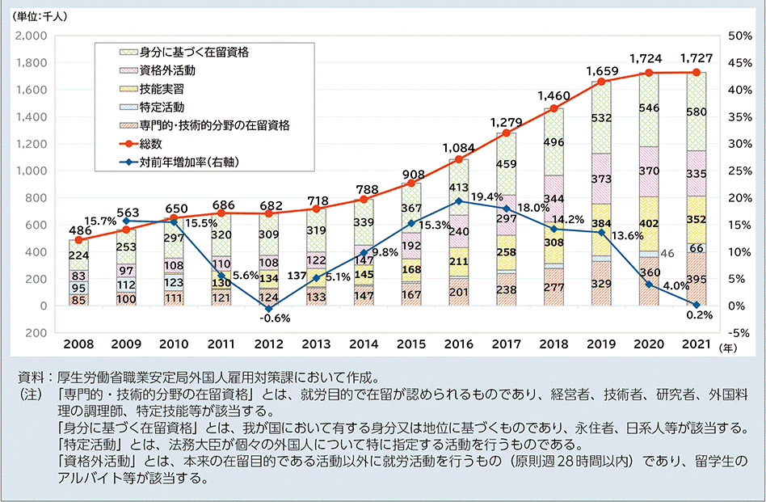
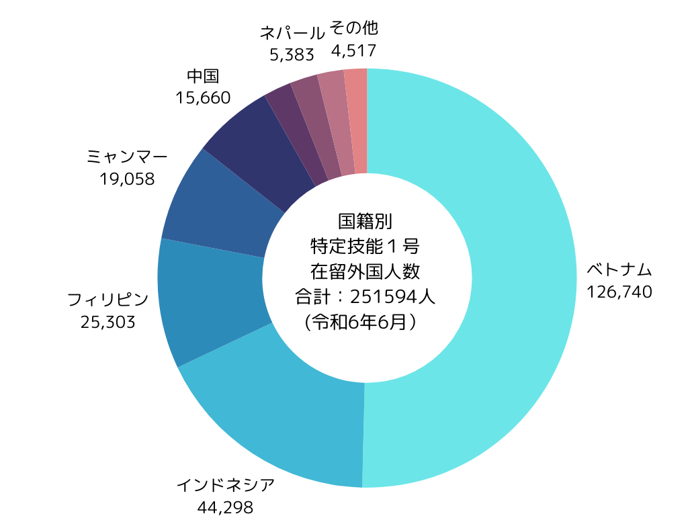
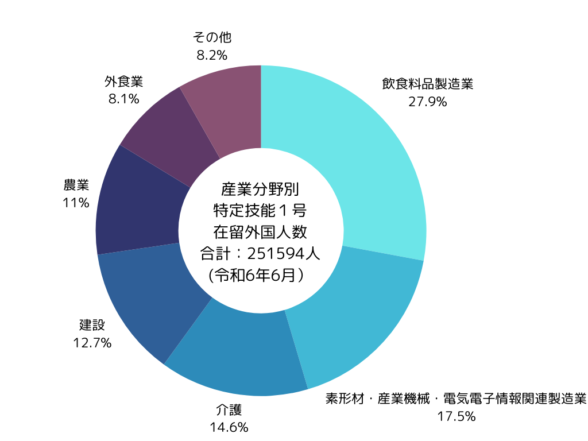
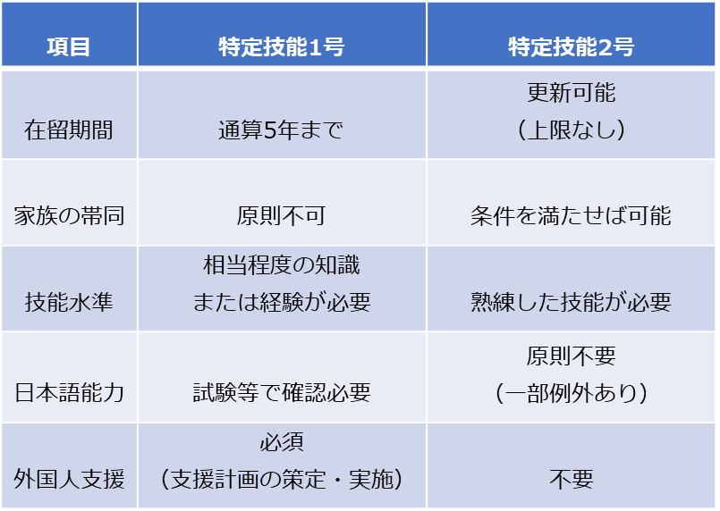

近年、日本の労働市場において外国人材の重要性が増しています。特に、2019年4月に新設された在留資格「特定技能」は、多くの企業にとって注目の的となっています。本記事では、特定技能の概要や最新の受入れ状況、そして採用に関する重要な情報をお伝えします。

## 外国人労働者の雇用状況

### 外国人労働者数推移

日本における外国人労働者数は着実に増加しています。2023年10月末時点で日本国内の外国人労働者数は2,048,675人に達し、前年比で225,950人増加しました。これは、2007年の届出義務化以降、最高の数字を記録しています。

在留資格別の割合を見ると、「特定技能」の増加が顕著です。2024年6月末の統計では、特定技能1号の在留外国人人数は251,594人と、外国人労働者数の増加を牽引しています。

[「外国人雇用状況」の届出状況まとめ（令和５年10月末時点）｜厚生労働省](https://www.mhlw.go.jp/stf/newpage_37084.html)

### 特定技能の国籍別割合

国籍別割合を見ると、ベトナムが最多で126,740人と全体の約50%を占めています。次いでインドネシアが44,298人、フィリピンが25,303人と続きます。ミャンマー（19,058人）と中国（15,660人）も上位に入っています。カンボジア、ネパール、タイがそれぞれ5,000人前後で続き、その他の国々が4,517人となっています。東南アジアと東アジアの国々が大半を占めており、特にベトナムの割合が突出していますが、近年はインドネシアやミャンマーからの受け入れが増加傾向にあります。

出典：[特定技能在留外国人数の公表等 | 出入国在留管理庁](https://www.moj.go.jp/isa/applications/ssw/nyuukokukanri07_00215.html)

### 特定技能の産業分野別割合

産業分野別割合を見ると、飲食料品製造業が最多で70,202人と全体の約28%を占めています。次いで素形材・産業機械・電気電子情報関連製造業が44,044人（約18%）、介護が36,719人（約15%）と続きます。建設業は31,853人（約13%）、農業が27,786人（約11%）、外食業が20,308人（約8%）となっています。その他の分野が20,682人（約8%）を占めており、飲食料品製造業と製造業関連が特に高い割合を示しています。この分布は、各産業分野における人手不足の深刻さと外国人材への需要を反映しています。

出典：[特定技能在留外国人数の公表等 | 出入国在留管理庁](https://www.moj.go.jp/isa/applications/ssw/nyuukokukanri07_00215.html)

## 特定技能　**16分野の業務内容と受入れ状況**

特定技能制度は、2019年4月に創設された在留資格で、日本国内の深刻な人手不足に対応するために設けられました。人材確保が困難な特定の産業分野において、一定の専門性と技能を持つ外国人材の就労を可能にする制度です。

特定技能には「特定技能1号」と「特定技能2号」の2種類があります。現在、特定技能1号は12分野に加え4分野追加予定、特定技能2号は11分野（介護分野を除く）で外国人材の受け入れが可能となっています。対象分野には介護、建設、農業、飲食料品製造業、外食業など、人手不足が顕著な産業が含まれています。各分野で就労するためには、それぞれ定められた試験に合格し、必要な技能水準と日本語能力を証明する必要があります。この制度の特徴は、単純労働を含む幅広い業務に従事できる点で、従来の技能実習制度と比べてより柔軟な就労が可能となっています。また、学歴は要件とされず、技能試験の合格が最も重要な取得要件となっています。特定技能1号16分野の概要は以下の通りです。

### 介護分野

- 仕事内容：身体介護等（利用者の心身の状況に応じた入浴、食事、排せつの介助等）のほか、これに付随する支援業務（レクリエーションの実施、機能訓練の補助等）※　訪問系サービスは対象外。介護分野については、現行の専門的・技術的分野の在留資格「介護」があることから、特定技能２号の対象分野とはしていません。

- 人材基準：技能試験（➀介護技能評価試験）並びに、日本語試験（➁国際交流基金日本語基礎テスト又は日本語能力試験Ｎ４以上及び➂介護日本語評価試験）に合格すること

- 現状の総数：36,719人(令和6年6月)

- 受入れ見込み総数：5年で60,000人

### ビルクリーニング分野

- 仕事内容：建築物内部の清掃

- 人材基準：技能試験（➀ビルクリーニング分野特定技能1号評価試験）並びに、日本語試験（➁国際交流基金日本語基礎テスト又は日本語能力試験Ｎ４以上）に合格すること  

- 現状の総数：4,635人(令和6年6月)

- 受入れ見込み総数：5年で37,000人

### 素形材・ 産業機械・ 電気電子 情報関連 製造業分野

- 仕事内容：機械金属加工、電気電子機器組立て、金属表面処理、紙器・段ボール箱製造、コンクリート製品製造、RPF製造、陶磁器製品製造、印刷・製本、紡織製品製造、縫製の作業

- 人材基準：技能試験（➀製造分野特定技能1号評価試験）並びに、日本語試験（➁国際交流基金日本語基礎テスト又は日本語能力試験Ｎ４以上）に合格すること  

- 現状の総数：44,044人（令和6年6月）

- 受入れ見込み総数：5年間で173,300人

### 建設分野

- 仕事内容：指示・監督の下、土木施設・建築物の新設、改築、維持、修繕に係る作業。指示・監督の下、電気通信、ガス、水道、電気その他のライフライン・設備の整備・設置、変更又は修理に係る作業。

- 人材基準：技能試験（➀建設分野特定技能1号評価試験又は、技能検定３級）並びに、日本語試験（➁国際交流基金日本語基礎テスト又は日本語能力試験Ｎ４以上）に合格すること

- 現状の総数：31,853人(令和6年6月)

- 受入れ見込み総数：5年間で80,000人

### 造船・舶用工業分野

- 仕事内容：監督者の指示を理解し、又は自らの判断により船舶・舶用機械・舶用電気電子機器の製造工程の作業

- 人材基準：技能試験（➀造船・舶用工業分野特定技能1号試験又は、技能検定３級）並びに、日本語試験（➁国際交流基金日本語基礎テスト又は日本語能力試験Ｎ４以上）に合格すること

- 現状の総数：8,703人(令和6年6月)

- 受入れ見込み総数：5年間で13,000人

### 自動車整備分野

- 仕事内容：自動車の日常点検整備、定期点検整備、特定整備、特定整備に付随する基礎的な業務

- 人材基準：技能試験（➀自動車整備分野特定技能１号評価試験又は、自動車整備士技能検定試験３級）並びに、日本語試験（➁国際交流基金日本語基礎テスト又は日本語能力試験Ｎ４以上）に合格すること

- 現状の総数：2,858人(令和6年6月)

- 受入れ見込み総数：5年間で10,000人

### 航空分野

- 仕事内容：空港グランドハンドリング  
    （社内資格等を有する指導者やチームリーダー の指導・監督の下、地上走行支援業務、手荷物・貨物取扱業務等に従事）、航空機整備（機体、装備品等の整備業務等）

- 人材基準：技能試験（➀航空分野特定技能１号評価試験）並びに、日本語試験（➁国際交流基金日本語基礎テスト又は日本語能力試験Ｎ４以上）に合格すること

- 現状の総数：959人(令和6年6月)

- 受入れ見込み総数：5年間で2,200人

### 宿泊分野

- 仕事内容：宿泊施設におけるフロント、企画・広報、接客、レストランサービス等の宿泊サービスの提供に従事する業務

- 人材基準：技能試験（➀宿泊分野特定技能１号評価試験）並びに、日本語試験（➁国際交流基金日本語基礎テスト又は日本語能力試験Ｎ４以上）に合格すること

- 現状の総数：492人(令和6年6月)

- 受入れ見込み総数：5年間で23,000人

### 農業分野

- 仕事内容：耕種農業全般（栽培管理、農産物の集出荷・選別等）、畜産農業全般（飼養管理、畜産物の集出荷・選別等）

- 人材基準：技能試験（➀１号農業技能測定試験）並びに、日本語試験（➁国際交流基金日本語基礎テスト又は日本語能力試験Ｎ４以上）に合格すること

- 現状の総数：27,786人(令和6年6月)

- 受入れ見込み総数：5年間で78,000人

### 漁業分野

- 仕事内容：漁業（漁具の製作・補修、水産動植物の探索、漁具・漁労機械の操作、水産動植物の採捕、漁獲物の処理・保蔵、安全衛生の確保等）、養殖業（養殖資材の製作・補修・管理、養殖水産動植物の育成管理、養殖水産動植物の収獲・処理、安全衛生の確保等）

- 人材基準：技能試験（➀１号漁業技能測定試験）並びに、日本語試験（➁国際交流基金日本語基礎テスト又は日本語能力試験Ｎ４以上）に合格すること

- 現状の総数：3,035人(令和6年6月)

- 受入れ見込み総数：5年間で17,000人

### 飲食料品製造業分野

- 仕事内容：飲食料品製造業全般（飲食料品（酒類を除く。）の製造・加工及び安全衛生の確保）

- 人材基準：技能試験（➀飲食料品製造業特定技能１号技能測定試験）並びに、日本語試験（➁国際交流基金日本語基礎テスト又は日本語能力試験Ｎ４以上）に合格すること

- 現状の総数：70,202人(令和6年6月)

- 受入れ見込み総数：5年間で139,000人

### 外食業分野

- 仕事内容：外食業全般（飲食物調理、接客、店舗管理）及び店舗経営

- 人材基準：技能試験（➀外食業特定技能１号技能測定試験）並びに、日本語試験（➁国際交流基金日本語基礎テスト又は日本語能力試験Ｎ４以上）に合格すること

- 現状の人数：20,308人(令和6年6月)

- 受入れ見込み総数：5年間で53,000人

### 自動車運送分野

- 仕事内容：トラック・タクシー・バスの運転、運転に付随する業務全般

- 人材基準：トラック/技能試験（➀自動車運送業分野特定技能１号評価試験 （トラック）及び第一種運転免許）並びに、日本語試験（➁国際交流基金日本語基礎テスト又は日本語能力試験Ｎ４以上）に合格することタクシー・バス/技能試験（➀自動車運送業分野特定技能１号評価試験 （タクシー・バス）及び第二種運転免許）並びに日本語試験（➁日本語能力試験Ｎ３以上）に合格すること

- 受入れ見込み総数：5年間で24,500人

### 林業分野

- 仕事内容：林業（育林、素材生産等）

- 人材基準：技能試験（➀林業技能測定試験）並びに、日本語試験（➁国際交流基金日本語基礎テスト又は日本語能力試験Ｎ４以上）に合格すること

- 受入れ見込み総数：5年間で1,000人

### 鉄道分野

- 仕事内容：軌道整備、車両整備、電気設備整備、車両製造、運輸係員　等

- 人材基準：軌道整備・車両整備・電気設備整備・車両製造／技能試験（鉄道分野特定技能１号評価試験（各業務別））並びに、日本語試験（➁国際交流基金日本語基礎テスト又は日本語能力試験Ｎ４以上）に合格すること運輸係員／技能試験（➀鉄道分野特定技能１号評価試験（運輸係員））並びに、日本語試験（➁日本語能力試験Ｎ３以上）に合格すること

- 受入れ見込み総数：5年間で3,800人

### 木材産業分野

- 仕事内容：製材業、合板製造業等に係る木材の加工等

- 人材基準：技能試験（➀木材産業特定技能１号測定試験）並びに、日本語試験（➁国際交流基金日本語基礎テスト又は日本語能力試験Ｎ４以上）に合格すること

- 受入れ見込み総数：5年間で5,000人

### 変更点

**１）2023年の閣議決定により、特定技能2号の対象分野が大幅に拡大**

これまで特定技能2号の対象は建設分野と造船・舶用工業分野の2分野に限られていましたが、新たに下記9分野が追加されることになりました。

1. 　ビルクリーニング

3. 素形材・産業機械・電気電子情報関連製造業

5. 自動車整備

7. 航空

9. 宿泊

11. 農業

13. 漁業

15. 飲食料品製造業

17. 外食業

この決定により、特定技能1号で認められている12の特定産業分野のうち、介護分野を除く全ての分野で特定技能2号の受入れが可能となりました。介護分野が除外されているのは、すでに在留資格「介護」が存在しているためです。この拡大は、より多くの産業分野で高度な技能を持つ外国人材の長期的な雇用を可能にし、日本の労働市場により柔軟性をもたらす重要な変更といえます。各産業分野において、熟練した技能を持つ外国人材がより長期的に活躍できる機会が広がったことになります。

また、2024年9月以降、特定技能制度に重要な変更が加えられました。

**２）4業種の追加：自動車運送、林業、鉄道、木材産業が新たに特定産業分野として追加**

**３）対象業務の拡大：介護、飲食料品製造業、製造業、造船・舶用工業の4業種で対象業務が拡大**

これにより、より多くの職種で特定技能外国人の受入れが可能になりました。

### 特定技能1号と特定技能2号の違い

特定技能1号と特定技能2号には、以下のような主要な違いがあります。

特定技能1号は、比較的短期の在留を想定した資格です。通算5年までの在留が認められ、基本的な業務遂行に必要な知識や経験が求められます。一方、特定技能2号は、より長期的な在留を前提としており、在留期間の更新に上限がなく、家族の帯同も可能です。技能面では、自己判断で専門的・技術的な業務を遂行できる、または監督者として業務を統括できるレベルの熟練した技能が要求されます。

日本語能力に関しては、1号では試験等での確認が必要ですが、2号では原則として不要です。ただし、外食・漁業分野では日本語能力試験N3以上が必須となっています。

特定技能2号が認められている業種は以下の通りです（介護を除く）：

1. ビルクリーニング

3. 工業製品製造業（一部）

5. 建設

7. 造船・舶用工業

9. 自動車整備

11. 航空

13. 宿泊

15. 農業

17. 漁業

19. 飲食料品製造業

21. 外食業

これらの業種では、特定技能2号の資格を取得することで、より高度な業務に従事し、長期的に日本での就労が可能となります。

介護分野における在留資格には、特別な選択肢があります。特定技能1号で働く外国人介護従事者には、キャリアアップの道が開かれています。具体的には、国家資格である「介護福祉士」を取得するなど、一定の条件を満たすことで、在留資格「介護」への切り替えが可能となります。この「介護」資格は、特定技能2号と同様に在留期間の上限がなく、長期的なキャリア形成を支援する仕組みとなっています。

### 特定技能採用ルート

特定技能外国人の採用ルートは、大きく国内採用と国外採用の2つに分けられます。それぞれの主なルートと特徴は以下の通りです。

1. 国内採用　留学生からの切り替え日本の教育機関を卒業した留学生は、特定技能への在留資格変更が可能です。このルートの利点は、日本語能力が既に一定レベルに達していること、日本の文化や習慣に馴染んでいることなどが挙げられます。

3. 国内採用　技能実習2号からの切り替え技能実習2号を良好に修了した外国人材は、試験免除で特定技能1号へ移行できます。このルートの利点は、日本での就労経験があるため、職場環境への適応がスムーズであること、特定の技能をすでに習得していることなどが挙げられます。

5. 国外採用　海外からの直接採用特定技能の試験に合格し、日本語能力要件を満たした外国人材を海外から直接採用することも可能です。このルートの特徴は、幅広い人材プールから選考できること、新たな文化や視点を企業に取り入れられることなどが挙げられます。

各ルートには固有の手続きや要件がありますので、詳細な採用プロセスについては、出入国在留管理庁のウェブサイトを参照することをお勧めします

参考：[https://www.moj.go.jp/isa/applications/ssw/nyuukokukanri06\_00103.html](https://www.moj.go.jp/isa/applications/ssw/nyuukokukanri06_00103.html)

## まとめ

特定技能制度は、日本の労働市場に新たな可能性をもたらしています。2024年の制度変更により、さらに多くの業種で外国人材の受入れが可能になりました。企業にとっては、人材不足の解消と多様性の促進につながる重要な機会となっています。しかし、制度の活用にはまだ課題も残されています。受入れ企業は、適切な労働環境の整備や文化的な配慮など、外国人材が活躍できる環境づくりに取り組むことが重要です。

株式会社TCJグローバルは、日本語教育における36年の実績を基に、国内外において日本語教育を軸とした人材育成に取り組んでおります。特にベトナムやネパールをはじめとする海外拠点において、日本語教育と日本語教師養成サービスの運営や日本への就労支援等、様々な活動を展開しております。また、外国人労働者を雇用されている企業様向けに、日本語教育コンサルティングや、ニーズに応じた外国人材のご紹介サービスを提供しております。ご相談やお問い合わせは、どうぞお気軽にご連絡ください。

★すぐご紹介可能な日本語力の高い特定技能人材がいらっしゃいます。お気軽にお問合せ下さい★  
国籍：ベトナム・ネパール  
業種：外食、介護
