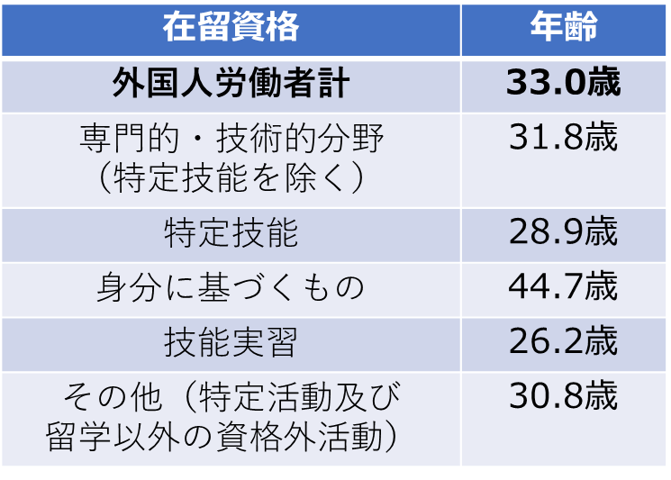
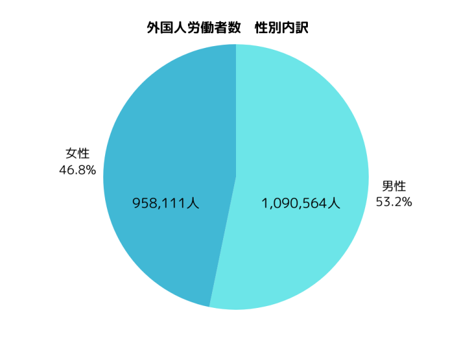
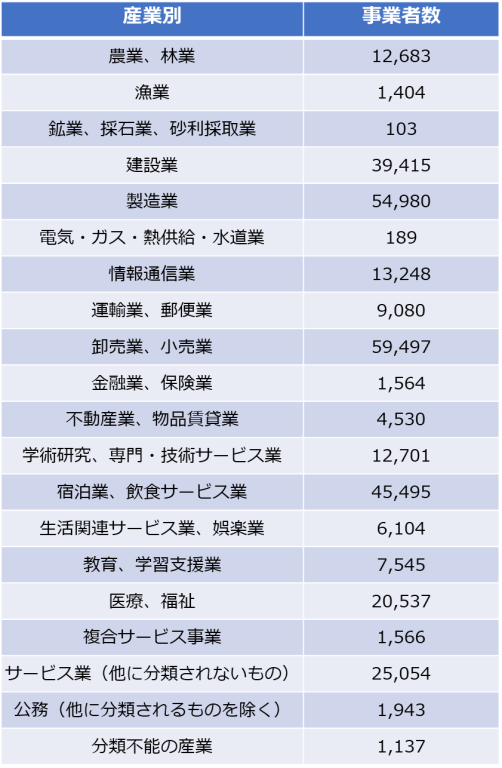

```
日本の労働市場は、少子高齢化による労働力不足という大きな課題に直面しています。この問題に対する有効な解決策の一つとして、外国人労働者の雇用が注目を集めています。本記事では、外国人労働者雇用の最新動向、メリット・デメリット、そして採用までの流れを解説します。人事担当者の皆様に、外国人労働者雇用に関する包括的な情報をお届けします。
```

## 外国人労働者雇用の現状

外国人労働者の雇用は近年急速に増加しており、その背景には日本の少子化と労働力不足が大きな要因として挙げられます。以下のデータを基に、外国人労働者の現状を詳しく解説します。

### 国内で働く外国人労働者数の推移

厚生労働省の最新データによると、2023年10月末時点で日本国内の外国人労働者数は2,048,675人に達し、前年比で225,950人増加しました。これは、2007年の届出義務化以降、最高の数字を記録しています。

2020年は新型コロナウイルスの影響で一時的に減少しましたが、その後は急速に回復し、現在ではほぼ元の水準に戻っています。特に製造業や介護業界での外国人労働者の需要は、年高まっています。


出典：[「外国人雇用状況」の届出状況まとめ（令和５年10月末時点）｜厚生労働省](https://www.mhlw.go.jp/stf/newpage_37084.html)

### 外国人労働者の国籍割合

外国人労働者の出身国を見ると、ベトナムからの労働者が最も多く、全体の25.3%を占めています。次いで中国、フィリピンと続き、これら3か国で全体の5割以上を占めています。

これらの国々からの労働者が多い背景には、技能実習生や特定技能労働者制度の利用があり、特にアジア諸国からの労働力が日本の産業に多く貢献しています。


出典：[「外国人雇用状況」の届出状況まとめ（令和５年10月末時点）｜厚生労働省](https://www.mhlw.go.jp/stf/newpage_37084.html)

### 外国人労働者の年齢と性別

2023年時点での外国人労働者の平均年齢は33.0歳と比較的若い層であり、特に日本で求められている技能実習（26.2歳）や特定技能（28.9歳）の分野では、さらに低い平均年齢が示されています。このことから、企業にとっては若い労働力を確保し、新しい技術を学び業務に貢献できる可能性が高いと言えます。

また、外国人労働者の男女比においては、男性が53.2％、女性が46.8％と、大きな偏りはなく、比較的均衡しています。



出典：[https://www.mhlw.go.jp/toukei/itiran/roudou/chingin/kouzou/z2023/dl/08.pdf](https://www.mhlw.go.jp/toukei/itiran/roudou/chingin/kouzou/z2023/dl/08.pdf)



出典：[https://www.mhlw.go.jp/content/11655000/001195789.pdf](https://www.mhlw.go.jp/content/11655000/001195789.pdf)

### 外国人労働者を多く雇用している業態

外国人労働者を雇用する事業所数は318,775所に上り、届出が義務化された平成19年以降、過去最高を更新しました。これは、日本国内における外国人労働者の需要が増加し、多くの事業所がその労働力を必要としている現状を反映しています。外国人労働者を多く雇用している業界は、製造業、小売業、宿泊飲食業、医療福祉業などで需要が高まっています。

特に製造業では、熟練した技術を持つ技能実習生や、特定技能労働者が多く働いており、自動車や電子機器の組み立てなどで活躍しています。

また、近年ではIT業界にも外国人労働者を積極的に受け入れる企業が増える傾向にあります。IT業界では、高度な技術を持つ外国人エンジニアの需要が急増しています。



出典：[「外国人雇用状況」の届出状況まとめ（令和５年10月末時点）｜厚生労働省](https://www.mhlw.go.jp/stf/newpage_37084.html)

## 外国人労働者を受け入れるメリット

外国人労働者を雇用することには、企業にとって多くのメリットがあります。ここではその代表的なメリットを5つご紹介します。

### ①人材不足の改善と優秀な若手人材の確保

日本の労働市場における人材不足は深刻な問題となっています。外国人労働者の雇用は、この課題に対する有効な解決策の一つです。特に、若く意欲的な人材を確保できる可能性が高まります。

### ②グローバル展開の強化

外国人労働者を雇用することで、企業の海外進出を支援する戦力として活用できます。特に、アジア圏や欧米市場への進出を考えている企業にとって、外国人労働者が現地の市場や文化に精通していることは大きな強みとなります。

### ③多様な視点からアイデアの創出

外国人労働者は、多様なバックグラウンドを持っているため、企業内で新しいアイデアや技術の創出に貢献することがあります。異なる視点や文化を持つ人々が集まることで、創造的な業務改善や新商品の開発に繋がることが期待できます。

### ④インバウンド対応の強化

訪日外国人が増加する中、外国人労働者を雇用することで、観光業やサービス業で訪日外国人のニーズに適切に対応することができます。外国語の対応が可能なスタッフがいることで、顧客満足度が向上し、企業の競争力を高めることができます。

### ⑤助成金の活用

外国人労働者を雇用することで、人材確保等支援助成金（外国人労働者就労環境整備助成コース）というような政府の助成金を活用できる場合があります。また、技能実習生や特定技能外国人の受け入れに対しては、各種支援策が整っているため、雇用コストを抑えることが可能です。

一般的な雇用を支援する助成金は多数あり、厚生労働省の助成金検索ツールを活用して、適切な助成金を探すことができます。

参考: [https://www.mhlw.go.jp/stf/seisakunitsuite/bunya/koyouroudou/koyou/kyufukin/index00007.html](https://www.mhlw.go.jp/stf/seisakunitsuite/bunya/koyouroudou/koyou/kyufukin/index00007.html)

## 外国人労働者を受け入れる際の課題

外国人労働者を雇用することには、もちろんデメリットもあります。以下にその主なデメリットを3つ挙げてみます。

### 複雑な雇用手続きと法的規制

外国人労働者を雇用するには、ビザの取得や雇用契約書の整備など、煩雑な手続きが必要です。特に、外国人労働者が日本に初めて来る場合や、長期的に働く場合には、法的な手続きが複雑になります。これらの手続きをスムーズに進めるためには、専門知識を持つ担当者が必要です。

### 言語とコミュニケーションの壁

異なる言語や文化を持つ従業員とのコミュニケーションは、場合によっては障害になることがあります。特に、業務の指示や情報伝達において誤解が生じる可能性があるため、受け入れ企業側はまず、やさしい日本語の使用が重要です。日本語が第二言語である外国人労働者に対して、専門的な用語を避け、簡潔で理解しやすい表現を心掛けることで、スムーズなコミュニケーションが可能になります。

### 異文化理解の不足による課題

文化的な背景が異なるため、外国人労働者と日本人スタッフの間での価値観や習慣の違いは、職場環境に大きく影響を与える可能性があります。これらの差異を理解し、互いを尊重する環境づくりが重要です。特に、コミュニケーションスタイルや時間に対する価値観が異なるため、柔軟に対応する姿勢が求められます。

### 外国人労働者雇用までの基本の流れ

外国人材を採用する際のプロセスは、以下の主要なステップで構成されます。このプロセスは、海外在住者と国内在住者で基本的な流れは同じです。

- 人材募集職務内容、勤務条件、必要なスキル、言語要件を明確に定義した求人広告を作成し、募集

- 候補者選考履歴書審査や面接を通じて、応募者の能力、経験、文化適合性を総合的に評価  
    国内在住の外国人の場合、在留カードと在留資格の有効性を必ず確認

- 採用決定と契約締結最終候補者を選定し、内定通知を発行職務内容、労働条件、給与体系などを詳細に記載した雇用契約書を作成し、双方で合意

- 在留資格手続き必要に応じて、就労ビザの新規申請または既存の在留資格の変更手続き申請

- 入社準備住居の手配支援、オリエンテーションや事前研修の実施、必要な場合は渡航手続きのサポートを行う

- 雇用開始雇用後は、言語や文化の壁を感じることがあるため、サポート体制を強化し、困った時に相談できる場所を作ることが、長期的な定着に重要

## まとめ

外国人労働者の雇用は、日本企業にとって大きな可能性を秘めています。人材不足の解消、グローバル展開の強化、イノベーションの促進など、多くのメリットがあります。一方で、法的手続きの複雑さやコミュニケーションの課題など、克服すべき課題も存在します。

これらの課題に適切に対処し、外国人労働者と日本人従業員が互いに尊重し合える環境を整えることが求められます。しっかりとした準備と配慮を行い、外国人労働者との円滑なコミュニケーションを図ることが、成功への鍵となります。

> 日本語教育のプロの視点から、貴社に最適な人材のご紹介、選考のサポート、採用後の定着支援までワンストップでご支援します。  
>   
> 外国人材の採用や選考でお困りの方は、まずはお気軽に資料請求・お問い合わせください。  
> [\>>資料請求する（無料）](https://tcj-education.com/ja/foreign-recruitment/)  
> [\>>今すぐお問合せする](https://gaikoku-jinzai.tcj-education.com/#contact)
