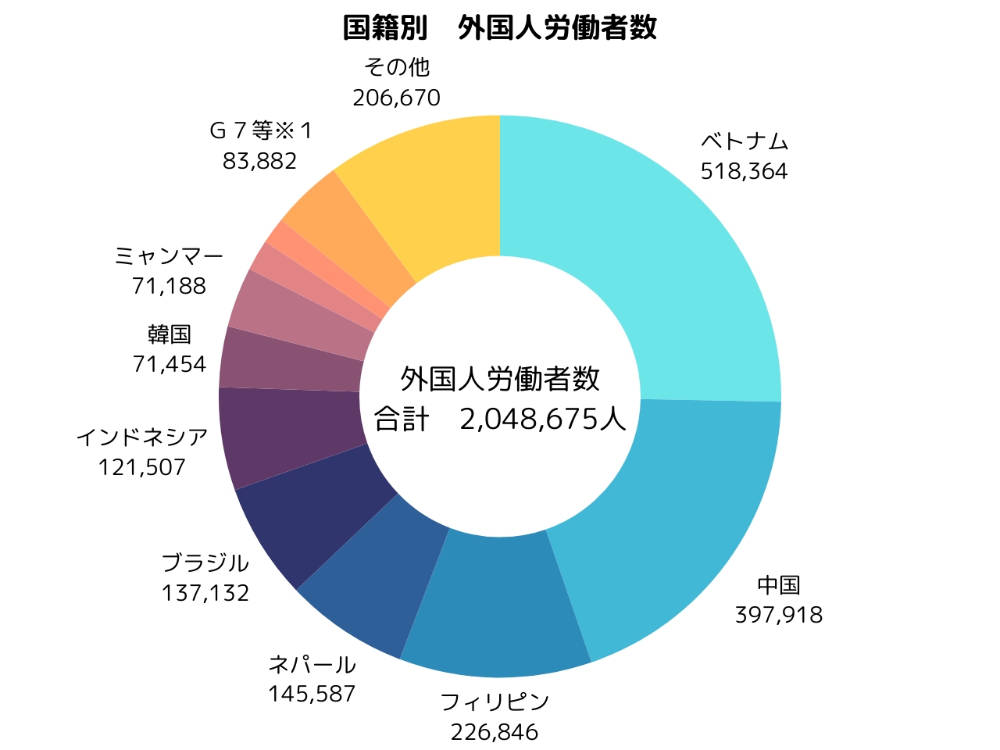
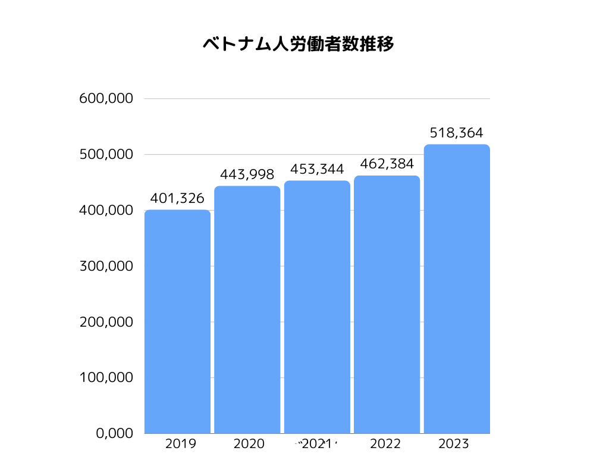
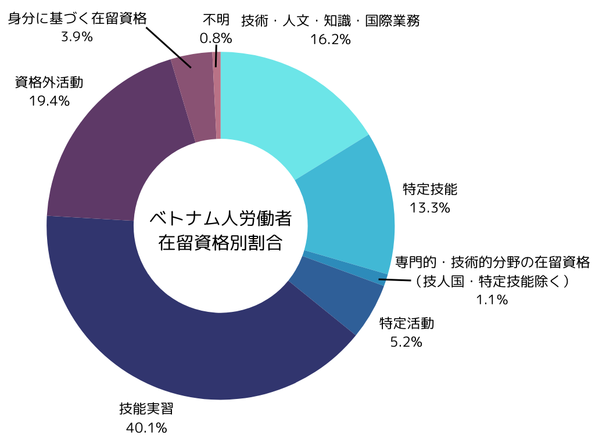
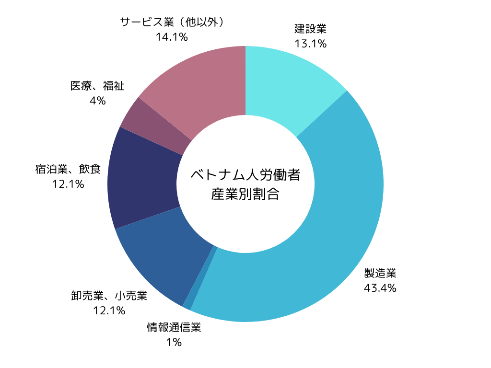

```
近年、日本における外国人労働者の数は増加の一途をたどっており、その中でもベトナム人労働者は重要な役割を果たしています。特に、優秀なエンジニアを数多く輩出しているベトナムは、これからの日本の企業にとって魅力的な採用先となっています。ベトナム人材を採用する際には、その文化的背景や特徴を理解し、適切なアプローチを取ることが重要です。本記事では、ベトナム人労働者の採用において知っておきたい基本的な情報を解説します。
```

## **ベトナムの採用の現状**

###  **ベトナムの基本情報**

ベトナムは東南アジアに位置し、2023年10月の時点で約9988万人の人口を抱える国です。ベトナムの特徴的な点の一つは、人口構成の若さです。日本の平均年齢は48.6歳（2022年時点）であるのに対し、ベトナムの平均年齢は32.5歳（2022年時点）であり、これは世界的に見ても若い部類に入ります。そのため、今後の労働力として非常に注目されています。また、ベトナムは多民族国家であり、主にキン族（ベト族）が占めるものの、少数民族の存在もあります。公用語はベトナム語で、ほとんどの国民が日常的に使っています。宗教においては仏教が主流ですが、南部を中心にカトリック教徒が多く、新興宗教であるカオダイ教やホアハオ教も一定数います。ベトナムは急速に経済成長を遂げており、特に製造業やIT分野で優れた人材を輩出しています。これにより、日本の企業にとってベトナムの若年層の活用は採用面で大きなアドバンテージとなります。今後も、ベトナムは日本企業にとって重要な採用市場となることが予想されます。

参考：[世界の統計2022](http://stat.go.jp/data/sekai/pdf/2022al.pdf)

### **国内でのベトナム人雇用数と推移**

日本におけるベトナム人労働者の数は年々増加しており、2023年10月時点で518,364人（外国人労働者全体の25.3％）を占め、最も多い国となっています。次いで、中国が397,918人（同19.4％）、フィリピンが226,846人（同11.1％）となっています。特に、技術職や製造業、介護業界におけるベトナム人労働者の需要は非常に高まっており、その多くがエンジニアや技術職として活躍しています。ベトナム人は、日本の製造業やIT分野において優れたスキルを発揮し、多くの企業から高く評価されており、彼らの技術力は日本の産業の発展に貢献しています。





出典：[「外国人雇用状況」の届出状況まとめ（令和５年10月末時点）｜厚生労働省](https://www.mhlw.go.jp/stf/newpage_37084.html)

### **ベトナム人労働者の在留資格と業種別内訳**

ベトナム人労働者の在留資格は、主に「技術・人文知識・国際業務」や「技能実習生」が多く、特に製造業や介護業界では「技能実習生」として日本に滞在している人が大半を占めます。また、近年では「特定技能」資格を取得して働くベトナム人も増えています。業種別では、製造業が最も多く、特に自動車や電子機器の組立て、金属加工業などが中心です。介護業界にも多くのベトナム人労働者が従事しており、今後さらに需要が高まると予測されています。





出典：[「外国人雇用状況」の届出状況まとめ（令和５年10月末時点）｜厚生労働省](https://www.mhlw.go.jp/stf/newpage_37084.html)

## **ベトナム人労働者の特徴**

### **勤勉で学習意欲が高い**

ベトナムの若者は非常に勤勉で、自己改善の意欲が強いことで知られています。学問や技術を学ぶことに対して高い評価を持ち、日本での仕事においても迅速にスキルを習得することができます。このため、日本語や専門知識を学びながら仕事をこなしていく姿勢が特徴的です。

### **家族との絆が強い**

ベトナム人は家族を非常に大切にする文化を持っています。そのため、仕事の合間でも家族を第一に考え、休暇や連絡においても家族の状況を優先することがあります。企業はこの点を理解し、柔軟な労働環境を提供することが、ベトナム人労働者の満足度を高める要因となります。

### **残業への姿勢**

ベトナム人労働者は、短期的に多くの収入を得ること目的に、日本で働くケースが多いです。そのため、給料を増やす手段として残業や夜勤に対して比較的ポジティブな姿勢を持っています。残業代が正当に支払われるのであれば、それを積極的に活用し、意欲的に業務に取り組む傾向があります。

ただし、ベトナムではサービス残業は一般的に好まれません。残業が必要な場合、適切に支払われるべきだという考えが根強いです。日本の労働環境は一部特殊でもありますが、ベトナム人にとっては、残業があくまで業務上必要な場合に限り行い、正当な対価が支払われるべきだと認識されています。

## **採用の際の注意点**

### **エリアによって異なるベトナム人の性格**

ベトナムは地域ごとに文化や性格が異なります。北部（ハノイ周辺）、中央部（ダナン周辺）、南部（ホーチミン市周辺）では、それぞれ異なる性格の傾向があります。北部の人々は真面目で控えめな傾向があり、南部の人々はフレンドリーで積極的な性格の人が多いとされています。したがって、採用時には個人の性格をよく観察し、一括りにせず適切なマッチングを行うことが重要です。

### **家族を大切にするため休暇への理解**

ベトナム人は前述したように家族を最優先に考えるため、祝日や休暇を非常に大切にします。ベトナムは休暇が少ない国の一つで、年間の法定休日は5日しかありません。その中で最も重要な祝日は「テト（旧正月）」で、旧暦1月1日に祝われ、約1週間の連休となります。2025年のテトは1月25日～2月2日で、家族や親戚と過ごしたり、祭りに参加したりする重要な時期です。このため、企業はテト休暇やその他の休暇取得に対する理解を示すことが重要です。

### **異文化理解と明確な指示の重要性**

ベトナム人は他の国籍の方同様、日本の特徴である高コンテキストのコミュニケーション（曖昧な指示や暗黙の了解）が苦手な傾向にあります。そのため、明確で具体的な指示を出すことが、彼らの仕事の成果を最大限に引き出すポイントです。また、日本語を学び始めたばかりの社員には、やさしい日本語を使ったコミュニケーションや日本の職場文化についてのサポートが必要であることを理解しておきましょう。

## **まとめ**

ベトナム人材の採用には、その文化や特徴をしっかりと理解した上で、企業が適切に対応することが重要です。ベトナム人労働者は非常に勤勉で、学習意欲が高く、家族を大切にするという文化を持っています。異文化理解を深め、柔軟な対応をすることで、若い活力に溢れるベトナム人労働者の採用は企業にとって大きなメリットとなります。

株式会社TCJグローバルは、1972年に設立されたベトナム国内最大規模の国立短期大学・Hanoi College for Electro-Mechanics（HCEM）と業務提携を結び、ベトナムにおける優れた人材育成に貢献しています。HCEMでは、科学技術領域に特化した教育プログラムを提供し、高水準の技術系人材を育成しています。

TCJグローバルでは、優秀なベトナム人材の日本への就労支援も行っており、企業が求めるスキルや経験を持ったベトナム人材をご紹介しています。また、就職後の日本語フォローや受け入れ企業向けの社内研修も提供し、スムーズな労働環境の整備をサポートします。

ベトナム人材の採用をお考えの企業様は、ぜひお気軽にご相談ください。TCJグローバルが、貴社の人材採用を全力でサポートいたします。

★すぐご紹介可能な日本語力の高い特定技能人材がいらっしゃいます。お気軽にお問合せ下さい★  
国籍：ベトナム・ネパール  
業種：外食、介護
