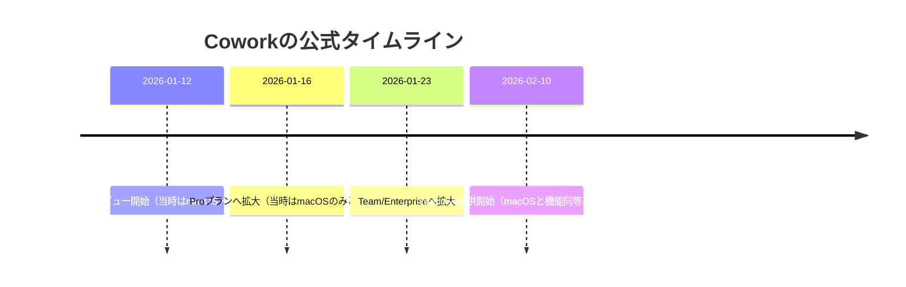
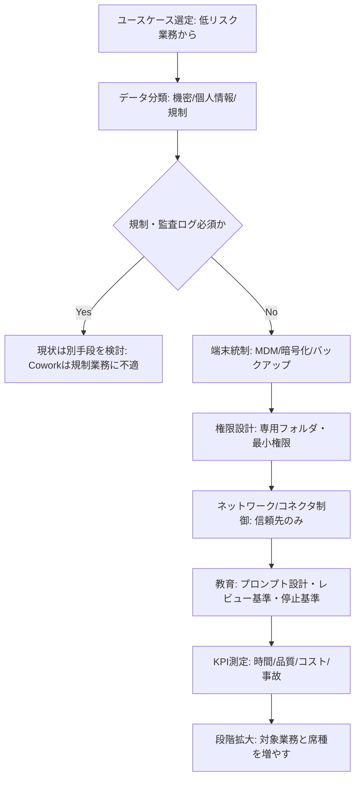

# Claude Cowork 調査・分析報告書

## エグゼクティブサマリー

調査時点は **2026-02-12（JST）**。本報告書は、公式情報（公式ブログ／公式ヘルプセンター／公式リリースノート／公式プライバシーセンター）を最優先に、主要テックメディア（The Verge / TechCrunch / Reuters等）を補助的に用いて、「Claude Cowork（Cowork）」の機能・対応プラットフォーム・導入・ユースケース・制約とリスク・競合比較・推奨導入フローを“噛み砕いて”網羅的に整理した。citeturn1view0turn14view1turn7view1turn5view2turn14view0

Coworkは、entity["company","Anthropic","ai research company"]のAI「Claude」を“チャット”から“タスク実行”に寄せるための**研究プレビュー（research preview）**であり、Claude Desktop内で「Tasks」モードとして提供される。ユーザーが許可したローカルフォルダに対して、Claudeが計画→分解→実行→成果物出力までを（隔離VM内で）進める設計が中心で、並列サブエージェント（sub-agents）による複数ワークストリーム調整、Excel/PowerPoint等の“業務成果物”生成、プラグイン（plugins）とコネクタ（connectors）によるツール連携を特徴とする。citeturn1view0turn14view1turn13view0

最大の注意点は「統制・監査」と「エージェント固有リスク」。Team/Enterprise利用でも、Cowork活動が **監査ログ・Compliance API・データエクスポートに記録されない**、会話履歴が端末ローカル保存で集中管理できない、研究プレビュー中は**組織一括ON/OFFのみでロール別制御（RBAC）ができない**といった制約が公式に明記される。加えて、Webコンテンツ等を起点としたプロンプトインジェクションのリスクは“非ゼロ”とされ、ファイルアクセスやブラウザアクセスの最小化、専用作業フォルダ化、バックアップ、権限レビューが必須になる。citeturn7view1turn14view0turn14view1

プラットフォーム面では、公式ブログで **2026-02-10** に「WindowsでmacOS同等（file access / multi-step tasks / plugins / MCP connectors）」提供開始が明示され、ヘルプセンター英語版もWindows（x64のみ）提供を明記する。一方、日本語記事の一部は「macOSのみ」と記載が残るため、2026-02-12時点の“公式確認”としては **英語ヘルプセンター＋公式ブログ＋公式ダウンロードページ**を優先するのが合理的である。citeturn1view0turn14view1turn14view0turn5view1turn5view2turn2view0

## 製品概要と主要機能

Coworkの定義は「Claude Codeと同じエージェントアーキテクチャを、ターミナル不要でClaude Desktopに持ち込んだ“複雑タスク実行”モード」。通常チャットのように1プロンプトずつ応答するというより、成果（outcome）を入力すると、Claudeが計画・サブタスク分解・実行・成果物出力まで進める。citeturn14view1turn1view0

**主要機能（公式が繰り返し強調する中核）**は、(a) ユーザーが指定したローカルフォルダへの直接読み書き（手動アップロード不要）、(b) VMでの隔離実行、(c) 複雑タスクのサブエージェント分解と並列処理、(d) Excelの数式付きファイルやPowerPoint等の“整った成果物”作成、(e) 長時間タスク（実行の途中で会話タイムアウトやコンテキスト制限で中断しにくい設計）である。citeturn14view1turn7view0turn4search3

**コラボレーション機能（協働の実態）**は、一般に想像される「同じセッションを複数人で同時編集」型ではない。公式の“現時点の制限”として、Coworkセッションは共有できず、チャットや成果物（artifact）共有もできない。一方で、リモートコネクタは“チームの共有ワークスペース／共通ツール”に接続できるため、協働は「Coworkセッション共有」ではなく「共有データソース（例：プロジェクト管理・ナレッジ・コミュニケーション）にClaudeがアクセスして作業する」という形で成立する。citeturn7view0turn5view4turn13view0

**会話履歴管理**は、通常のSaaS会話ログ管理と異なる。Coworkは会話履歴を端末ローカルに保存し、Anthropicの標準データ保持（data retention timeframe）の対象外とされる（＝管理者が一元的に保持・エクスポートするタイプではない）。Team/Enterprise向けには、これが「集中管理・エクスポート不可」の制約として明文化されている。citeturn14view1turn7view1

**マルチユーザー（組織導入）**は可能だが、研究プレビュー期間中は「組織一括トグル」であり、ユーザー/役割/チーム別に段階解放できない（RBAC不可）。また、Coworkを有効にするとプラグインも同じトグル配下になり、プラグインだけを別制御する設定はない。citeturn7view1turn7view0

**プラグイン/ツール連携**は二層構造で理解すると混乱が減る。  
第一に「プラグイン（plugins）」は、skills・connectors・slash commands・sub-agentsを1パッケージに束ね、職種別（例：営業、法務、財務、データ、CS等）のワークフローを“型”として配布するもの。citeturn7view0turn7view2  
第二に「コネクタ（connectors）」は、クラウドの業務ツールやローカル資源へ接続する仕組みで、ディレクトリ掲載の推奨コネクタ＋未検証のカスタムコネクタ（有料プランで追加可能）を扱う。citeturn13view0turn5view4

この連携例として公式プラグイン表では、entity["company","Slack","workplace messaging app"]／entity["company","Notion","productivity software"]／entity["company","Asana","project management software"]等の接続先が示され、プラグインが「社内の道具立てに接続した“役割別AI”」を狙っていることが明確である。プラグインはentity["company","GitHub","code hosting platform"]で公開され、ユーザーがローカルでカスタマイズできる。citeturn7view2turn7view0turn7view1

**セキュリティ・プライバシー設定**は、(1) ファイルアクセス許可（フォルダ単位）と削除保護（永久削除は明示許可）(2) ネットワーク/インターネットアクセス許可（デフォルト制限を“信頼できる範囲だけ”拡張）(3) MCP/拡張の信頼性評価（未確認MCPは高リスク）を軸に設計される。特に「Coworkはエージェントであり、インターネットアクセスも絡むため、プロンプトインジェクションのリスクは非ゼロ」と公式に明記される。citeturn14view0turn7view0turn7view1

## 対応プラットフォームとリリース動向

前提として、Coworkは **Claude Desktop内の機能**であり、公式に「Web/モバイルでは利用できない」「デバイス間同期もしない」と明記されている。つまり、WebやモバイルでClaudeを使えても、Cowork（Tasks実行）はデスクトップで完結する。citeturn7view0turn14view1

**Windows対応の公式確認**としては、公式ブログで「2026-02-10：Windowsで提供開始（macOSと完全機能同等）」が明記され、ヘルプセンター英語版でも「Windows（x64のみ）で利用可能」「Windows arm64は非対応」とされる。citeturn1view0turn14view0turn14view1

ただし、**日本語記事の更新遅れ**が観測される。日本語の「Coworkを始める」「リリースノート」には、2026年1月時点の記述として「macOSのみ」が残っている（＝“当時は正しかった”が、Windows開始後も更新が追いついていない可能性が高い）。よって、2026-02-12時点の判断は、英語版ヘルプセンターと公式ブログ、公式ダウンロードページを優先するのが堅い。citeturn5view1turn5view2turn14view1turn1view0turn2view0

**リリースの時系列（公式記載ベース）**は次の通り。



citeturn1view0turn1view1turn5view2

**バージョン表記について**：公式リリースノートは「機能・提供範囲の更新」を中心に記載しており、Claude Desktopアプリのバージョン番号（例：1.x.x）をセットで掲示する形式ではない。そのため本報告書では、公式に確認できる“機能のリリース日（上記）”を主に掲載し、端末側は「最新のClaude Desktopへ更新」を前提として記述する。citeturn1view1turn14view1turn2view0

## 導入手順と初期設定

まず重要な前提は、Coworkは研究プレビューであり、導入は「便利さ」より先に「最小権限・最小リスク」を設計しないと事故確率が上がる、という公式スタンスである（専用フォルダ化・バックアップ・信頼できるMCP/サイトに限定等）。citeturn14view0turn7view0

image_group{"layout":"carousel","aspect_ratio":"16:9","query":["Claude Cowork tab Tasks mode screenshot","Claude Desktop Cowork plugins sidebar screenshot","Cowork global instructions settings screenshot","Claude Cowork Windows toggle screenshot"],"num_per_query":1}

**料金/ライセンス（変動し得るため“調査時点”明記）**：2026-02-12時点、公式Pricingでは、Pro/Max/Team/EnterpriseにCoworkが含まれると記載される。Proは年契約割引で月$17（年$200相当、月払い$20）、Maxは月$100〜、TeamはStandard seatが年契約で$20/席（月$25/席）、Premium seatが年契約で$100/席（月$125/席）など、価格は地域/税で変動すると明記される。citeturn2view3turn2view5turn2view6

**個人導入の手順（Pro/Max想定）**は、手順自体は短いが“安全な初期設定”が肝になる。

1) Claude Desktopをインストール（macOS/Windows）しサインインする。公式ダウンロードページは「Coworkはデスクトップアプリ内のみ」「Windowsでも利用可能（ただしWindows arm64はサポート外）」と説明する。citeturn2view0turn14view0turn14view1  
2) 画面上部（モード切替）で「Cowork」タブへ移動し、Tasksモードに切り替える。citeturn14view1turn5view1  
3) **専用の作業フォルダ**を作る（例：`Cowork_Work/`）→そのフォルダだけアクセス許可する。重要ファイルを含む広範なフォルダ許可は避ける（公式推奨）。citeturn14view0  
4) Global instructions / Folder instructions（口調・出力形式・自分の役割・フォルダ固有の前提）を設定する。以後のセッションでも反映される“作法”として効く。citeturn1view0turn14view1turn7view0  
5) 必要ならプラグインを導入する（左サイドバー「Plugins」→インストール、またはUpload）。ただしプラグインはローカル保存で、組織配布は今後の予定と明記される。citeturn7view0turn7view1  
6) タスクを投入し、Claudeの計画（plan）をレビューして実行する。タスク中は進捗表示があり、途中で軌道修正（steering）できる。citeturn14view1turn5view1

**Windows導入の注意（個人/企業共通で重要）**：企業配布ガイドでは「Coworkを含むフル機能には管理者権限が必要」「管理者権限なしでもClaude Desktop自体は入るがCoworkだけ使えない」と明記される。Windows端末で“Coworkが見当たらない”場合、まずここを疑うのが最短である。citeturn1view2turn14view0turn14view1  
加えて、推奨インストーラはWindows 10 version 2004以降（Build 19041+）が要件で、Windows S Modeは無効が必要とされる。citeturn1view2turn4search11

**Team/Enterprise導入（組織運用）**は、アカウント/組織作成と統制設計をセットで行う。

- Teamは最低5名で、ビジネスメール要件がある等、個人用途と分けた設計が明記される。citeturn11search4turn11search0  
- Coworkの有効化/無効化は、Owner/Primary OwnerがAdmin settings > Capabilitiesで行う。研究プレビュー中は組織一括のみで細かい切り分けはできない。citeturn7view1turn11search23  
- ネットワークは「組織のegress設定を尊重」とされ、導入前にAdmin settings > Capabilitiesのネットワーク設定確認が推奨される。citeturn7view1turn14view1  
- コネクタはSettings > Connectorsから接続・権限確認・切断ができ、Team/Enterpriseはコネクタ/ツールコールの管理機能を持つ。インタラクティブコネクタは“表示用ツールコール”を管理側で無効化できる（コネクタ自体は残せる）という設計が公式に説明されている。citeturn13view0turn14view2

**よくあるトラブルと対処（公式FAQ）**：

- 「Setting up Claude’s workspace」と表示される：更新と修正適用のための想定内挙動。citeturn7view0  
- タスクが途中で止まる：アプリを閉じた／PCがスリープした可能性。Coworkはアプリを開き続ける必要がある。citeturn7view0turn14view1  
- すぐ使用制限に当たる：Coworkは標準チャットより使用割当を消費しやすい。関連作業をまとめて1セッションにし、軽い作業はチャットへ逃がす。citeturn7view0turn5view1  
- 出力ファイルが見つからない：フォルダ権限と出力先を確認する。citeturn7view0  
- WindowsでCoworkが出ない：管理者権限なしインストールだとCoworkだけ利用不可、という条件をまず確認する。citeturn1view2turn14view0

## 利用可能なこととユースケース

Coworkが強いのは「ファイルアクセス＋長時間実行＋複数段の処理」が揃う仕事で、公式例として、ダウンロードフォルダ整理、レシートから経費報告書作成、ファイル一括リネーム、メモ/論文/記事を統合したリサーチレポート、議事録や録音メモからの論点・アクション抽出、数式付きスプレッドシート生成、スライド生成、データ整形・可視化などが列挙される。citeturn7view0turn5view1turn1view0

**非エンジニアでも使えるか**という問いに対して、公式ブログと主要メディアは「Claude Code的なエージェント体験を、ターミナルなしで誰でも使える形にした」という位置づけを明確にしている。したがって“操作”は非エンジニア向けだが、成果の品質は「依頼の具体性」「レビュー能力」「データ管理の作法」で大きく変わる。citeturn1view0turn8search0turn8search3

**プラグイン活用の現実的な価値**は「社内ワークフローを“型”に落として再現性を上げる」点にある。公式は、職種別プラグイン（例：Productivity / Sales / Finance / Data / Legal等）を標準提供し、さらに公開リポジトリから追加インストールやローカル改変ができる、と明記する。citeturn7view0turn7view2turn7view1

**導入企業の声/成功事例（引用可能な範囲）**としては、entity["organization","Reuters","news agency"]が2026-02-06付で、entity["company","Goldman Sachs","investment bank"]がAnthropicと協力し、社内業務（会計処理、顧客DD、オンボーディング等）を自動化するAIエージェントを開発しており、その文脈でCoworkにも言及があると報じている（ただし“開発中”で、提供時期は明示されていない）。citeturn8news42

補助情報として、プロダクト発表直後の評価・要点整理は、entity["organization","The Verge","tech media website"]やentity["organization","TechCrunch","tech news website"]が、(a) 指定フォルダへのアクセスを核にした「非コード系エージェント」(b) プラグインのローカル保存と、将来の組織共有機能の示唆、という形で報じている。citeturn8search3turn8search4

## 制約・できないこと・向かないケース

**できないこと（公式の“Current limitations”）**は明確で、(1) セッション間メモリなし（Coworkセッションを跨いで記憶しない）(2) セッション共有なし（チャット/成果物共有不可）(3) デスクトップ限定でデバイス間同期なし (4) アプリを閉じるとセッション終了、が列挙される。リアルタイム共同編集をコア要件にする用途には不向きである。citeturn7view0turn14view1

**統制・監査の制約（特に組織導入で致命傷になり得る）**として、Team/EnterpriseでもCowork活動は監査ログ・Compliance API・データエクスポートに入らず、セキュリティチームが標準の監視基盤で可視化できない、と明記される。規制対象ワークロードでは有効化すべきでない、と公式に明記されている。citeturn7view1turn14view1

**会話履歴とデータ保持**も要注意で、Coworkは会話履歴を端末ローカルに保存し、標準のデータ保持枠外とされる。つまり、組織側が中央で保持・削除・エクスポートして統制する“いつものSaaS”とは異なる。端末管理（MDM/暗号化/廃棄/ログ収集）の成熟度が低い組織ほどリスクになる。citeturn7view1turn14view1

**エージェント固有リスク（プロンプトインジェクション等）**は公式が強く警告する。Webコンテンツは主要な攻撃ベクタで、Chrome拡張（Claude in Chrome）と併用する場合は信頼できるサイトに限定し、デフォルトのネットワーク制限をむやみに広げるべきでない。また、未確認MCPは攻撃面を増やすため慎重に扱うべきとされ、対策として専用作業フォルダ・バックアップ・不審挙動の即停止が推奨される。citeturn14view0turn7view1turn7view0

**コンテキスト長（文脈長）**は、Cowork固有の“数値としての上限”を公式が一括提示しているわけではないが、基盤モデル側にはコンテキストウィンドウがあり、例としてClaude Opus 4.6は200Kコンテキスト（1Mトークンはベータ条件付き）と公式が説明している。Cowork側は「長時間タスクでコンテキスト制限が進捗を妨げにくい」設計を掲げる一方、入力が巨大なワークロードは依然として計画的分割や要約が必要になり得る。citeturn7view0turn6search3turn6search21

**外部API呼び出し（外部ツール実行）の可否**は「コネクタ/MCP経由」で可能と整理すると正確である。公式は、コネクタディレクトリを通じてツール接続し、必要に応じてカスタムコネクタ（未検証）も追加できる、とする。つまり“任意の外部APIへ無制限に直叩きする”のではなく、許可したコネクタの権限範囲で実行される。なおインタラクティブコネクタは「購入や金融取引は未対応」と明記されている。citeturn13view0turn14view2

**コスト面の制約**として、Coworkは標準チャットより使用割当を消費しやすい（計算集約的でトークン消費が増える）ため、上限到達が早まる可能性が公式に明記される。多数のタスクを回す運用は、Max/Team Premium等の上位枠や、追加使用量（extra usage）の設計が必要になる場合がある。citeturn7view0turn6search11turn11search18

**向かないユーザー/ケース（具体例）**は、少なくとも次が“公式制約に直撃”する。

- 監査証跡（監査ログ・Compliance API・エクスポート）が必須な規制業務（公式が「規制ワークロードで使うな」と明記）。citeturn7view1turn14view1  
- 端末ローカルに会話履歴が残ることを許容できず、端末統制（暗号化・MDM・廃棄手順）が弱い組織。citeturn7view1turn14view1  
- “共同編集/共同レビュー”をCoworkセッションの共有でやりたいチーム（セッション共有不可）。citeturn7view0  
- Windowsで管理者権限が付与できない運用（Coworkだけ使えない条件が明記）。citeturn1view2  

## 比較・代替案と推奨導入フロー

まず、Coworkは「ローカルファイルを実際に変更して成果物を出す」ことに強みがある一方、統制（監査・集中管理）が弱い、という“尖った設計”である。よって比較軸は「便利さ」だけでなく「統制要件に耐えるか」に置くのが現実的である。citeturn14view1turn7view1turn2view0

### 主要競合との比較表

| 観点 | Cowork（Claude Desktop内） | entity["company","OpenAI","ai lab company"]（ChatGPT Business/Enterprise等） | entity["company","Microsoft","technology company"]（Microsoft 365 Copilot） | entity["company","Google","alphabet subsidiary"]（Gemini in Google Workspace） |
|---|---|---|---|---|
| 実行スタイル | 端末上でタスク実行（VM隔離）＋ローカルフォルダへの読み書きが中核。citeturn14view1 | クラウドの共有ワークスペース中心（ユーザー管理・使用量追跡等）。citeturn9search26 | Microsoft 365サービス境界内でプロンプト/取得データ/応答を扱う前提。citeturn10search4 | Workspace利用は契約（DPA等）に従い、組織内データは原則として学習に使わない旨を明示。citeturn9search3turn9search9 |
| セッション共有/共同作業 | Coworkセッション共有不可（チャット/成果物共有も不可）。citeturn7view0 | Projectsは共有可能で、招待/権限（edit/chat）概念がある。citeturn9search1 | 既存のM365権限・コンプライアンス枠組みの中で利用する設計。citeturn10search4 | Workspaceの共有モデルの延長で利用（組織内での取り扱い強調）。citeturn9search3turn9search9 |
| 監査・コンプライアンス | Cowork活動は監査ログ/Compliance API/エクスポート対象外（規制業務NG明記）。citeturn7view1turn14view1 | 企業向けにデータ保持や管理機能を掲げる（APIはZDR等も提供）。citeturn10search5turn10search2turn9search26 | 統合監査ログ等の仕組みがあり、CopilotはM365内の統制コミットメントに従う。citeturn9search2turn10search4 | Workspaceのデータ保護コミットメント（学習利用しない等）を提示。citeturn9search3turn9search9 |
| ツール連携 | コネクタ（推奨＋カスタム）とプラグイン（skills/connectors/commands/sub-agents束ね）で拡張。citeturn13view0turn7view0turn7view2 | Businessのアップデートでコネクタ拡充が継続。citeturn9search0turn9search14 | Microsoft Graph等の基盤データに沿う（詳細はM365設計に依存）。citeturn10search4 | Workspaceアプリ上のガバナンスの中で利用（サードパーティ連携は別条件と明示）。citeturn9search3 |
| プラットフォーム | Cowork自体はDesktopのみ。Windowsはx64のみ、arm64非対応。citeturn14view0turn7view0 | Web中心に複数デバイスで利用。citeturn9search26 | M365アプリ/サービス連携を前提。citeturn10search4 | Workspace環境で利用。citeturn9search3turn9search9 |

### 推奨導入フローとベストプラクティス

導入の基本方針は「最初から全社展開しない」「“事故が起きない枠”を先に作る」に尽きる。理由は、研究プレビュー段階で(1) 組織一括トグル (2) 監査ログ等なし (3) ローカル履歴管理という制約があるからである。citeturn7view1turn14view1turn14view0



citeturn7view1turn14view0turn7view0turn11search18

**導入前チェックリスト（最小限）**は以下が現実的。  
「専用フォルダ」「バックアップ」「信頼できるMCP/サイトのみ」「管理者権限（Windows）」「規制業務で使わない」は必須項目として扱うべきである。citeturn14view0turn1view2turn7view1turn7view0

**社内ポリシー（例）**は、公式ガイドの“やってはいけない”をそのまま社内ルールへ落とすのが早い。たとえば「機密ファイルにアクセス許可しない」「Claude in Chromeで機密操作しない」「カスタムコネクタは社内承認制」「MCP/拡張は許可リスト制」「成果物は人間がレビューしてから外部送付」。これらはプロンプトインジェクション等の非ゼロリスクを前提とした統制である。citeturn14view0turn13view0turn7view1

**教育（トレーニング計画）**は、(a) 依頼文テンプレ（目的・入力・制約・成果物形式・禁止事項）(b) レビュー観点（数字/引用/差分/出力先/アクセス範囲）(c) 異常時停止（スコープ逸脱・想定外ファイルアクセス・不審サイトアクセス）を短時間で教えるのが効果的。これは“個々のコマンドの妥当性を逐一検証するのではなく、タスクのパターン監視を重視せよ”という公式推奨に沿う。citeturn14view0turn14view1

**評価指標（KPI）**は、研究プレビューの性質上「成果と事故の両方」を測る必要がある。最低限の例は、(1) 1タスク当たりの人手時間削減（分）(2) 手戻り率（修正回数/差分量）(3) 使用量（上限到達頻度、追加使用量発生の有無）(4) セキュリティインシデント/ヒヤリハット件数（想定外アクセス、誤削除未遂等）である。Coworkは使用割当消費が大きいと公式に明記されるため、コスト・上限のKPIは特に重要になる。citeturn7view0turn11search18turn6search11

## 参考情報と優先ソース

以下は、本報告書で優先して参照・引用した原典URL（公式優先）である。URLは変更され得るため、アクセス不能の場合は同一ドメイン内検索を推奨。

```text
# Anthropic（公式ブログ / 公式ページ）
https://claude.com/blog/cowork-research-preview
https://claude.com/download
https://claude.com/pricing

# Claude Help Center（Cowork 中核）
https://support.claude.com/en/articles/13345190-getting-started-with-cowork
https://support.claude.com/en/articles/13364135-using-cowork-safely
https://support.claude.com/en/articles/13455879-cowork-for-team-and-enterprise-plans
https://support.claude.com/en/articles/12138966-release-notes
https://support.claude.com/en/articles/12622703-deploy-claude-desktop-for-windows
https://support.claude.com/en/articles/11724452-using-the-connectors-directory-to-extend-claude-s-capabilities
https://support.claude.com/en/articles/11725091-when-to-use-desktop-and-web-connectors
https://support.claude.com/en/articles/13454812-using-interactive-connectors-in-claude

# Claude Help Center（日本語：更新遅れの可能性があるが参考）
https://support.claude.com/ja/articles/12138966-%E3%83%AA%E3%83%AA%E3%83%BC%E3%82%B9%E3%83%8E%E3%83%BC%E3%83%88
https://support.claude.com/ja/articles/13345190-cowork%E3%82%92%E5%A7%8B%E3%82%81%E3%82%8B

# プラグイン（公式公開リポジトリ）
https://github.com/anthropics/knowledge-work-plugins

# Anthropic Privacy Center（データ/学習/保持）
https://privacy.claude.com/ja/articles/7996868-%E7%A7%81%E3%81%AE%E3%83%87%E3%83%BC%E3%82%BF%E3%81%AF%E3%83%A2%E3%83%87%E3%83%AB%E3%83%88%E3%83%AC%E3%83%BC%E3%83%8B%E3%83%B3%E3%82%B0%E3%81%AB%E4%BD%BF%E7%94%A8%E3%81%95%E3%82%8C%E3%81%A6%E3%81%84%E3%81%BE%E3%81%99%E3%81%8B
https://privacy.claude.com/en/articles/7996866-how-long-do-you-store-my-organization-s-data

# 主要テックメディア（補助：発表背景・外部評価）
https://www.theverge.com/ai-artificial-intelligence/860730/anthropic-cowork-feature-ai-agents-claude-code
https://techcrunch.com/2026/01/12/anthropics-new-cowork-tool-offers-claude-code-without-the-code/
https://techcrunch.com/2026/01/30/anthropic-brings-agentic-plugins-to-cowork/
https://www.reuters.com/business/finance/goldman-sachs-teams-up-with-anthropic-automate-banking-tasks-with-ai-agents-cnbc-reports-2026-02-06/

# 競合（比較用：公式中心）
https://chatgpt.com/business/business-plan/
https://help.openai.com/en/articles/10169521-projects-in-chatgpt
https://openai.com/business-data/
https://platform.openai.com/docs/guides/your-data

https://learn.microsoft.com/ja-jp/copilot/microsoft-365/microsoft-365-copilot-privacy
https://learn.microsoft.com/en-us/purview/audit-log-activities

https://support.google.com/a/answer/15706919
https://workspace.google.com/security/ai-privacy/
```