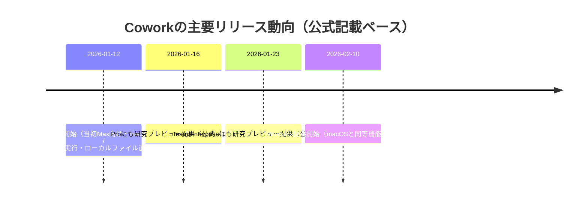
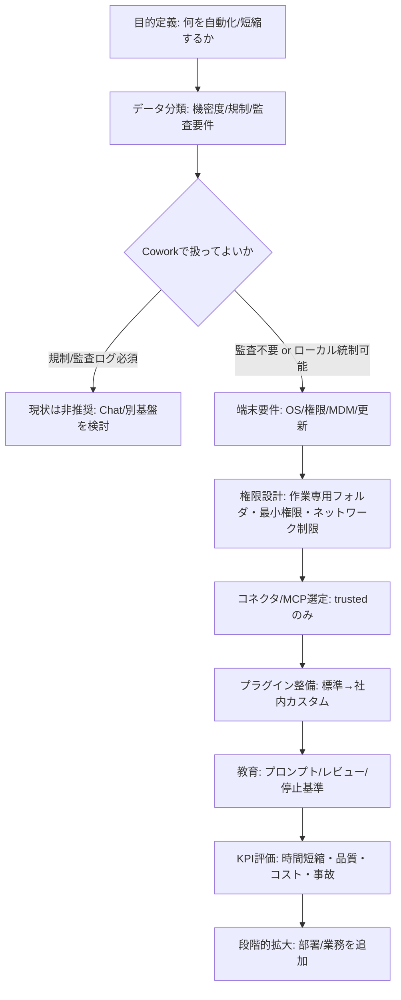

# Claude Cowork（AnthropicのCowork）網羅調査・分析報告書

## エグゼクティブサマリー

本報告書は、entity["company","Anthropic","ai company"]が提供する「Claude Cowork（正式表記としては *Cowork* を中心に呼称される）」について、公式ドキュメントとリリースノートを優先し、2026年2月12日（JST）時点の最新情報をもとに、機能・対応プラットフォーム・導入方法・ユースケース・制約/リスク・競合比較を分析的に整理したものである。citeturn39view2turn38view0turn13view0

結論として、Coworkは「エージェント型（agentic）」の実行環境をClaude Desktop内に持ち込み、ユーザーが許可したローカルファイルへの直接アクセス、マルチステップ作業、サブエージェントによる並列作業、プラグイン（技能・コネクタ・コマンド群のパッケージ）による役割特化を通じて、“チャット”ではなく“タスク実行”を主目的に設計された機能プレビュー（research preview）である。citeturn38view0turn15view0turn35view0

一方で、(1) エージェント特有のリスク（プロンプトインジェクション、誤操作、データ露出、ファイル破壊等）を前提に設計されていること、(2) Team/Enterprise環境でも「監査ログ/Compliance API/データエクスポートにCoworkの活動が記録されない」「会話履歴が端末ローカル保存で集中管理できない」など、統制上の大きな“穴”が現時点で残ること、(3) 利用量（usage）消費が大きく、費用/上限制約が実務のボトルネックになりやすいことが、導入上の主要な検討ポイントである。citeturn38view0turn8view2turn15view2turn22view0

プラットフォーム面では、公式ブログで **2026年2月10日** にWindows提供開始（macOSと同等の機能）と明記され、Help Center英語版もWindows（x64のみ）を明示する。citeturn39view2turn8view0turn38view0  
ただし、日本語ヘルプセンター記事の一部は **macOSのみ** と記載が残っており、翻訳反映の遅れ（あるいは段階的ロールアウト差）の可能性があるため、Windows利用判断は英語版・公式ブログ・ダウンロードページを優先すべきである。citeturn32view2turn39view2turn16view0turn8view0

## 調査対象の定義と前提

Coworkは、entity["company","Anthropic","ai company"]が「Claude Codeのエージェント機能を、コーディング以外の知識労働へ拡張する」目的でClaude Desktopに提供する研究プレビューである（公式表現として “Cowork: Claude Code for the rest of your work”）。citeturn39view2turn38view0

本報告書では、ユーザーが指定した「Claude Cowork」を、(a) Claude Desktop内のCoworkモード（Tasks）と、(b) それを拡張するプラグイン/コネクタ（MCPベース）群、(c) Team/Enterpriseにおける管理・統制仕様まで含めた“製品機能群”として扱う。citeturn38view0turn15view0turn27view4turn13view0

なお、価格・提供範囲・制限事項は「研究プレビュー」ゆえ変更頻度が高い。したがって、本報告書には必ず「調査時点（2026-02-12 JST）」を明記し、固定値ではなく“公式ページでの再確認”が前提になる箇所（価格、対応OS、統制機能、コネクタ一覧など）を区別して記載する。citeturn39view2turn17view0turn34view0

## 製品概要と主要機能

### 定義と目的

Coworkは「対話（Chat）の延長」ではなく、「成果物を作るためにClaudeが自律的に作業を進める」タスク実行モードとして定義されている。ユーザーは“アウトカム”を指示し、Claudeが計画→分解→実行→成果物生成までを担う設計である。citeturn38view0turn39view2

公式Help Centerでは、Coworkを「Claude Codeと同じエージェントアーキテクチャをClaude Desktop上で、ターミナル不要で使えるようにしたもの」と説明している。citeturn38view0turn39view2

### コラボレーション機能とマルチユーザー対応

Cowork自体の“セッション共有”は現状できず、チャット/成果物（artifact）の共有も不可とされる（＝同じタスクセッションを複数人で閲覧・共同推敲するタイプの協働には向かない）。citeturn38view2turn32view2

一方で、Team/Enterprise契約下では、組織としてCoworkを有効化すれば**全ユーザーが使える**（ただし後述の通り、研究プレビュー中はユーザー/部署/ロール単位での選別ができない）。citeturn8view2turn27view4  
つまり「マルチユーザー」は“組織導入”としては成立するが、“リアルタイム共同編集/共同実行”としての協働は制約が大きい、という整理が妥当である。citeturn38view2turn27view4

### 会話履歴管理と永続性

Coworkは会話履歴を端末ローカルに保存し、（少なくとも公式表現上）Anthropicの通常のデータ保持枠組み（data retention timeframe）とは別扱いになる。citeturn38view0turn8view2turn27view4  
この点は「クラウド上の会話履歴を削除/保持する」という一般的なSaaS統制とは異なり、組織にとっては“端末データ保護（MDM/暗号化/ログ収集/端末廃棄）”側の課題が強くなる。citeturn27view4turn6view1

加えて、Coworkのセッションは「デスクトップアプリを開き続ける必要がある」とされ、アプリ終了やスリープなどでタスクが止まる可能性がある。citeturn15view0turn38view2

### プラグイン/ツール連携（MCP、コネクタ、拡張）

Coworkはプラグインで拡張できる。公式Help Centerでは、プラグインを「skills・connectors・slash commands・sub-agentsを束ねたパッケージ」と定義し、役割（営業・法務・財務など）に合わせたテンプレート群を提供している。citeturn15view0turn15view2turn35view0

Anthropicが公開する公式プラグインリポジトリでは、複数職種向けプラグインと、それらが利用する外部サービス（例：Slack、Notion、Asana、Microsoft 365 等）が具体的に列挙され、プラグインが“企業の道具立て”に接続する前提で設計されていることが読み取れる。citeturn35view0

また、Claudeは「ローカル（Desktop Extensions）」と「リモート（Web Connectors）」の2形態でツール/データ連携する。ローカル拡張はClaude Desktop上で端末リソースに接続し、リモートコネクタはインターネット経由でクラウドサービスに接続する。citeturn13view0  
リモート側はAsana/Notion/PayPal/Zapier/Workato等の例が公式に示され、協働やクラウドツール統合の中心になるのはこの“コネクタ”レイヤーである。citeturn13view0turn34view0

### セキュリティ・プライバシー設定（権限、ネットワーク、削除保護）

CoworkはVM（仮想マシン）環境で動作し、ファイル/ネットワークアクセスが制御された隔離空間でタスクを実行するとされる。citeturn38view2turn32view0turn27view3  
ただし隔離は“無害化”ではなく、ユーザーが許可したローカルファイルにはアクセスでき、実ファイルを変更できる。したがって、実運用では「最小権限」「作業専用フォルダ」「バックアップ」が重要になる。citeturn38view0turn8view0turn32view0

重要な安全機能として、Coworkはファイルの**永久削除**に明示許可を要求する（削除保護）。citeturn15view0turn27view0

またTeam/Enterprise環境では、Coworkは組織のネットワークegress権限に従う（＝管理者が設定した外部通信範囲を前提に動く）とされ、管理者側のCapabilities設定確認が推奨されている。citeturn8view2turn38view0

image_group{"layout":"carousel","aspect_ratio":"16:9","query":["Claude Cowork desktop app Cowork tab Tasks mode screenshot","Claude Cowork plugins sidebar screenshot","Claude Desktop Cowork global instructions settings screenshot","Claude Cowork deletion permission prompt screenshot"],"num_per_query":1}

## 対応プラットフォームとリリース動向

### 対応状況の整理（CoworkとClaudeアプリを分けて理解する）

Coworkは **Claude Desktop内の機能**であり、Webやモバイル単体では提供されない（少なくとも公式Help Center英語版の現行記述）。citeturn38view0turn15view0  
一方で、Claude自体はWeb/デスクトップ/モバイルで提供され、コネクタ（特にリモート）はモバイルでも利用可能とされるため、「Coworkはデスクトップ限定」「ツール連携の一部は全デバイス」という二層構造になる。citeturn13view0turn16view0

### Windows対応の公式確認

「Windows提供開始が数日前」という点について、公式ブログが **2026年2月10日** のアップデートとして「Windowsで提供開始」「macOSと同等（file access / multi-step tasks / plugins / all MCP connectors）」を明記している。citeturn39view2  
加えて、Help Centerの安全ガイドもWindows（x64のみ）を明示し、arm64非対応を記載している。citeturn8view0turn38view0  
ダウンロードページも「Now available on Windows」を掲げ、Windows/macOSで有料プラン向けにCoworkが利用可能と説明する。citeturn16view0

### 日本語ドキュメントとの不整合（重要な注意）

日本語ヘルプセンターの記事には、現時点でも「macOS用デスクトップのみ」「Web/モバイル不可」といった表現が残り、英語版や公式ブログのWindows対応記載と不整合がある。citeturn32view2turn39view2turn38view0  
この不整合は、翻訳更新の遅れ、地域/段階的ロールアウト、またはページの更新タイミング差で起こり得るため、本報告書では **プラットフォーム可否は英語版Help Center＋公式ブログ＋claude.com/downloadを優先**し、日本語記事の“macOSのみ”は「翻訳反映遅れの可能性が高い」として扱う。citeturn39view2turn16view0turn38view0turn32view2

### リリース時系列


citeturn39view2turn27view1turn8view0

## 導入手順と運用設計

### 導入の全体像（個人〜組織まで共通の設計原則）

Cowork導入は、(1) 契約（どのプランで使うか）、(2) Desktop配布（端末要件・権限・更新制御）、(3) 権限設計（ファイル/ネットワーク/コネクタ/MCP）、(4) 成果物品質とセーフティ（レビュー、バックアップ、監査要件の可否）、の順に決めると失敗しにくい。citeturn15view0turn8view2turn6view1

### アカウント作成と料金プラン

個人向けにはFree/Pro/Maxがあり、Coworkは「有料プラン（Pro/Max/Team/Enterprise）の研究プレビュー」として提示される。citeturn38view0turn15view0turn16view0  
価格（US表示）は、Proが月$20（年額$200）と明記されている。citeturn18view1turn18view3turn17view0  
Maxは$100（5x）/ $200（20x）が代表例として案内される。citeturn18view1turn7search11turn17view0  
Teamは最小5名・最大75席で、Standard seatが$20/席（年契約）または$25/席（月額）、Premium seatが$100/席（年契約）または$125/席（月額）とされる（税・地域差あり）。citeturn19view0turn17view2  
価格は地域/税/販売チャネルで変動し得るため、最終確認は公式Pricingに依存すべきである。citeturn17view0turn19view0

加えて、Pro/Maxでは上限到達後に従量課金（extra usage）へ切り替えて継続する仕組みがあり、月次上限（spending cap）設定などでコスト制御できる。citeturn22view0

### インストール（macOS / Windows）と初期設定

Cowork利用にはClaude Desktopが必要で、モバイル/ブラウザだけでは実行できない。citeturn15view0turn38view0

Windows展開（enterprise想定）では、推奨がMSIXで、Windows 10 version 2004以降（Build 19041+）が要件とされ、Windows S Modeが無効である必要がある。citeturn6view1  
さらに重要なのは、**管理者権限なしのインストールではCoworkが利用できない**と明記されている点である。Windows組織導入でCoworkを使う場合、端末管理ポリシー（管理者権限、MDM/Intune、配布方式）を先に固める必要がある。citeturn6view1

### Coworkの起動と基本操作（Tasksモード）

基本操作は「Claude Desktopを開く → モードセレクタでCoworkタブを選ぶ → タスクを記述 → Claudeの計画をレビューして実行」という流れで説明される。citeturn15view0turn27view0  
実行中は進捗表示があり、途中で指示を追加して方向修正できる（steering）。複雑タスクではサブエージェントが並列に動作することがある。citeturn15view0turn27view0turn38view2

### チーム/ワークスペース作成と権限設計（Team/Enterprise想定）

Teamプランは、管理・請求の集中化、SSO/Domain Capture、コネクタ連携、Enterprise search等の“組織機能”を含むとされる。citeturn19view0turn17view0  
一方、Coworkは研究プレビュー中、組織オーナーがCapabilitiesでON/OFFする“組織一括トグル”であり、ユーザー/ロール別の細かい制御ができない。citeturn27view4turn8view2  
このため、最小構成の統制設計としては「まずPoC用の別組織 or 別ドメインで試す」「端末/ネットワーク/コネクタ許可を狭くしてから段階拡大」が現実的である。citeturn27view4turn6view1turn13view0

### よくあるトラブルと対処

Cowork開始時に「Setting up Claude's workspace」が表示されるが、これは更新・修正適用のための想定内動作とされる。citeturn33view0  
また、タスクが止まる場合は「アプリを開き続けていたか」「PCがスリープしていないか」を確認するよう案内される。citeturn33view0turn15view0  
出力ファイルが見当たらない場合は「ファイルアクセス許可」「出力先」を確認する。citeturn33view0  
利用上限にすぐ達する場合は、Cowork（重いタスク）と通常チャット（軽いタスク）を使い分け、関連作業をまとめる（batching）ことが推奨される。citeturn15view2turn32view0

### 推奨導入フロー（チェックリスト付き）


citeturn8view2turn8view0turn15view0turn13view0

運用ポリシーの最低限として、「Coworkに与えるフォルダは専用化する」「削除や外部送信を伴う作業は必ず人がレビューする」「未知のMCP/コネクタは許可しない」「Chrome拡張で機密操作をしない」などが公式にも強く推奨される。citeturn8view0turn27view2turn13view2

## 利用可能なことと代表的ユースケース

### 非エンジニアでも使えるか

公式ブログはCoworkを「開発者だけではなく誰でも使える、Claude Code的な働き方を実現するための簡易な方法」と位置付けている。citeturn39view3  
また、Help Centerは「ターミナル不要」「複雑なマルチステップを代行」と記述しており、非エンジニアにとっての障壁（CLI操作）を明示的に取り除く設計である。citeturn38view0turn27view3

ただし、非エンジニア利用で成果が出るかは「指示を成果物仕様まで具体化できるか」「データ/出力の検算ポイントを持てるか」に依存する。Coworkは“実行”を担うが、“責任”はユーザー側に残る（後述）。citeturn8view0turn13view1

### 業務ユースケース（公式例を中心に）

Coworkは「ファイルアクセス＋長時間実行＋マルチステップ」が効く業務に最適化されている。具体例として、ダウンロードフォルダ整理、レシートの経費報告書化、ファイルの一括リネーム、Web/論文/ノートを統合したリサーチレポート、議事録からテーマ・アクション抽出、数式付きExcel作成、スライドデッキ生成、データの統計分析/可視化/整形などが挙げられている。citeturn38view1turn32view0turn27view3

加えて、公式プラグイン群は、職種ごとに「どのツール群へ接続し、どんな定型作業を標準化するか」を設計している。たとえば生産性プラグインはSlack/Notion/Asana/各種チケット管理/entity["company","Microsoft 365","productivity suite"]等へ接続し、営業はCRMや商談準備、サポートはチケット処理、法務は契約レビュー、財務は照合・決算支援といった“業務の型”を含む。citeturn35view0turn15view0

### 成功事例・導入企業の声（入手可能な範囲）

Cowork単体の“成熟した成功事例”は、研究プレビュー開始（2026年1月）から日が浅く、公式の事例はまだ限定的である一方、金融領域ではentity["company","Goldman Sachs","investment bank"]がCoworkを含むエージェント開発で業務自動化を進めていると報じられている（取引/会計処理、顧客DD、オンボーディング等）。citeturn9news36turn9news37

また、Coworkが依拠するモデル/エージェント能力そのものについては、entity["company","Notion","productivity software company"]やentity["company","GitHub","software development platform"]などがentity["people","Sarah Sachs","notion ai lead"]やentity["people","Mario Rodriguez","github cpo"]のコメントとして「複雑な要求を分解し実行しきる」「マルチステップ作業での有効性」などを述べており、Coworkの方向性（長距離タスク）と整合する。citeturn21view1

## 制約・できないこととリスク対応

### 技術的制約（現時点で明示されているもの）

Coworkは研究プレビューであり、端末/セッションの制約がある。英語版では「セッション間メモリなし」「共有不可」「デスクトップ限定（同期しない）」「アプリを閉じると終了」が列挙される。citeturn38view2turn33view0  
日本語版には追加で「プロジェクト内でCoworkを使えない」「GSuiteコネクタ非互換」「macOS限定」などが記載されるが、Windows対応の不整合があるため、これら追加項目は“翻訳遅れを含む可能性がある注意情報”として扱うのが安全である。citeturn32view2turn38view0turn39view2

Windowsについては、Coworkはx64のみでarm64非対応とされる。citeturn8view0turn38view0turn16view0

さらに、Coworkはチャットより利用枠消費が大きい（マルチステップが計算集約的でトークン消費が増える）ため、運用では上限到達が起こりやすい。citeturn15view2turn32view0

### プライバシー/統制上の制約（特に組織導入で重要）

Team/Enterpriseで致命的になり得るのが、Cowork活動が **Audit Logs / Compliance API / Data Exports に記録されない**点である。公式は「規制対象ワークロードに使うべきでない」と明示する。citeturn38view0turn8view2turn27view4  
加えて、会話履歴が端末ローカル保存で、管理者が集中管理・エクスポートできない。これは“データ保持・eDiscovery・監査証跡”を組織要件とする場合に、構造的なミスマッチになる。citeturn8view2turn27view4

### 法的/倫理的懸念と誤情報リスク

エージェントは外部サイトやファイルにアクセスし得るため、プロンプトインジェクション（悪性指示の混入）や、誤操作による情報漏えい/改ざんリスクがゼロではない。AnthropicはRLやコンテンツ分類器などの防御層を述べつつも「リスクは非ゼロ」と明示し、機密ファイルを与えない、信頼できるサイト/コネクタに限定する、未知のMCPを避ける等の注意を求めている。citeturn8view0turn27view2turn13view2

また、エージェント利用は利用規約/ポリシーに従う必要があり、無断監視や不正なデータ収集、詐欺、なりすまし等の用途に使ってはならない旨がガイドで例示されている。citeturn13view1

誤情報については、生成AI一般として「もっともらしい誤り」が避けられないため、Coworkの導入効果を最大化するには「検算点（数値突合、ソース確認、差分レビュー）を最初からワークフローに埋め込む」ことが不可欠である（これはKPI設計にも直結する）。citeturn38view0turn32view0

### コスト面の制約

Coworkは利用枠消費が大きく、頻繁にタスクを回すとPro/Team Standard seatでは上限が先に来る可能性がある。公式も「簡単なものはチャットで」「関連作業をまとめて1セッションで」といった節約策を提示している。citeturn15view2turn32view0  
上限超過時の継続手段としてextra usage（API標準レートでの従量課金）があるが、これは“使えば使うほどコストが増える”ため、月次上限設定と監視が前提になる。citeturn22view0turn21view0

### 向かないユーザー/ケース

以下は、現時点の仕様から見て「導入しない/限定導入が妥当」になりやすい。

- 監査証跡（監査ログ、コンプライアンスAPI、データエクスポート）が必須の規制業務（Cowork自体が未対応と明記）。citeturn38view0turn8view2turn27view4  
- 端末ローカルに会話履歴が残ることが許容できない組織（端末紛失/廃棄/フォレンジックの統制が弱い場合）。citeturn8view2turn27view4  
- ユーザー/部署単位で段階的に機能解放したいが、研究プレビュー中の“組織一括トグル”しか許容されないケース。citeturn27view4turn8view2  
- Windows arm64環境、またはWindowsで管理者権限を付与できない運用（Coworkが動かない/使えない可能性が高い）。citeturn8view0turn6view1  
- セッション共有やリアルタイム共同編集が必須のチーム（Coworkセッションは共有不可）。citeturn38view2turn32view2  

## 競合比較と代替

### 機能比較表（主要競合）

下表は「エージェント実行」「ローカルアクセス」「統制/監査」「連携」「協働」を軸に、Coworkと主要代替を比較したものである。比較対象の仕様は変化しやすいため、各社の公式ページに基づく“2026-02-12時点のスナップショット”として読むべきである。citeturn39view2turn23search1turn23search2turn23search3

| 観点 | Cowork（Claude Desktop内） | OpenAI（ChatGPT Business/Enterprise + Agent） | Microsoft（Microsoft 365 Copilot） | Google（Gemini in Google Workspace） |
|---|---|---|---|---|
| 主目的 | “チャット”よりも「マルチステップのタスク実行」中心。ローカル成果物まで出す設計。citeturn38view0turn39view3 | 共有ワークスペース/共有プロジェクト等で業務支援。Agentは「自分のコンピュータ（専用環境）」でタスクを実行する設計。citeturn23search0turn24search13 | M365アプリ/業務データ（Graph）と統合し、組織内情報で生成・要約・操作支援。citeturn23search2turn23search6 | Workspace内の文書/メール等と統合し、組織内での生成AI活用を支援。citeturn23search3turn23search19 |
| ローカルファイル“直接”アクセス | ユーザー許可したローカルファイルを読み書きし、ファイルシステムへ成果物を出力。VMで隔離。citeturn38view0turn33view0 | Agent modeの一部は「他アプリ/ローカルFSへアクセス不可」等の境界を明示（製品モードにより差）。citeturn24search12turn23search20 | 基本はクラウド（M365）中心。端末ローカルFSをCowork同様に直接操作することは主戦場ではない。citeturn23search2turn23search14 | 基本はWorkspaceのクラウド資産中心。citeturn23search3turn23search19 |
| 協働（共同作業） | Coworkセッション共有不可。組織導入は可能だが“同一タスク共同編集”は弱い。citeturn38view2turn27view4 | Businessで共有プロジェクト等、チーム作業を前提に拡張。citeturn23search4turn23search0 | テナント/権限/アプリ統制が強く、組織協働（同一データ基盤）に適合しやすい。citeturn23search2turn23search6 | 既存Workspace統制の延長で協働に適合（組織内で完結する旨を強調）。citeturn23search3turn23search19 |
| 統制（監査・エクスポート等） | Coworkの活動はAudit/Compliance/Data Exportに入らない。規制業務NG明記。citeturn38view0turn8view2 | Enterpriseは保持期間の制御や管理機能を掲げ、アプリ/コネクタのRBAC等も言及。citeturn23search1turn23search20turn24search10 | 管理センターでエージェント許可、データアクセス/統制を管理する設計。citeturn23search2turn23search6 | Workspaceの既存統制を適用し、組織外へ共有しない等を強調。citeturn23search3turn23search19 |
| 連携（コネクタ/拡張） | MCPベースのローカル拡張＋リモートコネクタ。公式ディレクトリ/プラグインが豊富。citeturn13view0turn34view0turn35view0 | “Apps/Connectors”で社内ツール統合。citeturn23search20turn23search4 | M365 Copilot connectors/agentsで拡張。citeturn23search14turn23search6 | Workspace/管理者設定に基づくAI機能と連携。citeturn23search3turn23search11 |
| 主要プラットフォーム | Cowork自体はDesktop（Windows x64/macOS）。citeturn38view0turn8view0turn39view2 | Web/モバイル/デスクトップ。citeturn24search1turn24search0 | M365アプリ/サービス横断。citeturn23search2turn23search6 | WorkspaceのWeb/アプリ。citeturn23search3turn23search19 |
| 価格の目安（参考） | Pro $20/月、Max $100〜$200/月、Team $20〜$125/席/月（条件で変動）。citeturn17view0turn19view0 | Business $25/席/月（年契約） or $30/席/月（月額）等。citeturn36search10turn36search18 | Copilot Business $18〜$21/ユーザー/月（条件・市場差あり）。citeturn36search2turn36search19 | 版/地域で変動が大きく一概に言いにくい（Workspace運用情報として案内）。citeturn23search3turn36search9 |

**解釈（実務的な選び方）**  
Coworkは「端末上のファイル/成果物に対して、エージェントがまとまった作業を実行する」点が際立つ一方、監査・エクスポート等の統制要件が強い組織では導入リスクが大きい。統制優先なら、（現時点では）M365/GWS/ChatGPT Enterpriseのように“統制機能を前提に作られた枠”を優先し、Coworkは限定PoCとして扱うのが合理的である。citeturn8view2turn23search1turn23search2turn23search3

### 主要参考URL（原典）

```text
# Anthropic / Claude 公式（Cowork中核）
https://claude.com/blog/cowork-research-preview
https://support.claude.com/en/articles/13345190-getting-started-with-cowork
https://support.claude.com/en/articles/13364135-using-cowork-safely
https://support.claude.com/en/articles/13455879-cowork-for-team-and-enterprise-plans
https://claude.com/download
https://claude.com/pricing

# 日本語（翻訳反映遅れの可能性に注意しつつ参照）
https://support.claude.com/ja/articles/13345190-cowork%E3%82%92%E5%A7%8B%E3%82%81%E3%82%8B
https://support.claude.com/ja/articles/13364135-cowork%E3%82%92%E5%AE%89%E5%85%A8%E3%81%AB%E4%BD%BF%E7%94%A8%E3%81%99%E3%82%8B
https://support.claude.com/ja/articles/13455879-cowork-for-team-and-enterprise-plans
https://support.claude.com/ja/articles/12138966-%E3%83%AA%E3%83%AA%E3%83%BC%E3%82%B9%E3%83%8E%E3%83%BC%E3%83%88

# プラグイン / コネクタ（MCP）
https://github.com/anthropics/knowledge-work-plugins
https://claude.com/connectors
https://www.anthropic.com/news/model-context-protocol

# データ保持/学習（Privacy Center）
https://privacy.claude.com/en/articles/10023580-is-my-data-used-for-model-training
https://privacy.claude.com/en/articles/10023548-how-long-do-you-store-my-data
https://privacy.claude.com/ja/articles/10023548-%E3%81%82%E3%81%AA%E3%81%9F%E3%81%AE%E3%83%87%E3%83%BC%E3%82%BF%E3%81%AF%E3%81%A9%E3%81%AE%E3%81%8F%E3%82%89%E3%81%84%E3%81%AE%E6%9C%9F%E9%96%93%E4%BF%9D%E5%AD%98%E3%81%95%E3%82%8C%E3%81%BE%E3%81%99%E3%81%8B
https://privacy.claude.com/ja/articles/7996866-%E8%B2%B4%E7%A4%BE%E3%81%AE%E3%83%87%E3%83%BC%E3%82%BF%E3%81%AF%E3%81%A9%E3%81%AE%E3%81%8F%E3%82%89%E3%81%84%E3%81%AE%E6%9C%9F%E9%96%93%E4%BF%9D%E5%AD%98%E3%81%95%E3%82%8C%E3%81%BE%E3%81%99%E3%81%8B

# 競合（公式）
https://openai.com/chatgpt/team/
https://openai.com/enterprise-privacy/
https://openai.com/index/more-ways-to-work-with-your-team/
https://openai.com/chatgpt/desktop/
https://help.openai.com/en/articles/9309188-add-files-from-connected-apps-in-chatgpt
https://help.openai.com/en/articles/11487775-connectors-in-chatgpt
https://learn.microsoft.com/en-us/copilot/microsoft-365/microsoft-365-copilot-privacy
https://www.microsoft.com/en-us/microsoft-365-copilot/pricing
https://support.google.com/a/answer/15706919
https://workspace.google.com/security/ai-privacy/

# 主要メディア（補助的）
https://www.reuters.com/business/finance/goldman-sachs-teams-up-with-anthropic-automate-banking-tasks-with-ai-agents-cnbc-2026-02-06/
https://www.reuters.com/business/retail-consumer/anthropic-releases-ai-upgrade-market-punishes-software-stocks-2026-02-05/
```

