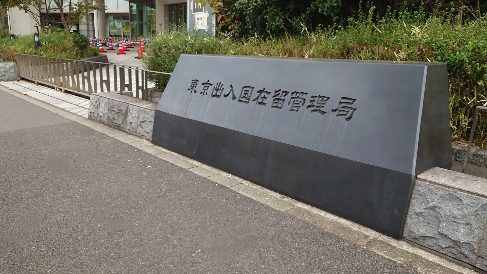

「技能実習制度が廃止されると聞いたが、自社への影響がわからない」

「法改正で外国人がすぐに転職してしまうのではないか不安」

2024年6月に成立した改正出入国管理法（入管法）は、日本の外国人採用のあり方を根本から変える歴史的な転換点です。特に注目すべきは、長年続いた**技能実習制度の廃止と、新制度「育成就労」の創設**です。これに伴い、「転籍（転職）の制限」が緩和され、外国人材が職場を選べる時代が到来します。

もし、この変化に対応できなければ、既存の外国人社員が流出したり、新たな採用ができなくなったりするリスクがあります。しかし逆に言えば、**適切な準備を今から進めれば、優秀な人材を確保し、定着させる大きなチャンス**にもなり得ます。

本記事では、37年以上の日本語教育実績を持つTCJグローバルが、複雑な法改正のポイントを時系列で整理し、企業が「今」取り組むべき具体的な対応策を解説します。

## 2024年入管法改正の最重要ポイント：「育成就労制度」の創設

今回の改正で最も影響が大きいのが、人材育成と人材確保を目的とした新制度「育成就労制度」の創設です。これは、国際貢献を目的としていた従来の「技能実習制度」を抜本的に見直し、実態に即した就労制度へと再編するものです。この新制度は、**2027年（令和9年）までの施行**が見込まれています。

### 技能実習制度との決定的な違い

新制度「育成就労」と旧制度「技能実習」の最大の違いは、目的が「国際貢献」から**「人材の確保・育成」**へと明確に変わった点です。これにより、制度設計もより労働者としての権利を尊重し、キャリアアップを促す形に変更されました。

#### 主な変更点3つのポイント

- **転籍（転職）制限の緩和**: 技能実習では原則認められていなかった転籍が、育成就労では「同一業務区分」かつ「一定の要件（就労期間や日本語能力など）」を満たすことで認められます。
- **日本語能力要件の厳格化**: 就労開始前および在留期間中に、一定の日本語能力試験（JLPTなど）への合格が求められるようになります。
- **特定技能への円滑な移行**: 育成就労修了者は、特定技能1号への移行が可能となり、長期的な就労キャリアが描きやすくなります。

### 企業への影響：人材の流動化と「育てる責任」

転籍制限の緩和は、企業にとって「人材流出のリスク」を意味します。これまでは制度上、転職が難しかったため定着していましたが、今後は待遇や人間関係、キャリアパスに不満があれば、より良い条件の企業へ移ることが可能になります。

一方で、これは「選ばれる企業」になれば、他社で経験を積んだ優秀な人材を採用できるチャンスでもあります。企業には、単なる労働力としてではなく、**「日本語教育」や「キャリア支援」を通じて人材を育て、定着させる努力**がこれまで以上に求められるようになります。

## 2024年入管法改正：その他の重要な変更点

育成就労以外にも、企業活動や外国人社員の生活に関わる重要な改正が含まれています。

### マイナンバーカードと在留カードの一体化

利便性の向上と行政運営の効率化を目指し、マイナンバーカードと在留カードを一体化したカードの利用が可能になります。この運用は**2026年6月**頃の開始が予定されています。一体化は義務ではありませんが、本人確認書類としての利便性が高まるため、従業員への周知が必要になるでしょう。

### 永住許可制度の適正化（取消事由の追加）

永住許可取得後の管理が厳格化されます。具体的には、税金や社会保険料の未納、在留カードの常時携帯義務違反などが、永住許可の取消事由として明記されました。

企業としては、雇用する永住者や、将来永住を目指す従業員に対し、社会保険加入や納税の重要性を正しく指導することが、彼らのキャリアを守ることにつながります。

あわせて読みたい [ 在留資格の更新手続き完全ガイド｜必要書類・手順・注意点を徹底解説](https://gaikoku-jinzai.tcj-education.com/posts/residence_status2)

## 2023年入管法改正のポイント（既に施行済み）

2024年の改正に先立ち、2023年にも入管法の改正が行われています。これらは主に不法滞在者対策や難民認定制度の適正化に関するものですが、企業コンプライアンスの観点からも理解しておく必要があります。

### 送還停止効の例外と監理措置制度

難民認定申請中の送還停止効に例外が設けられ、再三の申請者などは送還が可能になりました。また、収容施設への収容に代わり、監理人（親族や支援者など）の監督下で生活させる「監理措置制度」が創設されました。

### 不法就労助長罪の厳罰化

不法就労をあっせんしたり、不法就労と知りながら雇用したりした場合の「不法就労助長罪」の罰則が強化されるなど、取り締まりが厳しくなっています。企業は、採用時の在留カード確認を徹底し、知らぬ間に法律違反を犯さないよう十分な注意が必要です。

### 法改正への対応、自社だけで抱え込んでいませんか？

これからの外国人採用は「制度理解」と「教育体制」がセットで必要です。 37年の実績を持つTCJが、貴社に最適な採用・育成プランをご提案します。

[まずは無料相談をする](https://tcj-education.com/ja/foreign-recruitment/)

## 【法改正対応】企業が今すぐ準備すべき3つのステップ

育成就労制度が本格スタートする2027年に向けて、企業は今から準備を進める必要があります。「まだ先の話」と思っていると、制度変更時に現場が混乱したり、人材確保に遅れをとったりする可能性があります。

### 1\. 自社の受入れ体制（キャリアパス・待遇）の見直し

転籍が可能になる新制度下では、外国人材に「長く働きたい」と思ってもらうための仕組み作りが不可欠です。日本人社員と同様の評価制度を適用する、昇給や昇格の基準を明確にするなど、将来のキャリアが見える化されている企業は、転籍リスクを下げることができます。

あわせて読みたい [ 【完全ガイド】外国人材のキャリアパス｜成功へ導く企業の支援と定着戦略](https://gaikoku-jinzai.tcj-education.com/posts/career_path)

### 2\. 日本語教育・生活支援の強化

育成就労制度では、就労開始前（N5相当）だけでなく、就労開始から1年経過時にも一定の日本語能力（N4相当）が求められる予定です。試験に不合格の場合、在留期間の更新に影響が出る可能性もあります。

したがって、企業は「日本語学習の機会」を提供することが義務に近い形で求められます。TCJグローバルでは、特定技能人材を採用した企業様に対し、**入社後6ヶ月間の動画レッスンを無料で提供**するなど、企業の教育コストを抑えつつ、確実なスキルアップを支援する仕組みを整えています。

### 3\. 適切な監理支援機関・登録支援機関の選定

新制度では、監理団体の要件が厳格化され「監理支援機関」となります。また、特定技能の支援を行う「登録支援機関」の役割も重要です。

法改正の細部までを熟知し、適切な支援や行政手続きの代行ができる機関をパートナーに選ぶことが、コンプライアンス違反のリスクを回避する鍵となります。TCJは登録支援機関として、ビザ申請から生活支援までをワンストップでサポートしており、企業の負担を大幅に軽減します。

あわせて読みたい [ 採用コストを抑えて優秀な外国人材を確保！成功企業の工夫とは？](https://gaikoku-jinzai.tcj-education.com/posts/recruitment_cost)

## 育成就労・特定技能の成功は「日本語教育」が鍵

今回の法改正の根底にあるのは、「外国人と共に創る社会」というビジョンです。その基盤となるのがコミュニケーション、つまり「日本語力」です。

### なぜ法改正で「日本語教育」が重要視されるのか？

これまでの技能実習制度では、日本語力不足による労働災害や、コミュニケーション不全による失踪といった問題が発生していました。新制度で日本語要件が厳格化されたのは、外国人材を守り、同時に企業の生産性を高めるためです。

単にJLPT（日本語能力試験）に合格させるだけでなく、**「現場で安全に作業できる力」「同僚と円滑に連携する力」**といった、実務直結の日本語力を育てることが、これからの企業には求められます。

あわせて読みたい [ 【2025年最新版】外国人採用の日本語能力ガイド｜失敗しないレベルの見極め方から面接、育成まで](https://gaikoku-jinzai.tcj-education.com/posts/japanese_lang_skills)

### 定着率向上に直結するコミュニケーション教育の実践

TCJでは、独自の「Can-Doアセスメント」を用い、資格の有無だけでなく「実際に何ができるか」を評価します。さらに、建築なら「安全確認の掛け声」、介護なら「利用者の状態報告」といった、**業界特化型の日本語カリキュラム**を提供しています。

「言葉が通じる」ことは、外国人材自身の安心感につながり、それが離職防止（リテンション）の最強の施策となります。

あわせて読みたい [ 実践！「伝わる日本語」で指示を出すための言い換え表現集](https://gaikoku-jinzai.tcj-education.com/posts/clear_japanese)

## まとめ：法改正をチャンスに変え、選ばれる企業へ

出入国管理法の改正は、企業の負担を増やすものではなく、外国人材活用の質を高めるためのアップデートです。「育成就労」や「特定技能」などの制度を正しく理解し、教育体制を整えることで、貴社は他社に先駆けて優秀なグローバル人材を確保できる土壌を作ることができます。

TCJグローバルは、37年以上の教育実績に基づく「日本語教育」と、豊富な実績を持つ「人材紹介・定着支援」で、貴社の外国人採用を成功へと導きます。法改正への対応についてご不安があれば、ぜひ一度ご相談ください。

## よくある質問（FAQ）

### Q. 技能実習制度はいつまで利用できますか？

A. 育成就労制度の施行（2027年予定）までは、現行の技能実習制度での受け入れが可能です。また、新制度開始後も、一定の経過措置期間（3年間を想定）が設けられる見込みであり、急に受け入れができなくなるわけではありません。

### Q. 育成就労制度から特定技能への移行はスムーズにできますか？

A. はい、育成就労制度は特定技能制度への接続を前提として設計されています。原則3年間の就労と育成を経て、技能試験や日本語試験に合格（または免除）することで、特定技能1号へ移行し、さらに長期的なキャリアを築くことが可能です。

### Q. マイナンバーカードと在留カードの一体化は義務ですか？

A. いいえ、義務ではありません。一体化は外国人本人の申請（希望）に基づいて行われます。ただし、1枚で公的な身分証明とマイナンバーの証明ができるなど利便性が高いため、普及が進むと考えられます。

### Q. 日本語能力試験（JLPT）に合格できないとどうなりますか？

A. 育成就労制度では、在留期間更新や特定技能への移行時に日本語能力が確認されます。基準（1年経過時N5〜N4相当など）に達しない場合、再受験の機会や最長1年の在留延長措置があるものの、スムーズなキャリア形成には支障が出ます。企業がいかに学習環境を整えるかが重要です。

### Q. TCJではどのようなサポートが受けられますか？

A. TCJでは、採用前の「日本語能力アセスメント」から、特定技能・育成就労人材の「紹介」、煩雑な「ビザ申請代行」、「登録支援機関」としての生活支援、そして入社後の「日本語研修」まで、外国人採用に関する業務をワンストップでサポートしています。

## 外国人採用と教育のプロフェッショナルにご相談ください

法改正への対応、採用計画の見直し、既存社員への日本語教育など、 貴社の課題に合わせて最適なソリューションをご提案します。 まずは無料相談で、貴社の現状をお聞かせください。

[無料相談・資料請求はこちら](https://tcj-education.com/ja/foreign-recruitment/)

※オンラインでのご相談も可能です
