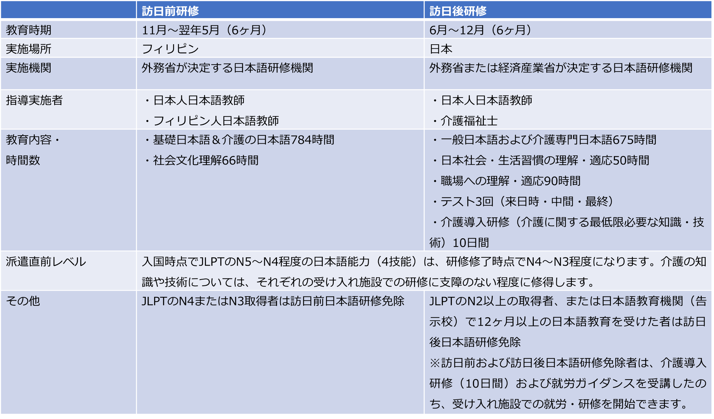
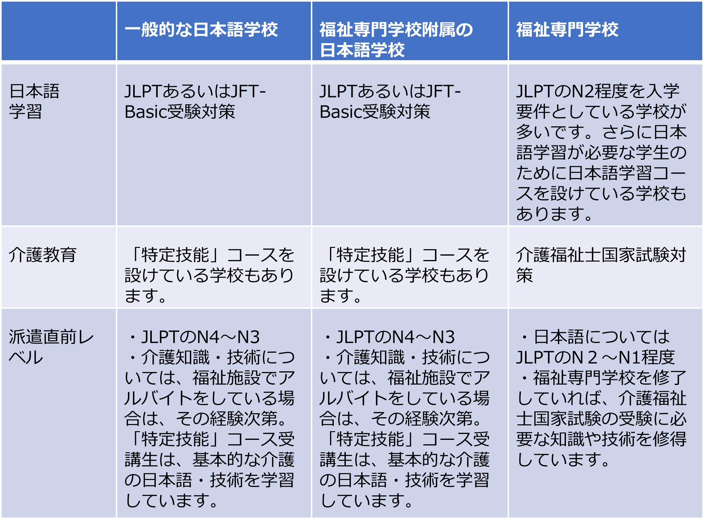
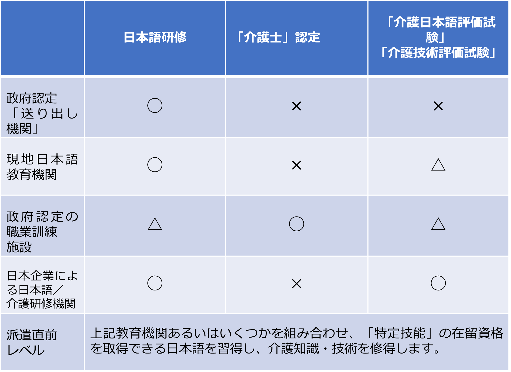
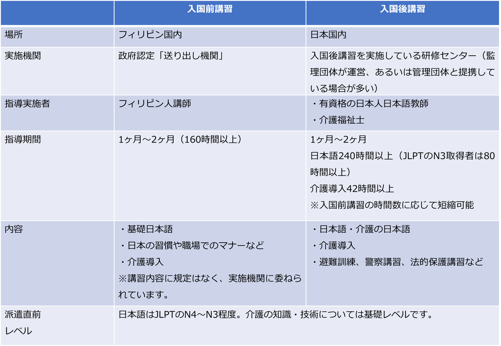

介護業界の人手不足を背景に、近年、外国人介護士を採用する施設も増えてきました。即戦力を求めて採用を検討する施設もあり、介護福祉士国家試験合格を見据えて採用を検討する施設もあります。外国人介護士といっても、利用する制度（EPA、留学、特定技能、技能実習）によって施設での就労前に受ける教育や研修には違いがあります。そこで本記事では、フィリピン人介護士たちが受け入れ施設で仕事を始めるまでに、国内外でどのような教育や研修を受けるのか、制度ごとにその大まかな特徴をご紹介します。

### EPA

選考を通過し、EAPの介護福祉士候補者となったフィリピン人は、まずはフィリピン国内で「訪日前研修」を受けます。研修を修了し来日すると、すぐに「訪日後研修」が始まります。この研修を修了してはじめて、それぞれの受け入れ施設へと派遣されます。研修内容等は以下のとおりです。

介護福祉士候補者たちは、施設派遣後は日常の業務を行いながら、介護福祉士国家試験へ向けて日本語学習や試験対策を行わなければなりません。そのため、訪日前・訪日後研修では、候補者の「自律学習」力の向上へ向けた指導も行われています。

### 留学

「留学」の在留資格でも、アルバイトとして福祉施設で働くことができます。この場合、就労時間は1週間28時間以内と決められています。留学生が通っている学校にもいくつか種類があり、一般的な日本語学校、福祉専門学校附属の日本語学校、福祉専門学校などがあります。介護施設で働くことを希望する留学生がそれぞれの学校でどのような学習をしているかを大まかにまとめました。

日本語学校のなかには「特定技能」の在留資格取得をめざしたコースを設けているところもあり、JLPTやJFT-Basic受験対策に加え、「介護技能評価試験」および「介護日本語評価試験」の受験対策を実施しています。合格すれば、卒業後、在留資格「特定技能」として就労することができます。

福祉専門学校では外国人の入学要件をJLPTのN2程度に設定しているところが多いようですが、実際には、N3程度でも合格できる学校もあります。福祉専門学校は、現在、入学者の多くが留学生であり、そうした留学生のための日本語コースを設けているところもあり、JLPTのN2やN1取得へ向けた学習支援を行なっています。

### 特定技能

在留資格「特定技能」で入国する場合、義務としての日本語や介護に関する事前研修等はありません。しかしながら、「特定技能」の在留資格を取得するためには、以下、すべてに合格している必要があります。

1)    JLPTのN4またはJFT-Basic

2)    「介護日本語評価試験」

3)    「介護技術評価試験」（英語での受験が可能）

さらにフィリピンでは、就労を目的に海外へ渡航する場合、政府認定「送り出し機関」へ登録することが義務づけられています。介護職種での就労を目的に日本へ渡航する場合、この登録に際して次のことを証明しなければなりません。

4)    日本語能力

5)    フィリピン政府による「介護士」認定

4)については、1)に合格していれば問題ありません。必要な試験に合格し、「介護士」としての認定を受けるための方法をまとめました。

介護の職業訓練施設の講師はほぼフィリピン人であり、介護教育も「フィリピンの介護」に関する教育になります。こうした職業訓練施設で日本語教育を実施しているところもありますが、数はかなり少ないです。また、「介護日本語評価試験」および「介護技術評価試験」対策については、日本人日本語教師や「日本の介護」について指導できる日本人講師がいないと実施することはむずかしく、こちらもやはり数はかなり少ないと思われます。

入国後はすぐに受け入れ施設での就労を開始できます。入国後の研修等は義務ではありませんが、受け入れ施設が日本語や介護の事前教育を希望する場合には、日本語教育や介護研修を実施している機関で研修を受けることもできます。

### 技能実習

「技能実習」の在留資格で入国する場合、入国前講習および入国後講習を受講することが義務づけられています。

### まとめ

フィリピンでは、国外で就労するフィリピン人は全員、政府認定「送り出し機関」に登録することが義務づけられています。この「送り出し機関」はフィリピン国内に数多く存在します。研修内容や費用は機関によって異なりますので、事前にできるだけ多くの情報を集め、検討することをおすすめします。また、「介護士」としての認定を受けるために研修を行う職業訓練施設についても同様のことが言えます。

また、フィリピン人介護士に即戦力を求める場合、介護の日本語や「日本の介護」の知識や技術を身につけてもらうためには、やはり、日本人「介護の日本語」講師や介護福祉士の指導を受けるか、あるいは、できるだけ早く受け入れ施設での研修を開始することをおすすめします。

TCJグローバルでは、企業が求める人材の日本への就労支援も行っております。また、就職後の日本語フォローや受け入れ企業向けの社内研修も提供し、スムーズな労働環境の整備をサポートします。外国人材の採用をお考えの企業様は、ぜひお気軽にご相談ください。

★すぐご紹介可能な日本語力の高い特定技能人材がいらっしゃいます。お気軽にお問合せ下さい★  
国籍：ベトナム・ネパール  
業種：外食、介護
